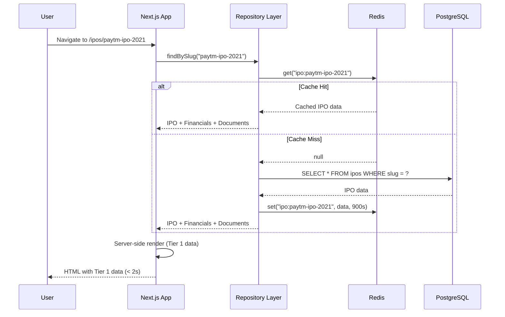
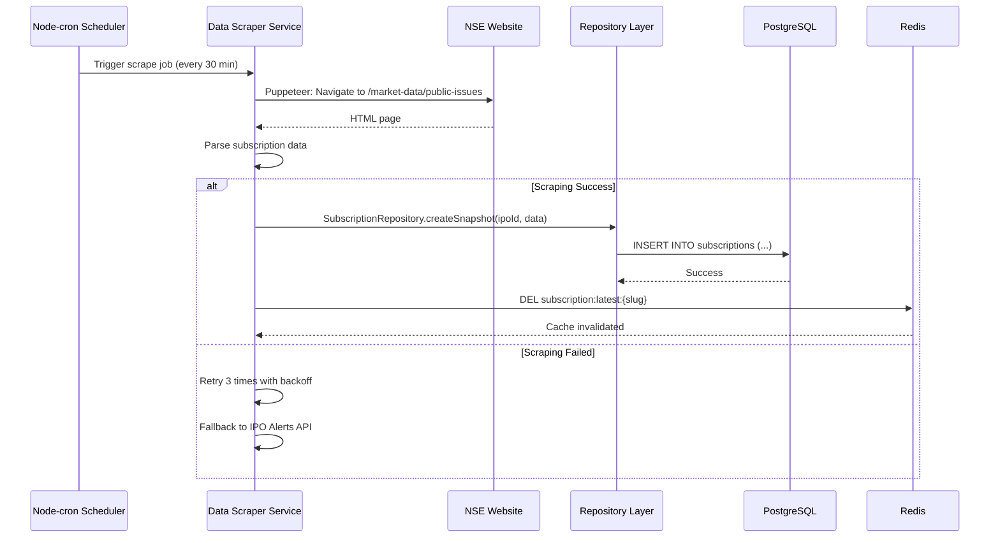
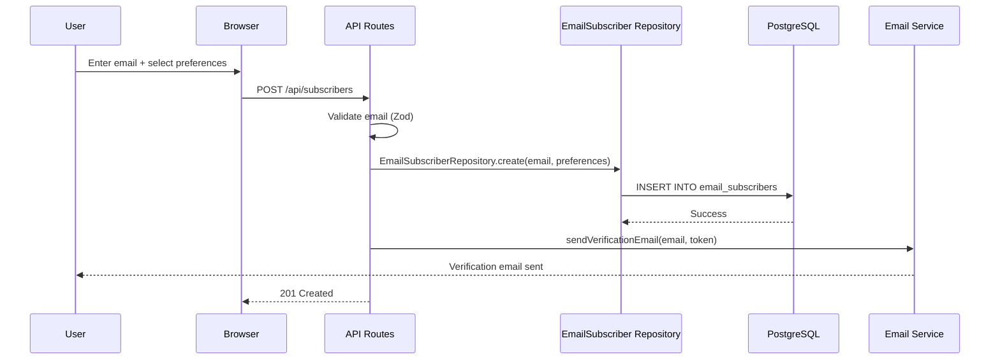

# Core Workflows

## Workflow 1: User Views IPO Detail Page

## Workflow 2: Data Scraper Updates IPO Subscription Data

## Workflow 3: User Subscribes to Email Alerts 🟢 **Phase 2**

*(This workflow will be implemented in Phase 2 when email alert functionality is added)*

---
