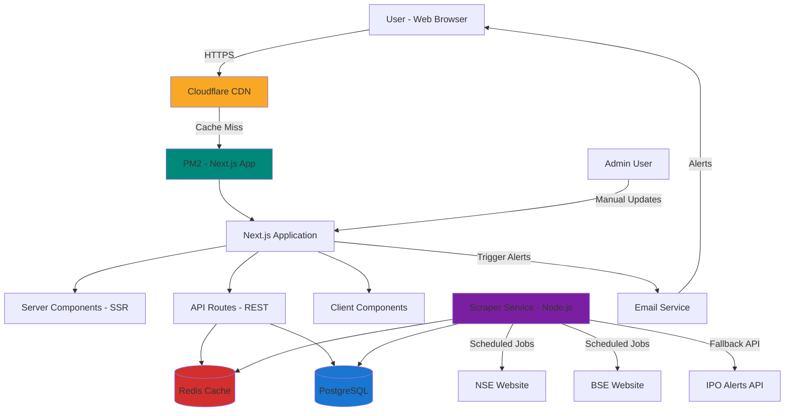

# High Level Architecture

## Technical Summary

IPODhan employs a **monolithic Next.js fullstack architecture** deployed on Windows Server 2022 VPS infrastructure. The frontend leverages Next.js 14's App Router with React Server Components for optimal SEO and performance, while the backend uses Next.js API Routes for RESTful endpoints and separate Node.js services for data scraping/aggregation. PostgreSQL serves as the primary database with Redis caching for frequently accessed IPO data. The system integrates with NSE/BSE websites via web scraping and third-party APIs (IPO Alerts) for fallback data. Cloudflare provides CDN, SSL, and DDoS protection. This architecture prioritizes **sub-2-second page loads**, **99.5% uptime during peak periods**, and **cost-efficiency** on shared VPS infrastructure—directly addressing the performance gaps in competitor platforms (Chittorgarh, InvestorGain).

## Platform and Infrastructure Choice

**Platform:** Windows Server 2022 VPS (existing, shared with other sites)

**Key Services:**
- **Application Host**: PM2 (Node.js process manager for Next.js)
- **Database**: PostgreSQL 16 (existing instance, "ipodhan" database)
- **Cache**: Redis (in-memory cache for IPO data)
- **CDN/Edge**: Cloudflare (DNS, SSL/TLS, caching, DDoS protection)
- **Web Scraping**: Puppeteer (headless browser for NSE/BSE scraping)
- **Task Scheduler**: Node-cron (scheduled data updates)
- **Email Service**: Not required for MVP (Phase 2 feature)

**Deployment Host and Regions:**
- Primary: VPS location (to be configured)
- CDN: Cloudflare global edge network (automatic)

## Repository Structure

**Structure:** Monorepo (single repository, multiple packages)

**Monorepo Tool:** npm workspaces (built-in, no additional tooling required)

**Package Organization:**
```
ipodhan/
├── web/                    # Next.js frontend + API routes
├── scraper/                # Data scraping service (separate Node.js process)
├── packages/
│   └── shared/             # Shared TypeScript types, utilities
```

## High Level Architecture Diagram



## Architectural Patterns

**1. Monolithic Architecture with Service Separation**
- **Description:** Single Next.js application handles frontend and API, with separate scraper service
- **Rationale:** Simplifies deployment on shared VPS, reduces infrastructure complexity, allows independent scaling of scraper

**2. Server-Side Rendering (SSR) + Static Generation (SSG)**
- **Description:** Use Next.js App Router's React Server Components for dynamic pages, Static Site Generation for historical IPO pages
- **Rationale:** SSR for current/upcoming IPOs (real-time data), SSG for closed IPOs (static, SEO-optimized, CDN-cacheable). Achieves <2s page loads per PRD.

**3. API Routes Pattern (Backend for Frontend)**
- **Description:** Next.js API Routes serve as RESTful backend, co-located with frontend
- **Rationale:** Simplifies data fetching, type-safe client-server communication (shared types), eliminates CORS complexity

**4. Repository Pattern (Data Access Layer)**
- **Description:** Abstract database queries behind repository interfaces (e.g., `IPORepository`, `SubscriptionRepository`)
- **Rationale:** Enables testing with mock data, future database migration flexibility, clean separation of business logic from data access

**5. Cache-Aside Pattern**
- **Description:** Check Redis cache before database queries, populate cache on miss, TTL-based invalidation
- **Rationale:** Reduces database load for frequently accessed IPO data, ensures sub-second response times for cached pages

**6. Scheduled Job Pattern (Cron-based Data Sync)**
- **Description:** Node-cron schedules scraper to run every 15-30 minutes, update database and invalidate cache
- **Rationale:** Ensures data freshness (PRD requirement: "subscription status updated within 15 minutes"), decouples scraping from user requests

**7. Component-Based UI (Atomic Design)**
- **Description:** shadcn/ui components (atoms) composed into molecules (IPO cards) and organisms (IPO listings)
- **Rationale:** Reusability, consistency with front-end spec design system, maintainability for AI-driven development

**8. Progressive Disclosure (Lazy Loading)**
- **Description:** Tier 1 data (company name, subscription status) loads immediately, Tier 2 (financials) lazy-loaded via tabs
- **Rationale:** Achieves <2s initial page load (per PRD), improves perceived performance, reduces data transfer for mobile users

---
