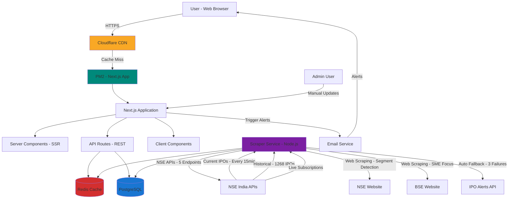

# High Level Architecture

## Technical Summary

IPODhan employs a **monolithic Next.js fullstack architecture** deployed on Windows Server 2022 VPS infrastructure. The frontend leverages Next.js 15's App Router with React 19 Server Components for optimal SEO and performance, while the backend uses Next.js API Routes for RESTful endpoints and separate Node.js services for data scraping/aggregation.

**Data Architecture**: PostgreSQL 16 serves as the primary database with Redis 7.2+ caching for frequently accessed IPO data. The system integrates with **NSE India APIs** (primary authoritative source - 1,272+ IPOs coverage), BSE website scraping (SME IPO focus), and IPO Alerts API (tertiary fallback). NSE integration includes 5 endpoints: current/upcoming IPOs, live subscription data, IPO details, historical IPOs (1,268 records), and intelligent segment detection via web scraping (100% data completeness achieved Oct 2025).

**Infrastructure**: Cloudflare provides CDN, SSL, and DDoS protection. This architecture prioritizes **sub-2-second page loads**, **99.5% uptime during peak periods**, and **cost-efficiency** on shared VPS infrastructure—directly addressing the performance gaps in competitor platforms (Chittorgarh, InvestorGain). The scraping infrastructure achieves 95%+ success rate with automatic failover and market-aware scheduling (15-min intervals during market hours).

## Platform and Infrastructure Choice

**Platform:** Windows Server 2022 VPS (existing, shared with other sites)

**Key Services:**
- **Application Host**: PM2 (Node.js process manager for Next.js)
- **Database**: PostgreSQL 16 (existing instance, "ipodhan" database)
- **Cache**: Redis (in-memory cache for IPO data)
- **CDN/Edge**: Cloudflare (DNS, SSL/TLS, caching, DDoS protection)
- **Web Scraping**: Puppeteer (headless browser for NSE/BSE scraping)
- **Task Scheduler**: Node-cron (scheduled data updates)
- **Email Service**: Not required for MVP (Phase 2 feature)

**Deployment Host and Regions:**
- Primary: VPS location (to be configured)
- CDN: Cloudflare global edge network (automatic)

## Repository Structure

**Structure:** Monorepo (single repository, multiple packages)

**Monorepo Tool:** npm workspaces (built-in, no additional tooling required)

**Package Organization:**
```
ipodhan/
├── web/                    # Next.js frontend + API routes
├── scraper/                # Data scraping service (separate Node.js process)
├── packages/
│   └── shared/             # Shared TypeScript types, utilities
```

## High Level Architecture Diagram



## Architectural Patterns

**1. Monolithic Architecture with Service Separation**
- **Description:** Single Next.js application handles frontend and API, with separate scraper service
- **Rationale:** Simplifies deployment on shared VPS, reduces infrastructure complexity, allows independent scaling of scraper

**2. Server-Side Rendering (SSR) + Static Generation (SSG)**
- **Description:** Use Next.js App Router's React Server Components for dynamic pages, Static Site Generation for historical IPO pages
- **Rationale:** SSR for current/upcoming IPOs (real-time data), SSG for closed IPOs (static, SEO-optimized, CDN-cacheable). Achieves <2s page loads per PRD.

**3. API Routes Pattern (Backend for Frontend)**
- **Description:** Next.js API Routes serve as RESTful backend, co-located with frontend
- **Rationale:** Simplifies data fetching, type-safe client-server communication (shared types), eliminates CORS complexity

**4. Repository Pattern (Data Access Layer)**
- **Description:** Abstract database queries behind repository interfaces (e.g., `IPORepository`, `SubscriptionRepository`)
- **Rationale:** Enables testing with mock data, future database migration flexibility, clean separation of business logic from data access

**5. Cache-Aside Pattern**
- **Description:** Check Redis cache before database queries, populate cache on miss, TTL-based invalidation
- **Rationale:** Reduces database load for frequently accessed IPO data, ensures sub-second response times for cached pages

**6. Scheduled Job Pattern (Cron-based Data Sync)**
- **Description:** Node-cron schedules scraper to run every 15-30 minutes, update database and invalidate cache
- **Rationale:** Ensures data freshness (PRD requirement: "subscription status updated within 15 minutes"), decouples scraping from user requests

**7. Component-Based UI (Atomic Design)**
- **Description:** shadcn/ui components (atoms) composed into molecules (IPO cards) and organisms (IPO listings)
- **Rationale:** Reusability, consistency with front-end spec design system, maintainability for AI-driven development

**8. Progressive Disclosure (Lazy Loading)**
- **Description:** Tier 1 data (company name, subscription status) loads immediately, Tier 2 (financials) lazy-loaded via tabs
- **Rationale:** Achieves <2s initial page load (per PRD), improves perceived performance, reduces data transfer for mobile users

**9. Multi-Tier Data Sourcing with Intelligent Fallback (Story 11.3-11.4)**
- **Description:** Tiered data acquisition strategy: NSE APIs (primary) → BSE Web Scraping (supplementary) → IPO Alerts API (fallback)
- **Implementation:**
  - **Tier 1 (Primary)**: NSE India APIs - 5 endpoints for current/historical IPOs, real-time subscriptions, segment detection
    - Coverage: 1,272+ IPOs (4 current, 1,268 historical)
    - Success Rate: 100% (tested Oct 2025)
    - Update Frequency: Every 15 minutes (market hours)
  - **Tier 2 (Supplementary)**: BSE website scraping for SME IPOs and dual-listed offerings
    - Merge Logic: Adds 'BSE' to `listingExchanges` array for dual-listed IPOs
    - Focus: SME platform coverage (BSE is primary SME exchange)
  - **Tier 3 (Fallback)**: IPO Alerts API triggered after 3 consecutive scraper failures
    - Rate Limited: 100 requests/hour with in-memory tracking
    - Authority: NEVER overwrites NSE/BSE data (logs discrepancies only)
  - **Segment Detection**: Intelligent web scraping for NULL segments (100% completeness achieved Oct 2025)
    - Process: API fetch → NULL detection → Web scrape detail page → Extract security type → Map to segment
    - Backfill Script: `web/scripts/backfill-null-segments.ts` for historical data
- **Rationale:**
  - Ensures 95%+ data availability even during primary source failures
  - NSE as authoritative source (most reliable for regulatory data)
  - BSE critical for comprehensive SME IPO coverage
  - Automatic failover minimizes manual intervention
  - Web scraping fills API data gaps (segment detection)
- **Resilience Features:**
  - Cookie-based session management with auto-refresh on 401/403 errors
  - Exponential backoff retry logic (1s → 2s → 4s)
  - Backward-compatible parsers for API format changes (Oct 2025 format migration handled gracefully)
  - Comprehensive error logging to `scraper_logs` table

**10. Market-Aware Scheduled Data Sync (Story 7.4)**
- **Description:** Dynamic scraper scheduling based on market hours and IPO activity patterns
- **Implementation:**
  - **Market Hours** (9 AM-5 PM weekdays): Every 15 minutes (NSE/BSE scrapers)
  - **After Hours** (5 PM-9 AM weekdays): Every 30 minutes
  - **Weekends**: Every 1 hour
  - **Historical IPOs**: Weekly (Sunday midnight)
- **Job Locking**: Redis-based distributed locks prevent overlapping runs (TTL: 5 min for scrapers)
- **Health Checks**: Every 5 minutes with threshold-based alerts (WARNING: 1hr, CRITICAL: 2hr)
- **Daily Summaries**: 8 AM reports with success rates, durations, and error analysis
- **Rationale:**
  - Higher frequency during market hours when subscription data changes rapidly
  - Reduces server load during low-activity periods
  - Prevents resource contention with distributed locks
  - Ensures fresh data for user-facing pages (<15 min latency requirement)

---
