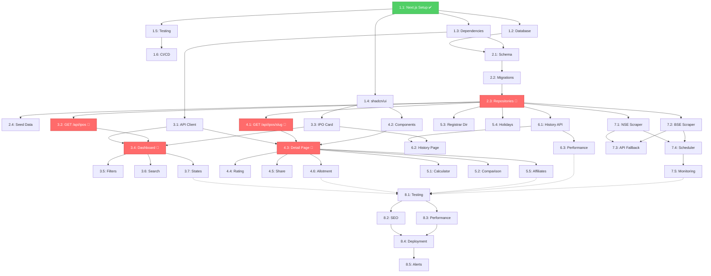

# IPODhan Dependency Matrix

This document maps all story dependencies to ensure proper sequencing and identify the critical path.

---

## Critical Path Visualization



**Legend:**
- 🟢 Green = Completed
- 🔴 Red = Critical Path (blocks many stories)
- ⚪ White = Standard dependency
- `-.->` Dotted = Optional/parallel dependency

---

## Dependency Table

| Story | Requires (Blockers) | Blocks (Downstream) | Can Parallel With |
|-------|---------------------|---------------------|-------------------|
| **1.1** | None | 1.2, 1.3, 1.4, 1.5 | None |
| **1.2** | 1.1 | 2.1 | 1.3, 1.4, 1.5 |
| **1.3** | 1.1 | 2.1, 3.1 | 1.2, 1.4, 1.5 |
| **1.4** | 1.1 | 3.3, 4.2 | 1.2, 1.3, 1.5 |
| **1.5** | 1.1 | 1.6 | 1.2, 1.3, 1.4 |
| **1.6** | 1.5 | None (improves all) | 2.1, 2.2 |
| **2.1** | 1.2, 1.3 | 2.2 | 1.4, 1.5, 1.6 |
| **2.2** | 2.1 | 2.3 | None |
| **2.3** 🔴 | 2.2 | 2.4, 3.2, 4.1, 5.3, 5.4, 6.1, 7.1, 7.2 | None |
| **2.4** | 2.3 | None (test data) | 3.1, 3.3 |
| **3.1** | 1.3 | 3.4, 4.3 | 2.4, 3.2, 3.3 |
| **3.2** 🔴 | 2.3 | 3.4 | 3.1, 3.3 |
| **3.3** | 1.4 | 3.4, 6.2 | 3.1, 3.2 |
| **3.4** 🔴 | 3.1, 3.2, 3.3 | 3.5, 3.6, 3.7 | None |
| **3.5** | 3.4 | None | 3.6, 3.7 |
| **3.6** | 3.4 | None | 3.5, 3.7 |
| **3.7** | 3.4 | None | 3.5, 3.6 |
| **4.1** 🔴 | 2.3 | 4.3 | 3.1, 4.2 |
| **4.2** | 1.4 | 4.3 | 3.1, 4.1 |
| **4.3** 🔴 | 3.1, 4.1, 4.2 | 4.4, 4.5, 4.6, 5.1, 5.2, 5.5 | None |
| **4.4** | 4.3 | None | 4.5, 4.6, 5.x |
| **4.5** | 4.3 | None | 4.4, 4.6, 5.x |
| **4.6** | 4.3 | None | 4.4, 4.5, 5.x |
| **5.1** | 4.3 | None | 5.2, 5.3, 5.4, 5.5 |
| **5.2** | 4.3 | None | 5.1, 5.3, 5.4, 5.5 |
| **5.3** | 2.3 | None | 5.1, 5.2, 5.4, 5.5 |
| **5.4** | 2.3 | None | 5.1, 5.2, 5.3, 5.5 |
| **5.5** | 4.3 | None | 5.1, 5.2, 5.3, 5.4 |
| **6.1** | 2.3 | 6.2, 6.3 | 5.x |
| **6.2** | 6.1, 3.3 | None | 6.3, 5.x |
| **6.3** | 6.1 | None | 6.2, 5.x |
| **7.1** | 2.3 | 7.3, 7.4 | 7.2 |
| **7.2** | 2.3 | 7.3, 7.4 | 7.1 |
| **7.3** | 7.1, 7.2 | None | 7.4 |
| **7.4** | 7.1, 7.2 | 7.5 | 7.3 |
| **7.5** | 7.4 | None | None |
| **8.1** | All epics | 8.2, 8.3, 8.4 | None |
| **8.2** | 8.1 | 8.4 | 8.3 |
| **8.3** | 8.1 | 8.4 | 8.2 |
| **8.4** | 8.2, 8.3 | 8.5 | None |
| **8.5** | 8.4 | None | None |

---

## Blocking Analysis

### Most Blocking Stories (by downstream impact)

| Story | Blocks Count | Impact Level | Must Complete By |
|-------|--------------|--------------|------------------|
| **2.3: Repository Layer** | 8 stories | 🔴 CRITICAL | End of Week 2 |
| **4.3: IPO Detail Page** | 5 stories | 🔴 CRITICAL | End of Week 6 |
| **3.4: Dashboard Page** | 3 stories | 🟡 HIGH | End of Week 4 |
| **2.1: Database Schema** | 1 story | 🟡 HIGH | Mid Week 2 |
| **7.4: Scheduler** | 1 story | 🟢 MEDIUM | End of Week 10 |

**Key Insight:** Story 2.3 (Repository Layer) is the BIGGEST blocker. If this slips by even 1 day, it delays 8 downstream stories.

---

## Parallelization Opportunities

### Week 1 (4 parallel tracks possible)
```
Track A: 1.2 (Database) → 2.1 (Schema)
Track B: 1.3 (Dependencies)
Track C: 1.4 (shadcn/ui)
Track D: 1.5 (Testing) → 1.6 (CI/CD)
```

### Week 3 (3 parallel tracks)
```
Track A: 3.1 (API Client) → 3.4 (Dashboard)
Track B: 3.2 (API Route) → 3.4 (Dashboard)
Track C: 3.3 (IPO Card) → 3.4 (Dashboard)

All converge at 3.4 (cannot parallelize)
```

### Week 7 (Epics 5 & 6 fully parallel)
```
Epic 5: All 5 tools can run in parallel (independent)
Epic 6: All 3 stories can run in parallel
Total: 8 parallel stories possible
```

### Week 9 (2 parallel scrapers)
```
Track A: 7.1 (NSE) → 7.4 (Scheduler)
Track B: 7.2 (BSE) → 7.4 (Scheduler)
Track C: 7.3 (Fallback API) - after 7.1 + 7.2
```

---

## Risk Mitigation Strategy

### If Story 2.3 (Repository) Delays:
**Impact:** Delays 8 stories, pushes project by 1+ weeks
**Mitigation:**
1. Start 2.3 immediately after 2.2 (no gap)
2. Assign most senior developer
3. Daily standup check-in on progress
4. Prepare mock repositories if delays continue (allows API work to start)

### If Story 3.4 (Dashboard) Delays:
**Impact:** Delays first user-visible feature, affects morale
**Mitigation:**
1. Ensure 3.1, 3.2, 3.3 complete on time (no slip)
2. Reduce scope: Basic filters only, defer advanced features
3. Accept technical debt if needed (refactor later)

### If Story 4.3 (Detail Page) Delays:
**Impact:** Delays 5 tool features (Epic 5)
**Mitigation:**
1. Epic 5 & 6 can work in parallel (not blocked by each other)
2. Start Epic 6 (History) early if 4.3 delays
3. Defer Epic 5 tools to Week 8 if needed

---

## Sequencing Rules

**Rule 1:** Never start a story until ALL "REQUIRES" are completed
**Rule 2:** If a story has 3+ blockers, consider splitting it
**Rule 3:** Critical path stories get priority assignment (senior devs)
**Rule 4:** Stories with 5+ downstream blocks get daily progress checks
**Rule 5:** If a story slips 2+ days, reassess entire timeline

---

## Definition of "Done" for Dependencies

A story is only considered complete (and unblocks downstream) when:
- ✅ All acceptance criteria met
- ✅ Tests passing (unit + integration)
- ✅ Code reviewed and merged to main
- ✅ Documentation updated
- ✅ No known blockers for dependent stories

**Example:** Story 2.3 (Repository) is NOT done until:
- Repositories work in isolation (unit tests pass)
- Repositories work with real DB (integration tests pass)
- APIs can import and use them (verified with sample)
- Performance benchmarks met (<100ms queries)

---

## Recommended Workflow

1. **Monday:** Review dependency matrix, confirm no blockers for week
2. **Daily:** Standup focuses on critical path stories first
3. **Wednesday:** Mid-week check: Are we on track for story completion?
4. **Friday:** Ensure critical path stories completed or escalate immediately
5. **Sprint Review:** Validate no hidden dependencies discovered

---

This dependency matrix should be reviewed and updated weekly as the project progresses.
