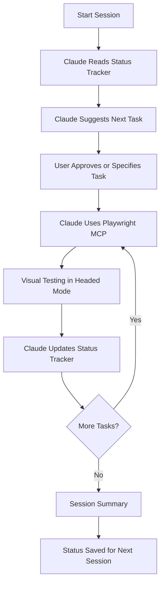

# IPODhan UI Testing Documentation

**Last Updated**: 2025-11-12
**Status**: Active - Ready to Start Testing
**Quick Start**: See [TESTING_SESSION_PROMPT.md](./TESTING_SESSION_PROMPT.md)

---

## 📚 Documentation Overview

This directory contains all UI testing documentation for the IPODhan application, including the comprehensive testing plan, Playwright MCP workflows, and real-time status tracking.

---

## 🎯 Quick Start

### **Start a New Testing Session**

1. **Copy this prompt** and give it to Claude Code:

```
Continue IPODhan UI testing. Read docs/07-testing/TESTING_STATUS_TRACKER.md to see current progress, then proceed with the next task using Playwright MCP in headed mode. Update status tracker in real-time. Reference docs/07-testing/PLAYWRIGHT_MCP_WORKFLOWS.md for commands.
```

2. **Claude will**:
   - ✅ Read the current testing status
   - ✅ Suggest next steps or continue previous work
   - ✅ Use Playwright MCP in headed mode (you see the browser)
   - ✅ Update the status tracker as work progresses
   - ✅ Save screenshots and document findings

3. **That's it!** Testing will begin and progress will be tracked automatically.

---

## 📁 Files in This Directory

### **Primary Documents**

| File | Purpose | When to Use |
|------|---------|-------------|
| **[README.md](./README.md)** | Overview & navigation (this file) | Always start here |
| **[TESTING_STATUS_TRACKER.md](./TESTING_STATUS_TRACKER.md)** | Real-time progress tracking | Every session (auto-updated) |
| **[TESTING_SESSION_PROMPT.md](./TESTING_SESSION_PROMPT.md)** | Prompt templates to start sessions | Copy prompts from here |

### **Reference Documents**

| File | Purpose | When to Use |
|------|---------|-------------|
| **[COMPREHENSIVE_UI_TESTING_PLAN.md](./COMPREHENSIVE_UI_TESTING_PLAN.md)** | Complete 11-week testing plan | Planning & understanding phases |
| **[PLAYWRIGHT_MCP_WORKFLOWS.md](./PLAYWRIGHT_MCP_WORKFLOWS.md)** | MCP command reference & workflows | During testing (command lookup) |
| **[TESTING_STRATEGY_UPDATE_SUMMARY.md](./TESTING_STRATEGY_UPDATE_SUMMARY.md)** | What changed & why | Understanding new approach |
| **[MCP_STATUS_REPORT.md](./MCP_STATUS_REPORT.md)** | MCP server status | Technical reference |
| **[CHROME_DEVTOOLS_MCP_INTEGRATION.md](./CHROME_DEVTOOLS_MCP_INTEGRATION.md)** | Chrome DevTools setup | Week 6 (performance testing) |

---

## 🎓 Testing Workflow

### **The Three-Document System**

```
1. TESTING_SESSION_PROMPT.md
   └─> Copy prompt to start session
       ↓
2. TESTING_STATUS_TRACKER.md
   └─> Claude reads current status
   └─> Claude updates status in real-time
       ↓
3. PLAYWRIGHT_MCP_WORKFLOWS.md
   └─> Claude references commands
   └─> Executes testing workflows
```

### **Session Flow**



---

## 🔧 Testing Approach

### **60-30-10 Strategy**

- **60% Playwright MCP (Headed Mode)**: Interactive visual verification
  - You see the browser in real-time
  - Claude assists with UI exploration
  - Quick manual checks
  - Screenshot documentation

- **30% Native Playwright (Automated)**: CI/CD regression tests
  - Automated test scripts
  - Cross-browser testing (7 browsers)
  - CI/CD pipeline integration

- **10% Chrome DevTools MCP**: Performance profiling
  - CPU profiling
  - Memory leak detection
  - Network analysis
  - Core Web Vitals measurement

---

## 📊 Testing Plan Overview

### **11-Week Plan**

| Week | Phase | Status | Testing Method |
|------|-------|--------|----------------|
| **Week 1** | Critical Bug Fixes | 🔴 Not Started | Playwright MCP (70%) |
| **Week 2** | Visual Regression & Accessibility | ⏸️ Pending | Playwright MCP (80%) |
| **Week 3-4** | Component Testing | ⏸️ Pending | Mixed (40% MCP / 60% Native) |
| **Week 5** | Data Validation | ⏸️ Pending | Mixed (50% MCP / 50% Native) |
| **Week 6** | Performance Testing | ⏸️ Pending | Chrome DevTools MCP (50%) |
| **Week 7** | Cross-Browser Testing | ⏸️ Pending | Native Playwright (80%) |
| **Week 8** | Missing Coverage | ⏸️ Pending | Mixed (40% MCP / 60% Native) |
| **Week 9** | Error Handling | ⏸️ Pending | Mixed (40% MCP / 60% Native) |
| **Week 10** | CI/CD Integration | ⏸️ Pending | Native Playwright (90%) |
| **Week 11** | Documentation | ⏸️ Pending | Documentation work |

### **Current Phase: Week 1 - Critical Bug Fixes**

**Tasks**:
1. ✅ Investigate Dashboard crash (Playwright MCP)
2. ✅ Investigate IPO Detail crash (Playwright MCP)
3. ✅ Document homepage console errors (Playwright MCP)

**Progress**: 0/3 tasks completed

---

## 🎯 Current Testing Goals

### **Immediate (This Session)**
- [ ] Start Phase 1: Bug Fixes
- [ ] Investigate Dashboard crash using Playwright MCP
- [ ] Capture screenshots and console errors
- [ ] Document findings in status tracker

### **This Week (Week 1)**
- [ ] Complete all Phase 1 tasks (3 tasks)
- [ ] Fix all P0 production blockers
- [ ] Document hydration issues
- [ ] Create baseline for regression tests

### **This Month (Weeks 1-4)**
- [ ] Complete Phases 1-4
- [ ] Achieve 80% component coverage (currently 29%)
- [ ] Create 50+ visual regression baselines
- [ ] Implement WCAG AA accessibility testing

---

## 📋 How to Use This Documentation

### **Scenario 1: First Time Testing**

1. Read this README (you are here)
2. Open [TESTING_SESSION_PROMPT.md](./TESTING_SESSION_PROMPT.md)
3. Copy the "Quick Start" prompt
4. Give it to Claude Code
5. Follow Claude's guidance

### **Scenario 2: Continue Previous Work**

1. Open [TESTING_SESSION_PROMPT.md](./TESTING_SESSION_PROMPT.md)
2. Use the "Continue Previous Work" prompt
3. Claude reads [TESTING_STATUS_TRACKER.md](./TESTING_STATUS_TRACKER.md)
4. Claude continues from where you left off

### **Scenario 3: Test Specific Feature**

1. Open [TESTING_SESSION_PROMPT.md](./TESTING_SESSION_PROMPT.md)
2. Use a specific feature prompt (e.g., "Bug Investigation")
3. Customize with your feature details
4. Claude follows the workflow

### **Scenario 4: Learn MCP Commands**

1. Open [PLAYWRIGHT_MCP_WORKFLOWS.md](./PLAYWRIGHT_MCP_WORKFLOWS.md)
2. Browse common commands
3. Reference during testing

### **Scenario 5: Check Testing Progress**

1. Open [TESTING_STATUS_TRACKER.md](./TESTING_STATUS_TRACKER.md)
2. See real-time status
3. Review completed tasks, blockers, metrics

---

## 🚀 Example Prompts

### **Start Testing Now**
```
Read docs/07-testing/TESTING_STATUS_TRACKER.md and start Phase 1: Bug Fixes using Playwright MCP in headed mode. Begin with Task 1.1: Investigate Dashboard crash. Update status tracker as we progress.
```

### **Continue From Where We Left Off**
```
Continue IPODhan UI testing from where we left off. Read docs/07-testing/TESTING_STATUS_TRACKER.md for current status, then proceed with next task using Playwright MCP.
```

### **Test Specific Page**
```
Test the homepage using Playwright MCP:
1. Navigate to http://localhost:3000
2. Check console errors
3. Take accessibility snapshot
4. Test navigation tabs
5. Create visual regression baseline
6. Update docs/07-testing/TESTING_STATUS_TRACKER.md
```

---

## 📈 Progress Tracking

### **Real-Time Updates**

The [TESTING_STATUS_TRACKER.md](./TESTING_STATUS_TRACKER.md) file is updated in real-time by Claude during testing:

- ✅ Task completion status
- 📸 Screenshot locations
- 🐛 Issues found
- 📊 Testing metrics
- ⏱️ Time tracking
- 🚧 Blockers

### **Cross-Session Persistence**

All progress is saved to disk, so you can:
- Stop and resume anytime
- Continue across multiple sessions
- Track progress over days/weeks
- Never lose testing context

---

## 🎓 Key Concepts

### **Playwright MCP in Headed Mode**

**What it means**:
- Browser opens visually (you see it)
- Claude navigates and interacts with the UI
- You can observe what's happening in real-time
- Perfect for visual verification and debugging

**Why it's better**:
- ✅ Visual confirmation (no blind testing)
- ✅ Interactive debugging (see issues immediately)
- ✅ Fast iteration (no script writing for manual checks)
- ✅ Screenshot documentation (visual proof)

### **Status Tracker Philosophy**

**Single Source of Truth**:
- All testing status in one file
- Updated in real-time during sessions
- Persists across sessions
- No progress lost

**Always Up-to-Date**:
- Claude updates after each task
- Immediate reflection of current state
- No manual tracking needed

---

## 🔧 Troubleshooting

### **Issue: Status Tracker Not Updating**

**Solution**: Remind Claude to update:
```
Update docs/07-testing/TESTING_STATUS_TRACKER.md to mark Task X as complete with findings: [your notes]
```

### **Issue: Don't Know What to Test Next**

**Solution**: Ask Claude to read status:
```
Read docs/07-testing/TESTING_STATUS_TRACKER.md and suggest what to test next based on priorities and current progress.
```

### **Issue: Need to Find a Specific Command**

**Solution**: Reference the workflows guide:
```
Show me how to [action] using Playwright MCP. Reference docs/07-testing/PLAYWRIGHT_MCP_WORKFLOWS.md.
```

### **Issue: Server Not Running**

**Solution**: Check background bash processes:
```bash
# Check if dev server is running
lsof -i :3000

# Or restart
cd web && npm run dev
```

---

## 📊 Success Metrics

### **Testing Goals**

| Metric | Current | Target | Week |
|--------|---------|--------|------|
| **Component Coverage** | 29% | 80% | Week 3-4 |
| **Page Coverage** | 80% | 95% | Week 8 |
| **Visual Baselines** | 0 | 50+ | Week 2 |
| **Accessibility (WCAG AA)** | ~15% | 100% | Week 2 |
| **Performance (LCP)** | 2.8-3.2s | <2.5s | Week 6 |
| **Bug Fixes** | 0 | 3 P0 bugs | Week 1 |

### **Quality Indicators**

- ✅ All P0 bugs fixed
- ✅ No production crashes
- ✅ WCAG AA compliant
- ✅ Performance targets met
- ✅ 80%+ test coverage

---

## 🎯 Quick Links

### **Start Testing**
- [Session Prompt Template](./TESTING_SESSION_PROMPT.md) - Copy prompts here

### **Track Progress**
- [Status Tracker](./TESTING_STATUS_TRACKER.md) - Real-time status

### **Reference Guides**
- [Testing Plan](./COMPREHENSIVE_UI_TESTING_PLAN.md) - Full 11-week plan
- [MCP Workflows](./PLAYWRIGHT_MCP_WORKFLOWS.md) - Command reference
- [Strategy Summary](./TESTING_STRATEGY_UPDATE_SUMMARY.md) - What changed

### **Technical Docs**
- [MCP Status](./MCP_STATUS_REPORT.md) - Server status
- [Chrome DevTools Integration](./CHROME_DEVTOOLS_MCP_INTEGRATION.md) - Performance testing

---

## 💡 Pro Tips

### **Tip 1: Always Check Status First**
Before each session, check [TESTING_STATUS_TRACKER.md](./TESTING_STATUS_TRACKER.md) to see where you left off.

### **Tip 2: Use Headed Mode for Visual Work**
Playwright MCP runs in headed mode by default - take advantage of seeing the browser.

### **Tip 3: Screenshot Everything**
Visual documentation is proof of testing. Take screenshots liberally.

### **Tip 4: Update Status Immediately**
Don't wait until end of session - update status after each task.

### **Tip 5: Document Blockers Right Away**
If you hit a blocker, document it in status tracker immediately.

---

## 🎬 Ready to Start?

### **Your Next Step**

1. Open [TESTING_SESSION_PROMPT.md](./TESTING_SESSION_PROMPT.md)
2. Copy the "Quick Start" prompt
3. Give it to Claude Code
4. Begin testing!

Or simply give Claude this prompt now:

```
Read docs/07-testing/TESTING_STATUS_TRACKER.md and start Phase 1 testing using Playwright MCP in headed mode. Begin with investigating the Dashboard crash. Update status tracker as we progress. Reference docs/07-testing/PLAYWRIGHT_MCP_WORKFLOWS.md for commands.
```

---

**Documentation maintained by**: Claude Code + Testing Team
**Last reviewed**: 2025-11-12
**Next review**: After Phase 1 completion

---

## 📞 Need Help?

- **For prompt templates**: See [TESTING_SESSION_PROMPT.md](./TESTING_SESSION_PROMPT.md)
- **For command reference**: See [PLAYWRIGHT_MCP_WORKFLOWS.md](./PLAYWRIGHT_MCP_WORKFLOWS.md)
- **For current status**: See [TESTING_STATUS_TRACKER.md](./TESTING_STATUS_TRACKER.md)
- **For overall plan**: See [COMPREHENSIVE_UI_TESTING_PLAN.md](./COMPREHENSIVE_UI_TESTING_PLAN.md)

**Ask Claude**: "Help me understand [topic] from the testing documentation"
