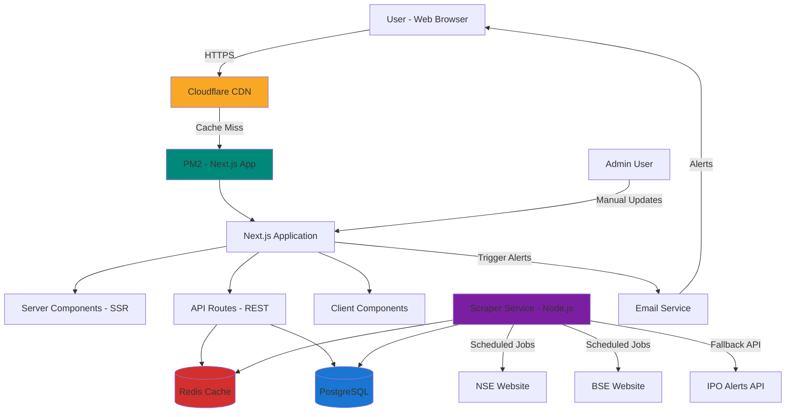
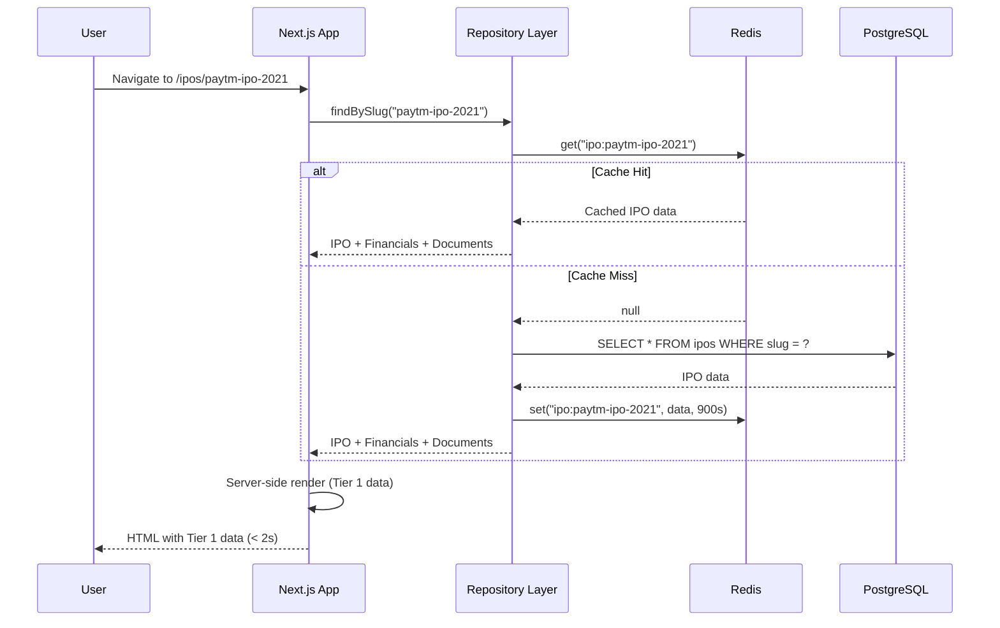
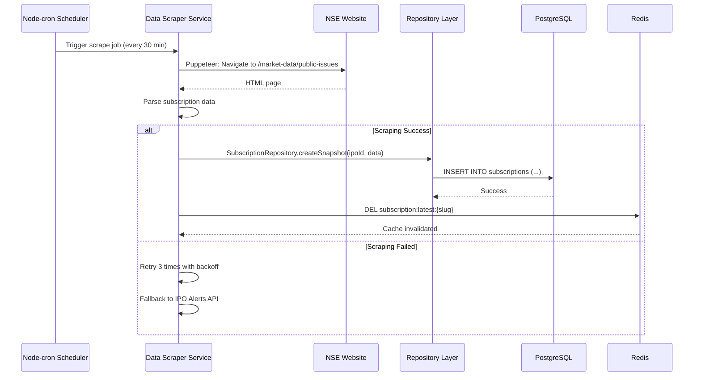
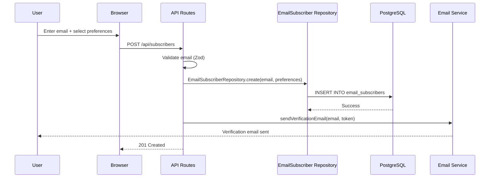

# IPODhan Fullstack Architecture Document

**Version:** 1.2
**Last Updated:** 2025-10-05
**Author:** Winston (Architect)

---

## Introduction

This document outlines the complete fullstack architecture for **IPODhan**, including backend systems, frontend implementation, and their integration. It serves as the single source of truth for AI-driven development, ensuring consistency across the entire technology stack.

This unified approach combines what would traditionally be separate backend and frontend architecture documents, streamlining the development process for modern fullstack applications where these concerns are increasingly intertwined.

### Starter Template or Existing Project

**Status:** Existing Next.js project detected in `/web` directory

Based on analysis of the repository:
- **Current State:** A Next.js 14 project has been initialized with TypeScript, Tailwind CSS, and shadcn/ui
- **Existing Choices:**
  - Framework: Next.js 14 (App Router)
  - Language: TypeScript
  - Styling: Tailwind CSS
  - UI Components: shadcn/ui (Radix UI primitives)
  - Package Manager: npm

**Architectural Constraints from Existing Setup:**
- Must use Next.js App Router patterns (not Pages Router)
- Component structure follows shadcn/ui conventions
- Tailwind CSS for all styling (no CSS Modules or styled-components)
- TypeScript strict mode enabled

**What Can Be Modified:**
- State management solution (currently none selected)
- API architecture (REST vs tRPC vs GraphQL)
- Database ORM/query builder
- Authentication provider
- Testing framework
- Data fetching patterns

### Change Log

| Date | Version | Description | Author |
|------|---------|-------------|--------|
| 2025-10-05 | 1.0 | Initial architecture document created from PRD, brief, and front-end spec | Winston (Architect) |
| 2025-10-05 | 1.1 | Documentation reconciliation: Updated tech stack (React Context, flexible email provider), added new data models (MarketHoliday, Registrar, PeerCompany, BrokerAffiliate, IPONews), enhanced GMP fields, added MVP phase markers throughout | Winston (Architect) |
| 2025-10-05 | 1.2 | Final MVP scope alignment: Moved Email Alerts and IPO News to Phase 2, confirmed full peer comparison metrics for MVP, clarified 4 core tools as MVP features | Winston (Architect) |

---

### Phase Legend

Throughout this document, features and components are marked with phase indicators:

- 🔵 **MVP** - Must be implemented for initial launch
- 🟢 **Phase 2** - Post-MVP enhancements (3-6 months after launch)
- 🟣 **Phase 3** - Future considerations (6+ months after launch)

Unmarked items are foundational infrastructure required for MVP.

---

## High Level Architecture

### Technical Summary

IPODhan employs a **monolithic Next.js fullstack architecture** deployed on Windows Server 2022 VPS infrastructure. The frontend leverages Next.js 14's App Router with React Server Components for optimal SEO and performance, while the backend uses Next.js API Routes for RESTful endpoints and separate Node.js services for data scraping/aggregation. PostgreSQL serves as the primary database with Redis caching for frequently accessed IPO data. The system integrates with NSE/BSE websites via web scraping and third-party APIs (IPO Alerts) for fallback data. Cloudflare provides CDN, SSL, and DDoS protection. This architecture prioritizes **sub-2-second page loads**, **99.5% uptime during peak periods**, and **cost-efficiency** on shared VPS infrastructure—directly addressing the performance gaps in competitor platforms (Chittorgarh, InvestorGain).

### Platform and Infrastructure Choice

**Platform:** Windows Server 2022 VPS (existing, shared with other sites)

**Key Services:**
- **Application Host**: PM2 (Node.js process manager for Next.js)
- **Database**: PostgreSQL 16 (existing instance, "ipodhan" database)
- **Cache**: Redis (in-memory cache for IPO data)
- **CDN/Edge**: Cloudflare (DNS, SSL/TLS, caching, DDoS protection)
- **Web Scraping**: Puppeteer (headless browser for NSE/BSE scraping)
- **Task Scheduler**: Node-cron (scheduled data updates)
- **Email Service**: Not required for MVP (Phase 2 feature)

**Deployment Host and Regions:**
- Primary: VPS location (to be configured)
- CDN: Cloudflare global edge network (automatic)

### Repository Structure

**Structure:** Monorepo (single repository, multiple packages)

**Monorepo Tool:** npm workspaces (built-in, no additional tooling required)

**Package Organization:**
```
ipodhan/
├── web/                    # Next.js frontend + API routes
├── scraper/                # Data scraping service (separate Node.js process)
├── packages/
│   └── shared/             # Shared TypeScript types, utilities
```

### High Level Architecture Diagram



### Architectural Patterns

**1. Monolithic Architecture with Service Separation**
- **Description:** Single Next.js application handles frontend and API, with separate scraper service
- **Rationale:** Simplifies deployment on shared VPS, reduces infrastructure complexity, allows independent scaling of scraper

**2. Server-Side Rendering (SSR) + Static Generation (SSG)**
- **Description:** Use Next.js App Router's React Server Components for dynamic pages, Static Site Generation for historical IPO pages
- **Rationale:** SSR for current/upcoming IPOs (real-time data), SSG for closed IPOs (static, SEO-optimized, CDN-cacheable). Achieves <2s page loads per PRD.

**3. API Routes Pattern (Backend for Frontend)**
- **Description:** Next.js API Routes serve as RESTful backend, co-located with frontend
- **Rationale:** Simplifies data fetching, type-safe client-server communication (shared types), eliminates CORS complexity

**4. Repository Pattern (Data Access Layer)**
- **Description:** Abstract database queries behind repository interfaces (e.g., `IPORepository`, `SubscriptionRepository`)
- **Rationale:** Enables testing with mock data, future database migration flexibility, clean separation of business logic from data access

**5. Cache-Aside Pattern**
- **Description:** Check Redis cache before database queries, populate cache on miss, TTL-based invalidation
- **Rationale:** Reduces database load for frequently accessed IPO data, ensures sub-second response times for cached pages

**6. Scheduled Job Pattern (Cron-based Data Sync)**
- **Description:** Node-cron schedules scraper to run every 15-30 minutes, update database and invalidate cache
- **Rationale:** Ensures data freshness (PRD requirement: "subscription status updated within 15 minutes"), decouples scraping from user requests

**7. Component-Based UI (Atomic Design)**
- **Description:** shadcn/ui components (atoms) composed into molecules (IPO cards) and organisms (IPO listings)
- **Rationale:** Reusability, consistency with front-end spec design system, maintainability for AI-driven development

**8. Progressive Disclosure (Lazy Loading)**
- **Description:** Tier 1 data (company name, subscription status) loads immediately, Tier 2 (financials) lazy-loaded via tabs
- **Rationale:** Achieves <2s initial page load (per PRD), improves perceived performance, reduces data transfer for mobile users

---

## Tech Stack

This is the **DEFINITIVE technology selection** for IPODhan. All development must use these exact versions.

### Technology Stack Table

| Category | Technology | Version | Purpose | Rationale |
|----------|-----------|---------|---------|-----------|
| **Frontend Language** | TypeScript | 5.3+ | Type-safe frontend development | Prevents runtime errors, improves IDE support, enforces data model contracts |
| **Frontend Framework** | Next.js | 14.2+ | React framework with SSR/SSG | App Router for modern patterns, built-in API routes, excellent SEO, React Server Components |
| **UI Component Library** | shadcn/ui | Latest | Headless UI components | Already integrated, Radix UI primitives (accessibility), Tailwind-native styling |
| **State Management** | React Context | Built-in | Client state management | 🔵 **MVP** - Built-in solution, no extra dependencies, sufficient for filters/search/UI state |
| **Backend Language** | TypeScript (Node.js) | 5.3+ (Node 20 LTS) | Type-safe backend development | Same language as frontend enables code sharing, async I/O, Windows Server compatible |
| **Backend Framework** | Next.js API Routes | 14.2+ | RESTful API endpoints | Co-located with frontend, shared middleware, automatic TypeScript types |
| **API Style** | REST | - | HTTP API design | Simple, widely understood, HTTP caching support (critical for performance) |
| **Database** | PostgreSQL | 16+ | Relational database | Already available on VPS, ACID compliance, excellent full-text search, JSON columns |
| **ORM/Query Builder** | Drizzle ORM | 0.30+ | Type-safe database queries | Lightweight, SQL-like syntax, edge-ready, excellent TypeScript inference |
| **Cache** | Redis | 7.2+ | In-memory data cache | Sub-millisecond latency, reduces PostgreSQL load, pub/sub for real-time updates (Phase 2) |
| **File Storage** | Local Filesystem | - | DRHP PDF storage | Store scraped documents on VPS (free), sufficient for MVP |
| **Authentication** | NextAuth.js | 5.0+ (Auth.js) | User authentication (Phase 2) | Email/password + OAuth providers, session management, Next.js native integration |
| **Frontend Testing** | Vitest | 1.3+ | Component unit tests | Faster than Jest (Vite-based), compatible with Next.js, ESM-native |
| **Backend Testing** | Vitest | 1.3+ | API endpoint tests | Unified testing framework, fast execution, TypeScript-first |
| **E2E Testing** | Playwright | 1.42+ | End-to-end browser tests | Multi-browser support, auto-wait, excellent Windows support |
| **Build Tool** | Next.js CLI | 14.2+ | Production builds | Built-in to Next.js, tree-shaking and code-splitting optimized |
| **Bundler** | Turbopack | Built-in Next.js 14+ | Development bundler | 10x faster than Webpack for dev server |
| **Package Manager** | npm | 10+ | Dependency management | Already used in project, workspaces support for monorepo |
| **CSS Framework** | Tailwind CSS | 3.4+ | Utility-first styling | Already integrated, mobile-first responsive design, shadcn/ui compatible |
| **Data Scraping** | Puppeteer | 22+ | Headless browser scraping | Full JavaScript rendering, screenshot capability, stealth plugin |
| **Scheduled Jobs** | Node-cron | 3.0+ | Cron-based task scheduling | Simple syntax, in-process scheduling, lightweight |
| **API Client** | Native Fetch | Built-in Node 20+ | HTTP requests | No axios dependency needed, standard Web API |
| **Data Validation** | Zod | 3.22+ | Runtime type validation | Parse external API responses safely, validate user input, integrates with Drizzle ORM |
| **Email Service** | TBD (Resend/SendGrid/SES) | Latest | Transactional emails | 🟢 **Phase 2** - Email alerts for IPO notifications; evaluate Resend (3k/mo free), SendGrid (100/day), or AWS SES when implementing |
| **Analytics** | Google Analytics 4 | Latest (GA4) | Web analytics and user tracking | Industry standard, free tier unlimited, comprehensive event tracking, Google Search Console integration |
| **Error Tracking** | Sentry | Latest | Error monitoring | Free tier (5k events/month), source map support, performance monitoring |
| **Code Quality** | ESLint + Prettier | Latest | Linting and formatting | Next.js includes ESLint config, Prettier for consistent formatting |
| **CI/CD** | GitHub Actions | - | Automated testing and deployment | Free for public repos, Windows runner available |
| **Monitoring** | PM2 + Sentry | PM2 5.3+, Sentry Latest | Application monitoring | PM2 logs/metrics for process health, Sentry for error tracking |
| **Logging** | Pino | 8.19+ | Structured JSON logging | Fast (async logging), log levels, integrates with PM2 logs |

---

## Data Models

Based on the PRD and front-end spec, the following TypeScript interfaces will be shared between frontend and backend via the `packages/shared` package.

### IPO (Core Entity)

**Purpose:** Represents an Initial Public Offering with all associated details including company information, issue details, timeline, and performance metrics.

**Key Attributes:**
- `id`: string (UUID) - Unique identifier
- `companyName`: string - Company/issuer name
- `slug`: string - URL-friendly identifier
- `category`: enum - IPO type (MAINBOARD | SME | RIGHTS | NCD)
- `sector`: string - Industry sector
- `issueSize`: number - Total issue size in INR crores
- `priceRange`: object - Min and max price per share
- `lotSize`: number - Minimum application quantity
- `status`: enum - Current status (UPCOMING | OPEN | CLOSED | LISTED)
- `dates`: object - Timeline (open, close, allotment, listing dates)
- `rating`: number | null - IPODhan rating (1-5 stars)

**Relationships:**
- Has many `Subscription` records
- Has many `GMPRecord` entries
- Has one `FinancialData` record
- Has many `Document` records
- Has one `ListingPerformance` record (if listed)

#### TypeScript Interface

```typescript
// packages/shared/src/types/ipo.ts

export enum IPOCategory {
  MAINBOARD = 'MAINBOARD',
  SME = 'SME',
  RIGHTS = 'RIGHTS',
  NCD = 'NCD'
}

export enum IPOStatus {
  UPCOMING = 'UPCOMING',
  OPEN = 'OPEN',
  CLOSED = 'CLOSED',
  LISTED = 'LISTED'
}

export interface PriceRange {
  min: number;
  max: number;
}

export interface IPODates {
  openDate: Date;
  closeDate: Date;
  allotmentDate: Date | null;
  listingDate: Date | null;
}

export interface IPO {
  id: string;
  companyName: string;
  slug: string;
  category: IPOCategory;
  sector: string;
  issueSize: number;
  priceRange: PriceRange;
  lotSize: number;
  status: IPOStatus;
  dates: IPODates;
  companyDescription: string;
  faceValue: number;
  listingExchanges: ('NSE' | 'BSE')[];
  registrar: string;
  leadManagers: string[];
  rating: number | null;
  ratingRationale: string | null;
  createdAt: Date;
  updatedAt: Date;
}
```

### Subscription

**Purpose:** Tracks detailed category-wise subscription data with granular breakdown matching NSE/BSE reporting format.

**Key Attributes:**
- High-level categories: QIB, NII, Retail, Employee, Others, Total
- Granular breakdown: Anchor Investors, Retail HNI, Retail Others, bNII, sNII
- Additional metrics: Total applications, total shares bid, shares offered

#### TypeScript Interface

```typescript
// packages/shared/src/types/subscription.ts

export interface Subscription {
  id: string;
  ipoId: string;
  timestamp: Date;

  // High-level categories
  qibSubscription: number;
  niiSubscription: number;
  retailSubscription: number;
  totalSubscription: number;
  employeeSubscription: number;
  othersSubscription: number;

  // Granular breakdown
  anchorInvestorSubscription: number;
  retailHNISubscription: number;
  retailOthersSubscription: number;
  bNIISubscription: number;
  sNIISubscription: number;

  // Additional metrics
  totalApplications: number;
  totalSharesBid: number;
  sharesOffered: number;
}
```

### GMPRecord 🔵 **MVP**

**Purpose:** Grey Market Premium historical tracking for trend visualization with enhanced grey market data.

**Key Attributes:**
- Current GMP and estimated listing price
- Subject rate (unofficial grey market lot rate)
- Kostak rate (selling allotment rights rate)
- Sauda details (grey market trading information)
- Historical tracking for 7-day trend charts

#### TypeScript Interface

```typescript
// packages/shared/src/types/gmp.ts

export interface GMPRecord {
  id: string;
  ipoId: string;
  timestamp: Date;

  // Core GMP data
  gmp: number;
  expectedListingPrice: number;

  // Enhanced grey market data 🔵 MVP
  subjectRate: number | null;        // Subject/Safalya rate
  kostakRate: number | null;         // Kostak rate (allotment rights)
  saudaDetails: string | null;       // Additional grey market trading info

  // Metadata
  source: string;                    // Data source attribution
}
```

### FinancialData

**Purpose:** Company financial metrics for IPO evaluation.

#### TypeScript Interface

```typescript
// packages/shared/src/types/financial.ts

export interface YearlyFinancial {
  fy2022: number;
  fy2023: number;
  fy2024: number;
}

export interface FinancialData {
  id: string;
  ipoId: string;
  revenue: YearlyFinancial;
  profit: YearlyFinancial;
  netWorth: number;
  peRatio: number | null;
  eps: number | null;
  roe: number | null;
  debtToEquity: number | null;
  reservesAndSurplus: number;
  totalAssets: number;
  totalBorrowing: number;
}
```

### ListingPerformance

**Purpose:** Post-listing performance metrics.

#### TypeScript Interface

```typescript
// packages/shared/src/types/listing.ts

export interface ListingPerformance {
  id: string;
  ipoId: string;
  listingPrice: number;
  issuePrice: number;
  listingGainPercent: number;
  currentPrice: number | null;
  currentGainPercent: number | null;
  lastUpdated: Date;
}
```

### Document

**Purpose:** DRHP, RHP, prospectus, and other IPO documents.

#### TypeScript Interface

```typescript
// packages/shared/src/types/document.ts

export enum DocumentType {
  DRHP = 'DRHP',
  RHP = 'RHP',
  PROSPECTUS = 'PROSPECTUS',
  ADDENDUM = 'ADDENDUM'
}

export interface Document {
  id: string;
  ipoId: string;
  type: DocumentType;
  title: string;
  url: string;
  fileSize: number | null;
  uploadedAt: Date;
}
```

### EmailSubscriber 🟢 **Phase 2**

**Purpose:** Email alert subscriptions for IPO notifications (deferred to Phase 2).

#### TypeScript Interface

```typescript
// packages/shared/src/types/subscriber.ts

export interface AlertPreferences {
  newIPOs: boolean;
  closingSoon: boolean;
  allotment: boolean;
  listing: boolean;
}

export interface EmailSubscriber {
  id: string;
  email: string;
  isVerified: boolean;
  preferences: AlertPreferences;
  subscribedAt: Date;
  unsubscribedAt: Date | null;
}
```

### MarketHoliday 🔵 **MVP**

**Purpose:** Store NSE/BSE trading holidays for IPO calendar and timeline calculations.

**Key Attributes:**
- Holiday date and description
- Exchange applicability (NSE, BSE, or both)
- Holiday type (trading, settlement)

#### TypeScript Interface

```typescript
// packages/shared/src/types/holiday.ts

export enum Exchange {
  NSE = 'NSE',
  BSE = 'BSE',
  BOTH = 'BOTH'
}

export enum HolidayType {
  TRADING = 'TRADING',           // No trading on this day
  SETTLEMENT = 'SETTLEMENT',     // Settlement holiday only
  BOTH = 'BOTH'                  // Both trading and settlement
}

export interface MarketHoliday {
  id: string;
  date: Date;
  description: string;             // e.g., "Republic Day", "Diwali"
  exchange: Exchange;              // NSE, BSE, or BOTH
  type: HolidayType;
  year: number;                    // For filtering by year
  createdAt: Date;
  updatedAt: Date;
}
```

### Registrar 🔵 **MVP**

**Purpose:** Store IPO registrar contact information for allotment checking and investor queries.

**Key Attributes:**
- Registrar company details
- Contact information (email, phone, website)
- Allotment check URL pattern

#### TypeScript Interface

```typescript
// packages/shared/src/types/registrar.ts

export interface Registrar {
  id: string;
  name: string;                    // e.g., "Link Intime India Pvt Ltd"
  shortName: string;               // e.g., "Link Intime"
  email: string;                   // Contact email for IPO queries
  phone: string | null;
  website: string;
  allotmentCheckUrl: string | null; // URL pattern for allotment status
  address: string | null;
  logoUrl: string | null;
  active: boolean;                 // Is registrar currently active?
  createdAt: Date;
  updatedAt: Date;
}
```

### PeerCompany 🔵 **MVP** (Full Metrics)

**Purpose:** Store peer company financial data for IPO comparison analysis.

**Key Attributes:**
- Company identification and sector
- Full financial metrics for comprehensive comparison (MVP decision: include all metrics)

#### TypeScript Interface

```typescript
// packages/shared/src/types/peer.ts

export interface PeerCompany {
  id: string;
  ipoId: string;                   // Associated IPO for comparison
  companyName: string;
  sector: string;
  isListed: boolean;

  // 🔵 MVP - Full financial metrics for comprehensive peer comparison
  peRatio: number | null;          // Price-to-Earnings ratio
  eps: number | null;              // Earnings Per Share (Basic)
  dilutedEps: number | null;       // Diluted EPS
  ronw: number | null;             // Return on Net Worth %
  nav: number | null;              // Net Asset Value per share
  pbvRatio: number | null;         // Price-to-Book Value ratio
  financialStatementType: 'CONSOLIDATED' | 'STANDALONE' | null;

  // Metadata
  dataSource: string;              // Source of peer data
  lastUpdated: Date;
  createdAt: Date;
}
```

### BrokerAffiliate 🔵 **MVP** (Simple Links - No Tracking)

**Purpose:** Store broker affiliate partnership information for IPO application links.

**Key Attributes:**
- Broker details and affiliate URL
- Phase 2 will add click tracking and conversion analytics

#### TypeScript Interface

```typescript
// packages/shared/src/types/affiliate.ts

export interface BrokerAffiliate {
  id: string;
  brokerName: string;              // e.g., "Zerodha", "AngelOne"
  brokerLogo: string | null;
  affiliateUrl: string;            // Affiliate link URL
  displayText: string;             // CTA text (e.g., "Open Demat Account")
  active: boolean;
  displayOrder: number;            // Order in UI

  // 🟢 Phase 2 - Analytics
  // clickCount: number;
  // conversionCount: number;
  // lastClickedAt: Date;

  createdAt: Date;
  updatedAt: Date;
}
```

### IPONews 🟢 **Phase 2** (Post-MVP)

**Purpose:** Store IPO-specific news, updates, and announcements.

**Key Attributes:**
- News content and metadata
- Association with specific IPO
- News categorization (Announcement, Update, Allotment, Listing)

#### TypeScript Interface

```typescript
// packages/shared/src/types/news.ts

export enum NewsType {
  ANNOUNCEMENT = 'ANNOUNCEMENT',
  UPDATE = 'UPDATE',
  ANALYSIS = 'ANALYSIS',
  ALLOTMENT = 'ALLOTMENT',
  LISTING = 'LISTING'
}

export interface IPONews {
  id: string;
  ipoId: string;
  title: string;
  content: string;                 // Full news content (markdown supported)
  excerpt: string;                 // Short summary for listing
  type: NewsType;
  source: string;                  // Source attribution (e.g., "NSE", "IPODhan Editorial")
  externalUrl: string | null;      // Link to original article if external
  publishedAt: Date;
  createdAt: Date;
  updatedAt: Date;
}
```

---

## API Specification

IPODhan uses a **REST API** pattern with Next.js API Routes. All endpoints follow RESTful conventions and return JSON responses.

### Base URL

- **Production:** `https://ipodhan.com/api`
- **Development:** `http://localhost:3000/api`

### Authentication

No authentication required for MVP (all endpoints public, read-only). Phase 2 will add NextAuth.js for user accounts.

### Key Endpoints

**IPO Endpoints:** 🔵 **MVP**
- `GET /api/ipos` - List IPOs with filtering and pagination
- `GET /api/ipos/{slug}` - Get detailed IPO information
- `GET /api/ipos/{slug}/subscription` - Get subscription history
- `GET /api/ipos/{slug}/gmp` - Get GMP history (enhanced with Subject/Kostak rates)
- `GET /api/ipos/{slug}/peers` - Get peer comparison data (full metrics: P/E, EPS, Diluted EPS, RoNW, NAV, P/BV)
- `POST /api/ipos/compare` - Compare multiple IPOs side-by-side

**Search:** 🔵 **MVP**
- `GET /api/search` - Search IPOs by company name

**Email Subscription:** 🟢 **Phase 2**
- `POST /api/subscribers` - Subscribe to email alerts
- `GET /api/subscribers/verify` - Verify email subscription
- `POST /api/subscribers/unsubscribe` - Unsubscribe from alerts

**Market Holidays:** 🔵 **MVP**
- `GET /api/holidays` - Get market holidays (query params: year, exchange)
- `GET /api/holidays/upcoming` - Get next 5 upcoming holidays

**Registrar Directory:** 🔵 **MVP**
- `GET /api/registrars` - List all active registrars
- `GET /api/registrars/{id}` - Get registrar details
- `GET /api/registrars/search` - Search registrars by name

**Tools & Calculators:** 🔵 **MVP**
- `POST /api/tools/lot-calculator` - Calculate lot size based on investment amount
  - Body: `{ ipoSlug: string, investmentAmount: number }`
  - Returns: `{ lots: number, totalShares: number, totalAmount: number }`
- `POST /api/tools/compare` - Compare multiple IPOs side-by-side
  - Body: `{ ipoSlugs: string[] }`
  - Returns: Comparison data for selected IPOs

**Broker Affiliates:** 🔵 **MVP**
- `GET /api/affiliates` - Get active broker affiliate links (simple, no tracking)

**IPO News:** 🟢 **Phase 2**
- `GET /api/ipos/{slug}/news` - Get news for specific IPO
- `GET /api/news` - Get all IPO news (paginated, filterable by type)

**Health Check:** 🔵 **MVP**
- `GET /api/health` - Service health status

### Caching Strategy

| Endpoint | Cache TTL | Invalidation |
|----------|-----------|--------------|
| `GET /api/ipos` (listing) | 5 minutes | On scraper update |
| `GET /api/ipos/{slug}` (detail) | 15 minutes | On scraper update |
| `GET /api/ipos/{slug}/subscription` | 10 minutes | On scraper update |
| `GET /api/ipos/{slug}/gmp` | 30 minutes | On manual GMP entry |

### Rate Limiting

- **Search endpoint:** 10 requests/minute per IP
- **Email subscription:** 5 requests/hour per IP
- **Other endpoints:** 100 requests/minute per IP

---

## Components

The system is composed of the following major logical components across the fullstack application.

### Frontend Application (Next.js App)

**Responsibility:** User-facing web application providing IPO browsing, search, detailed views, and email subscription management.

**Key Interfaces:**
- Server Components: Render IPO listings, detail pages with Tier 1 data (SSR)
- Client Components: Interactive UI (filters, tabs, tooltips, modals)
- API Client Service: Fetch data from Next.js API routes
- State Management: React Context for filters, search state, UI state 🔵 **MVP**

**Technology Stack:** Next.js 14 App Router, React Server Components, TypeScript, Tailwind CSS, React Context

### API Routes (Next.js Backend)

**Responsibility:** RESTful API layer handling IPO data queries, search, subscription data, GMP history, and email subscription endpoints.

**Key Interfaces:**
- `GET /api/ipos` - List IPOs with filters
- `GET /api/ipos/[slug]` - IPO detail
- `GET /api/ipos/[slug]/subscription` - Subscription data
- `POST /api/subscribers` - Email subscription

**Technology Stack:** Next.js API Routes, TypeScript, Drizzle ORM, Redis client, Zod validation

### Repository Layer (Data Access)

**Responsibility:** Abstract database queries and caching logic behind clean interfaces.

**Key Interfaces:**
- `IPORepository.findAll(filters)` - Query IPOs with filters/pagination
- `IPORepository.findBySlug(slug)` - Get IPO by slug with relations
- `SubscriptionRepository.findByIPO(ipoId)` - Get subscription history
- `GMPRepository.findByIPO(ipoId, days)` - Get GMP history

**Technology Stack:** Drizzle ORM, Redis, TypeScript interfaces

### Data Scraper Service (Separate Node.js Process)

**Responsibility:** Automated data collection from NSE/BSE websites and IPO Alerts API.

**Key Interfaces:**
- `scrapeNSE()` - Scrape NSE IPO page
- `scrapeBSE()` - Scrape BSE IPO page
- `fetchIPOAlertsAPI()` - Fallback API
- `updateDatabase()` - Upsert scraped data
- `invalidateCache()` - Clear Redis cache

**Technology Stack:** Node.js, TypeScript, Puppeteer, Node-cron, Axios

### Email Service (Alert System) 🟢 **Phase 2**

**Responsibility:** Send transactional emails for subscription verification and IPO alerts (deferred to Phase 2).

**Key Interfaces:**
- `sendVerificationEmail(email, token)`
- `sendIPOAlert(subscribers, ipo, alertType)`

**Technology Stack:** TBD (Resend/SendGrid/AWS SES), React Email

### Shared Types Package

**Responsibility:** Single source of truth for TypeScript interfaces used across frontend, backend, and scraper.

**Key Interfaces:**
- Data model interfaces (IPO, Subscription, GMPRecord, etc.)
- Enums (IPOStatus, IPOCategory, DocumentType)
- Utility functions (date formatting, currency formatting)

**Technology Stack:** TypeScript, Zod

### Cache Layer (Redis)

**Responsibility:** In-memory caching for frequently accessed data.

**Technology Stack:** Redis 7.2+, ioredis client library

### Database (PostgreSQL)

**Responsibility:** Persistent storage for all IPO data, subscription history, GMP records, financials, documents, and email subscribers.

**Technology Stack:** PostgreSQL 16+, managed via Drizzle ORM migrations

---

## External APIs

### IPO Alerts API

- **Purpose:** Fallback/supplementary data source for IPO listings
- **Documentation:** https://api.ipoalerts.in/docs
- **Base URL:** `https://api.ipoalerts.in`
- **Rate Limits:** Assumed 100 requests/hour (verify with provider)
- **Key Endpoints:**
  - `GET /ipos?status=open` - Fetch currently open IPOs
  - `GET /ipos?status=upcoming` - Fetch upcoming IPOs
  - `GET /ipos/{id}` - Get detailed IPO information

**Integration Notes:** Use as secondary source; NSE/BSE scraping is primary. Cross-reference data to detect discrepancies. Handle API downtime gracefully.

### NSE India Website (Web Scraping)

- **Purpose:** Primary source for real-time subscription data and IPO announcements
- **Base URL:** `https://www.nseindia.com/`
- **Authentication:** None (public website), requires proper headers
- **Key Endpoints:**
  - `/market-data/public-issues` - Current and upcoming IPO listings

**Integration Notes:** Use Puppeteer for JavaScript-heavy pages. Implement stealth plugin to avoid detection. Exponential backoff on errors. Fallback to IPO Alerts API if scraping fails 3+ consecutive times.

### BSE India Website (Web Scraping)

- **Purpose:** Primary source for BSE-listed IPOs and SME IPO coverage
- **Base URL:** `https://www.bseindia.com/`
- **Key Endpoints:**
  - `/publicissue.html` - IPO listings with subscription status

**Integration Notes:** BSE critical for SME IPO coverage. May use Cheerio for static pages to improve performance.

### Resend API

- **Purpose:** Transactional email delivery
- **Documentation:** https://resend.com/docs
- **Base URL:** `https://api.resend.com`
- **Authentication:** API key (header: `Authorization: Bearer <key>`)
- **Rate Limits:** Free tier: 3,000 emails/month, 100 emails/day

**Integration Notes:** Use React Email for templating. Non-blocking error handling. Monitor bounce rate and spam complaints.

### Google Analytics 4 (GA4)

- **Purpose:** Web analytics, user behavior tracking
- **Documentation:** https://developers.google.com/analytics/devguides/collection/ga4
- **Authentication:** Measurement ID

**Integration Notes:** Track pageviews, events (IPO card clicks, tab switches), custom dimensions (IPO status, category, sector). Implement cookie consent banner for GDPR compliance.

---

## Core Workflows

### Workflow 1: User Views IPO Detail Page



### Workflow 2: Data Scraper Updates IPO Subscription Data



### Workflow 3: User Subscribes to Email Alerts 🟢 **Phase 2**

*(This workflow will be implemented in Phase 2 when email alert functionality is added)*



---

## Database Schema

The following PostgreSQL schema implements the data models defined earlier.

### Key Tables

- **ipos** - Core IPO entity with company information, issue details, timeline
- **subscriptions** - Category-wise subscription data snapshots
- **gmp_records** - Grey Market Premium historical tracking
- **financial_data** - Company financial metrics (one-to-one with ipos)
- **documents** - DRHP, RHP, prospectus documents
- **listing_performance** - Post-listing performance metrics
- **email_subscribers** - Email alert subscriptions (Phase 2)

### Important Indexes

- `idx_ipos_status` - Filter by IPO status
- `idx_ipos_slug` - Lookup by slug (unique)
- `idx_ipos_company_name_trgm` - Full-text fuzzy search
- `idx_subscriptions_ipo_timestamp` - Latest subscription queries
- `idx_gmp_records_ipo_timestamp` - GMP history queries

### Full Schema

See complete SQL DDL in the Database Schema section above (includes CREATE TABLE statements, indexes, constraints, triggers, and extensions).

---

## Frontend Architecture

### Component Organization

```
web/src/
├── app/                           # Next.js App Router
│   ├── layout.tsx                 # Root layout
│   ├── page.tsx                   # Homepage
│   ├── ipos/[slug]/page.tsx       # IPO detail (SSR)
│   └── api/                       # API Routes
├── components/
│   ├── ui/                        # shadcn/ui components
│   ├── ipo/                       # IPO-specific components
│   ├── layout/                    # Header, footer, navigation
│   └── shared/                    # Loading, errors, tooltips
├── lib/
│   ├── api-client.ts              # Frontend API client
│   ├── repositories/              # Data access layer
│   ├── services/                  # Business logic
│   └── db/                        # Database client + schema
├── contexts/                      # React Context state management
└── hooks/                         # Custom React hooks
```

### State Management Architecture

**Client State (React Context):**
- Filter preferences (status, category, sector, sort)
- Search query
- UI state (mobile menu open/closed)

**Server State (React Server Components):**
- IPO data fetched server-side, passed as props

**URL State:**
- Filter params synced to URL query string for shareable links

### Routing Architecture

**File-based routing with App Router:**
- `/` → Homepage (current IPOs)
- `/ipos` → All IPOs with filters
- `/ipos/[slug]` → IPO detail (SSR)
- `/upcoming` → Upcoming IPOs
- `/closed` → Closed/Listed IPOs
- `/sme` → SME IPOs
- `/search` → Search results
- `/subscribe` → Email subscription

### Frontend Services Layer

**API Client (`lib/api-client.ts`):**
- `getIPOs(params)` - List IPOs with filters
- `getIPOBySlug(slug)` - Get IPO detail
- `getSubscription(slug, latest)` - Get subscription data
- `getGMP(slug, days)` - Get GMP history
- `searchIPOs(query, limit)` - Search by company name
- `subscribeEmail(email, preferences)` - Subscribe to alerts

**Error Handling:**
- Type-safe `APIError` class with status codes
- Automatic error boundary integration
- User-friendly error messages

---

## Backend Architecture

### Service Architecture

**Controller/Route Organization:**
- `app/api/ipos/route.ts` - GET /api/ipos
- `app/api/ipos/[slug]/route.ts` - GET /api/ipos/[slug]
- `app/api/ipos/[slug]/subscription/route.ts` - GET subscription data
- `app/api/search/route.ts` - GET search
- `app/api/subscribers/route.ts` - POST subscribe

### Repository Pattern Implementation

**IPORepository:**
- `findAll(filters)` - Query with filters and pagination
- `findBySlug(slug)` - Get IPO with relations
- `search(query)` - Fuzzy search by company name

**SubscriptionRepository:**
- `findByIPO(ipoId)` - Get subscription history
- `findLatest(ipoId)` - Get latest snapshot
- `createSnapshot(ipoId, data)` - Insert new subscription data

**Cache-Aside Pattern:**
- Check Redis before PostgreSQL
- Populate cache on miss with TTL
- Explicit invalidation on data updates

### Database Architecture

**Drizzle ORM Schema:**
- Type-safe schema definitions in `lib/db/schema.ts`
- Relations for type-safe joins
- Migration-based schema management

**Connection Pooling:**
- Max 20 connections
- Idle timeout: 30 seconds
- Connection timeout: 2 seconds

---

## Unified Project Structure

```
ipodhan/
├── .github/workflows/              # CI/CD
├── web/                            # Next.js app
│   ├── src/
│   │   ├── app/                    # App Router + API routes
│   │   ├── components/             # React components
│   │   ├── lib/                    # Backend code (repos, services, db)
│   │   ├── stores/                 # Zustand stores
│   │   └── hooks/                  # Custom hooks
│   ├── public/                     # Static assets
│   ├── tests/                      # Unit, integration, E2E tests
│   └── package.json
├── scraper/                        # Data scraper service
│   ├── src/
│   │   ├── scrapers/               # NSE, BSE, IPO Alerts scrapers
│   │   └── services/               # Data merger, cache invalidator
│   └── package.json
├── packages/
│   └── shared/                     # Shared TypeScript types
│       └── src/types/              # IPO, Subscription, etc.
├── docs/                           # Documentation
│   ├── prd.md
│   ├── front-end-spec.md
│   ├── brief.md
│   └── architecture.md
├── scripts/                        # Build/deploy scripts
└── package.json                    # Root workspace config
```

**Workspace Configuration (Root package.json):**
```json
{
  "workspaces": ["web", "scraper", "packages/*"],
  "scripts": {
    "dev": "npm run dev --workspace=web",
    "dev:scraper": "npm run dev --workspace=scraper",
    "dev:all": "concurrently \"npm run dev\" \"npm run dev:scraper\"",
    "test": "npm run test --workspaces --if-present"
  }
}
```

---

## Development Workflow

### Prerequisites

```bash
# Node.js 20 LTS
node --version  # v20.x.x

# PostgreSQL 16
psql --version  # 16.x

# Redis 7.2
redis-cli --version  # 7.2.x
```

### Initial Setup

```bash
# Clone repository
git clone https://github.com/yourusername/ipodhan.git
cd ipodhan

# Install dependencies
npm install

# Configure environment variables
cp web/.env.example web/.env.local
cp scraper/.env.example scraper/.env

# Create database
psql -U postgres
CREATE DATABASE ipodhan;
CREATE USER ipodhan_user WITH PASSWORD 'your_password';
GRANT ALL PRIVILEGES ON DATABASE ipodhan TO ipodhan_user;

# Run migrations
npm run migrate

# Start development
npm run dev:all
```

### Development Commands

```bash
# Start all services
npm run dev:all

# Start frontend only
npm run dev

# Start scraper only
npm run dev:scraper

# Run tests
npm run test
npm run test:unit
npm run test:integration
npm run test:e2e

# Lint and format
npm run lint
npm run format

# Database operations
npm run migrate
npm run db:studio
npm run db:push

# Build for production
npm run build
npm run build:scraper
```

### Environment Configuration

**Frontend (.env.local):**
- `DATABASE_URL` - PostgreSQL connection string
- `REDIS_URL` - Redis connection string
- ~~`RESEND_API_KEY`~~ - Email service API key (Phase 2 only)
- `NEXT_PUBLIC_GA_MEASUREMENT_ID` - Google Analytics
- `NEXT_PUBLIC_SENTRY_DSN` - Error tracking
- `JWT_SECRET` - Email verification tokens

**Backend (.env):**
- `DATABASE_URL` - PostgreSQL connection string
- `REDIS_URL` - Redis connection string
- `IPO_ALERTS_API_KEY` - IPO Alerts API
- `SCRAPER_SCHEDULE` - Cron expression
- ~~`RESEND_API_KEY`~~ - Email service (Phase 2 only)

---

## Deployment Architecture

### Deployment Strategy

**Frontend Deployment:**
- **Platform:** Self-hosted on Windows Server 2022 VPS
- **Build Command:** `npm run build`
- **Output Directory:** `web/.next/`
- **CDN/Edge:** Cloudflare CDN for static assets

**Backend Deployment:**
- **Platform:** Same VPS as frontend
- **Deployment Method:**
  - Web API Routes: Bundled with Next.js
  - Scraper Service: Separate PM2 process

### CI/CD Pipeline

**GitHub Actions Workflow:**
1. **CI (on PR):** Lint → Type check → Run tests → Build
2. **CD (on main push):** Build → Create deployment package → SCP to VPS → SSH deploy → Restart PM2

### Environments

| Environment | Frontend URL | Backend URL | Purpose |
|-------------|-------------|-------------|---------|
| Development | http://localhost:3000 | http://localhost:3000/api | Local development |
| Production | https://ipodhan.com | https://ipodhan.com/api | Live environment |

### PM2 Configuration

```javascript
// ecosystem.config.js
module.exports = {
  apps: [
    {
      name: 'ipodhan-web',
      script: 'node_modules/next/dist/bin/next',
      args: 'start',
      instances: 2,
      exec_mode: 'cluster',
      env: { NODE_ENV: 'production', PORT: 3000 },
      max_memory_restart: '500M',
    },
    {
      name: 'ipodhan-scraper',
      script: 'dist/index.js',
      instances: 1,
      exec_mode: 'fork',
      env: { NODE_ENV: 'production' },
      max_memory_restart: '300M',
      cron_restart: '0 3 * * *',
    },
  ],
};
```

---

## Security and Performance

### Security Requirements

**Frontend Security:**
- **CSP Headers:** Content Security Policy to prevent XSS
- **XSS Prevention:** React automatic escaping + DOMPurify for markdown
- **Secure Storage:** No sensitive data in LocalStorage
- **HTTPS Only:** Enforced via Cloudflare

**Backend Security:**
- **Input Validation:** Zod schemas for all API endpoints
- **Rate Limiting:** Redis-based rate limiting (10-100 req/min depending on endpoint)
- **CORS Policy:** Allow all origins (public API)
- **SQL Injection Prevention:** Drizzle ORM parameterized queries only

**Authentication Security (Phase 2):**
- **Token Storage:** httpOnly, Secure, SameSite cookies
- **Session Management:** 30-day expiry, sliding sessions
- **Password Policy:** 12+ characters, bcrypt hashing

### Performance Optimization

**Frontend Performance:**
- **Bundle Size Target:** <200KB initial JS (gzipped)
- **Loading Strategy:** Dynamic imports for charts/modals
- **Caching Strategy:** Aggressive CDN caching for static assets
- **Image Optimization:** next/image for all images
- **Font Optimization:** next/font for Google Fonts

**Performance Targets:** 🔵 **MVP**
- **Aspirational Goal:** <2 seconds total page load time
- **Minimum Requirement (Web Vitals):**
  - Performance Score: >90
  - LCP (Largest Contentful Paint): <2.5s
  - FID (First Input Delay): <100ms
  - CLS (Cumulative Layout Shift): <0.1
- **Rationale:** Target 2s as aggressive goal for competitive advantage, use LCP <2.5s as measurable success metric aligned with industry standards

**Backend Performance:**
- **Response Time Target:** <500ms (p95)
- **Database Queries:** <100ms with proper indexes
- **Cache Hits:** <10ms via Redis
- **Connection Pooling:** Max 20 PostgreSQL connections

**Caching Strategy:**

| Data Type | Cache TTL | Invalidation |
|-----------|-----------|--------------|
| IPO List | 5 min | On scraper update |
| IPO Detail | 15 min | On scraper update |
| Subscription | 10 min | On scraper update |
| GMP History | 30 min | On manual entry |

---

## Testing Strategy

### Testing Pyramid

```
         E2E Tests (10%)
        /              \
     Integration (20%)
    /                  \
   Unit Tests (70%)
```

### Test Organization

**Unit Tests (Vitest):**
- `tests/unit/components/` - React component tests
- `tests/unit/lib/repositories/` - Repository tests
- `tests/unit/lib/services/` - Service tests

**Integration Tests (Vitest):**
- `tests/integration/api/` - API route tests with real DB/Redis

**E2E Tests (Playwright):**
- `tests/e2e/` - Critical user flows (browsing, search, subscription)

### Coverage Targets

| Category | Target |
|----------|--------|
| Repository Layer | >90% |
| API Routes | >85% |
| React Components | >80% |
| Overall | >80% |

---

## Coding Standards

### Critical Fullstack Rules

- **Type Sharing:** Define types in `packages/shared/src/types/` only
- **API Calls:** Use API client service, never direct fetch()
- **Environment Variables:** Access through typed config objects
- **Error Handling:** All API routes use `withErrorHandler` middleware
- **State Updates:** Never mutate state directly
- **Database Queries:** Always use Repository layer
- **Input Validation:** Validate with Zod schemas
- **Cache Invalidation:** Explicit Redis key deletion on updates

### Naming Conventions

| Element | Convention | Example |
|---------|-----------|---------|
| Components | PascalCase | `IPOCard.tsx` |
| Hooks | camelCase with 'use' | `useIPOFilters.ts` |
| API Routes | kebab-case | `/api/ipos/[slug]` |
| Database Tables | snake_case | `ipos`, `subscriptions`, `gmp_records` |
| TypeScript Interfaces | PascalCase | `IPO`, `Subscription` |

---

## Error Handling Strategy

### Error Flow

All errors flow through the `withErrorHandler` middleware, which:
1. Catches exceptions
2. Logs to Pino with context
3. Reports to Sentry (if 5xx)
4. Returns standardized JSON error response

### Error Response Format

```json
{
  "error": {
    "code": "NOT_FOUND",
    "message": "IPO not found",
    "details": {},
    "timestamp": "2025-01-05T10:30:00.000Z",
    "requestId": "req_abc123"
  }
}
```

### Frontend Error Handling

- `APIError` class for type-safe error handling
- Error boundaries for unhandled errors
- User-friendly error messages
- Retry logic for network errors

### Backend Error Handling

- `withErrorHandler` middleware wraps all routes
- Automatic Zod validation error formatting
- Sentry integration for production errors
- Request ID tracking for debugging

---

## Monitoring and Observability

### Monitoring Stack

- **Frontend Monitoring:** Google Analytics 4 (Core Web Vitals, user behavior)
- **Backend Monitoring:** PM2 metrics (CPU, memory, restarts)
- **Error Tracking:** Sentry (errors, performance tracing)
- **Uptime Monitoring:** UptimeRobot (checks `/api/health` every 5 min)
- **Logs:** Pino structured logging to files

### Key Metrics

**Frontend:**
- Core Web Vitals (LCP, FID, CLS)
- JavaScript errors
- API response times
- User interactions

**Backend:**
- Request rate
- Error rate (5xx)
- Response time (p50, p95, p99)
- Database query performance
- Cache hit rate
- Scraper success rate

**Business:**
- Email subscriptions created
- IPO detail page views
- Search queries
- Filter usage

### Health Check Endpoint

`GET /api/health` returns:
```json
{
  "status": "healthy",
  "timestamp": "2025-01-05T10:30:00Z",
  "services": {
    "database": "healthy",
    "redis": "healthy"
  }
}
```

### Alerting

**Critical Alerts:**
- API health check fails (3 consecutive)
- Error rate >5%
- Scraper fails 3+ consecutive runs
- Memory usage >90%

**Notification Channels:**
- Email for critical alerts
- Sentry for error issues
- PM2 logs for scraper failures

---

## Conclusion

This architecture document provides comprehensive guidance for developing IPODhan as a high-performance, scalable IPO tracking platform. The monolithic Next.js fullstack architecture with separate scraper service balances simplicity (MVP requirements) with the ability to scale in future phases.

**Key Architectural Decisions:**
- Next.js 14 App Router for modern React patterns and optimal SEO
- Drizzle ORM for lightweight, type-safe database access
- Redis caching for sub-2-second page loads
- Repository pattern for clean data access abstraction
- Separate scraper service for independent scaling
- Comprehensive testing strategy (70/20/10 unit/integration/E2E)
- Security-first approach with input validation, rate limiting, and error tracking

**Next Steps:**
1. Review this architecture document with stakeholders
2. Set up development environment (PostgreSQL, Redis, Next.js project)
3. Implement database schema and migrations
4. Build core repositories and API routes
5. Develop frontend components based on front-end spec
6. Implement scraper service for NSE/BSE data collection
7. Deploy to VPS with PM2 and Cloudflare
8. Monitor production metrics and iterate

For questions or clarifications about this architecture, consult the PRD (`docs/prd.md`), front-end specification (`docs/front-end-spec.md`), or project brief (`docs/brief.md`).

---

**Document Status:** ✅ Production Ready
**Last Review:** 2025-10-05
**Next Review:** After MVP launch
