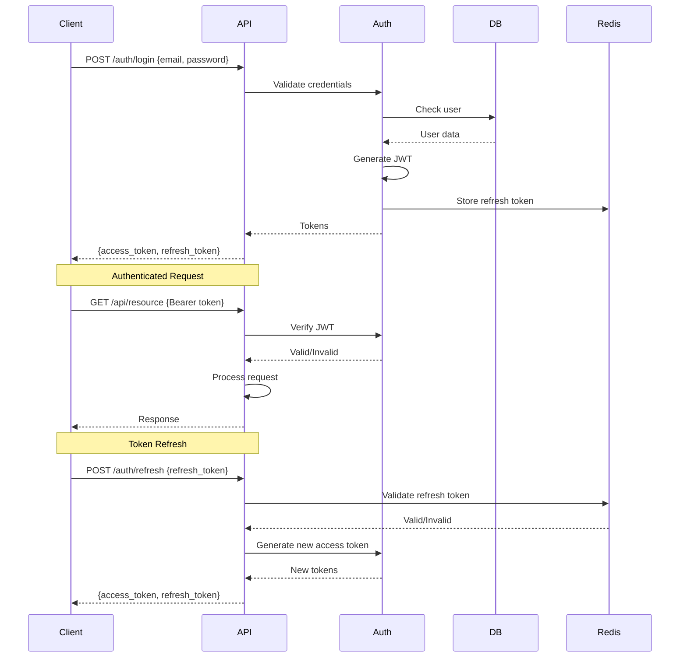

# Backend Architecture

## Service Architecture

### Controller/Route Organization
```
ipodhan-backend/src/
├── routes/
│   ├── ipos.routes.ts
│   ├── users.routes.ts
│   ├── auth.routes.ts
│   └── webhooks.routes.ts
├── controllers/
│   ├── ipoController.ts
│   ├── userController.ts
│   └── authController.ts
├── services/
│   ├── ipoService.ts
│   ├── scoreService.ts
│   ├── notificationService.ts
│   └── cacheService.ts
├── repositories/
│   ├── ipoRepository.ts
│   ├── userRepository.ts
│   └── scoreRepository.ts
├── middleware/
│   ├── auth.middleware.ts
│   ├── rateLimit.middleware.ts
│   └── validation.middleware.ts
├── utils/
│   ├── logger.ts
│   └── errors.ts
└── app.ts
```

### Controller Template
```typescript
// controllers/ipoController.ts
import { Request, Response, NextFunction } from 'express';
import { ipoService } from '../services/ipoService';
import { AppError } from '../utils/errors';

export class IPOController {
  async getIPOs(req: Request, res: Response, next: NextFunction) {
    try {
      const { status, category } = req.query;
      const ipos = await ipoService.getIPOs({ status, category });

      res.json({
        success: true,
        data: ipos,
        timestamp: new Date().toISOString(),
      });
    } catch (error) {
      next(error);
    }
  }

  async getIPODetails(req: Request, res: Response, next: NextFunction) {
    try {
      const { id } = req.params;
      const ipo = await ipoService.getIPOWithScore(id);

      if (!ipo) {
        throw new AppError('IPO not found', 404);
      }

      res.json({
        success: true,
        data: ipo,
        timestamp: new Date().toISOString(),
      });
    } catch (error) {
      next(error);
    }
  }
}
```

## Database Architecture

### Schema Design
```sql
-- Already defined in Database Schema section above
-- Additional materialized views for performance

CREATE MATERIALIZED VIEW current_ipo_scores AS
SELECT DISTINCT ON (ipo_id)
  ipo_id,
  total_score,
  verdict,
  confidence,
  reasoning,
  calculated_at
FROM ipo_scores
ORDER BY ipo_id, calculated_at DESC;

CREATE INDEX idx_current_scores_ipo ON current_ipo_scores(ipo_id);

-- Refresh every hour
REFRESH MATERIALIZED VIEW CONCURRENTLY current_ipo_scores;
```

### Data Access Layer
```typescript
// repositories/ipoRepository.ts
import { Pool } from 'pg';
import { IPO } from '@ipodhan/shared/types';
import { pool } from '../config/database';

export class IPORepository {
  async findAll(filter: { status?: string; category?: string }): Promise<IPO[]> {
    let query = 'SELECT * FROM ipos WHERE 1=1';
    const params: any[] = [];
    let paramIndex = 1;

    if (filter.status) {
      query += ` AND status = $${paramIndex++}`;
      params.push(filter.status);
    }

    if (filter.category) {
      query += ` AND category = $${paramIndex++}`;
      params.push(filter.category);
    }

    query += ' ORDER BY open_date DESC';

    const result = await pool.query(query, params);
    return result.rows;
  }

  async findById(id: string): Promise<IPO | null> {
    const result = await pool.query(
      'SELECT * FROM ipos WHERE id = $1',
      [id]
    );
    return result.rows[0] || null;
  }

  async create(ipo: Partial<IPO>): Promise<IPO> {
    const result = await pool.query(
      `INSERT INTO ipos (symbol, company_name, issue_size, price_band_low, price_band_high,
       lot_size, open_date, close_date, listing_date, status, category)
       VALUES ($1, $2, $3, $4, $5, $6, $7, $8, $9, $10, $11)
       RETURNING *`,
      [ipo.symbol, ipo.companyName, ipo.issueSize, ipo.priceBand?.low, ipo.priceBand?.high,
       ipo.lotSize, ipo.dates?.open, ipo.dates?.close, ipo.dates?.listing, ipo.status, ipo.category]
    );
    return result.rows[0];
  }
}
```

## Authentication and Authorization

### Auth Flow


### Middleware/Guards
```typescript
// middleware/auth.middleware.ts
import { Request, Response, NextFunction } from 'express';
import jwt from 'jsonwebtoken';
import { AppError } from '../utils/errors';

interface AuthRequest extends Request {
  user?: {
    id: string;
    email: string;
    tier: string;
  };
}

export const authenticate = async (
  req: AuthRequest,
  res: Response,
  next: NextFunction
) => {
  try {
    const token = req.headers.authorization?.replace('Bearer ', '');

    if (!token) {
      throw new AppError('Authentication required', 401);
    }

    const decoded = jwt.verify(token, process.env.JWT_SECRET!) as any;
    req.user = decoded;

    next();
  } catch (error) {
    if (error.name === 'TokenExpiredError') {
      next(new AppError('Token expired', 401));
    } else {
      next(new AppError('Invalid token', 401));
    }
  }
};

export const authorize = (...allowedTiers: string[]) => {
  return (req: AuthRequest, res: Response, next: NextFunction) => {
    if (!req.user || !allowedTiers.includes(req.user.tier)) {
      return next(new AppError('Insufficient permissions', 403));
    }
    next();
  };
};
```
