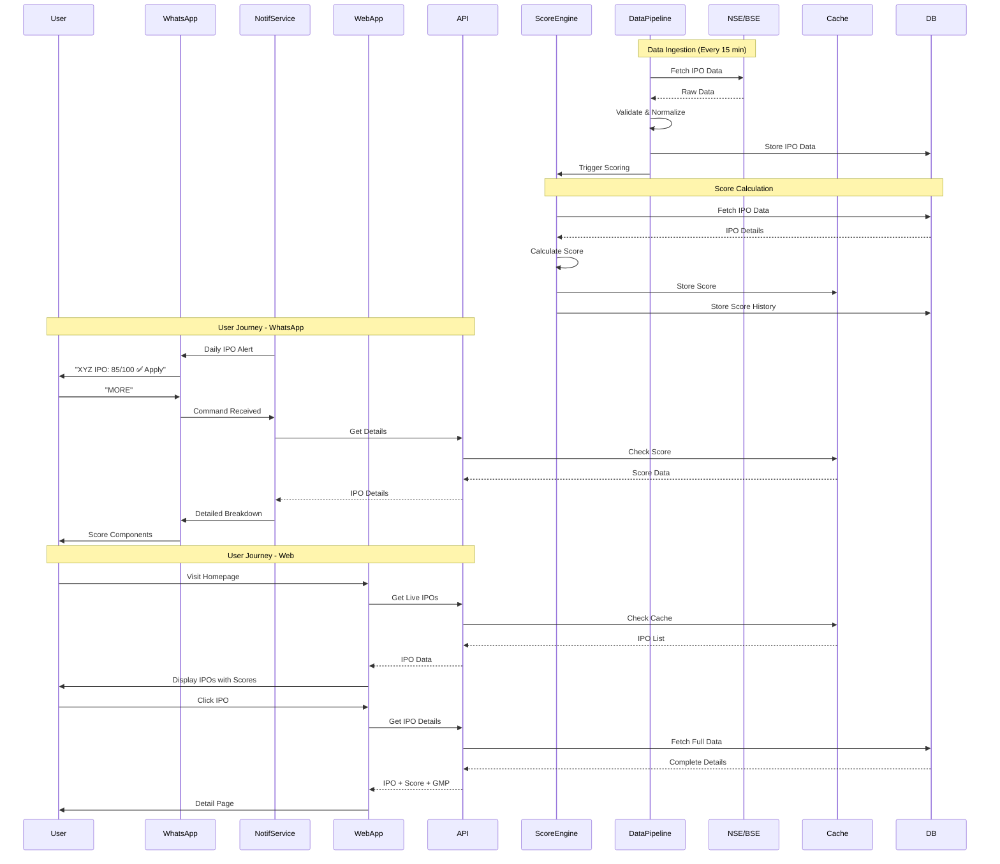

# Core Workflows

```mermaid
sequenceDiagram
    participant User
    participant WhatsApp
    participant NotifService
    participant WebApp
    participant API
    participant ScoreEngine
    participant DataPipeline
    participant NSE/BSE
    participant Cache
    participant DB

    Note over DataPipeline,NSE/BSE: Data Ingestion (Every 15 min)
    DataPipeline->>NSE/BSE: Fetch IPO Data
    NSE/BSE-->>DataPipeline: Raw Data
    DataPipeline->>DataPipeline: Validate & Normalize
    DataPipeline->>DB: Store IPO Data
    DataPipeline->>ScoreEngine: Trigger Scoring

    Note over ScoreEngine,DB: Score Calculation
    ScoreEngine->>DB: Fetch IPO Data
    DB-->>ScoreEngine: IPO Details
    ScoreEngine->>ScoreEngine: Calculate Score
    ScoreEngine->>Cache: Store Score
    ScoreEngine->>DB: Store Score History

    Note over User,API: User Journey - WhatsApp
    NotifService->>WhatsApp: Daily IPO Alert
    WhatsApp->>User: "XYZ IPO: 85/100 ✅ Apply"
    User->>WhatsApp: "MORE"
    WhatsApp->>NotifService: Command Received
    NotifService->>API: Get Details
    API->>Cache: Check Score
    Cache-->>API: Score Data
    API-->>NotifService: IPO Details
    NotifService->>WhatsApp: Detailed Breakdown
    WhatsApp->>User: Score Components

    Note over User,API: User Journey - Web
    User->>WebApp: Visit Homepage
    WebApp->>API: Get Live IPOs
    API->>Cache: Check Cache
    Cache-->>API: IPO List
    API-->>WebApp: IPO Data
    WebApp->>User: Display IPOs with Scores
    User->>WebApp: Click IPO
    WebApp->>API: Get IPO Details
    API->>DB: Fetch Full Data
    DB-->>API: Complete Details
    API-->>WebApp: IPO + Score + GMP
    WebApp->>User: Detail Page
```
