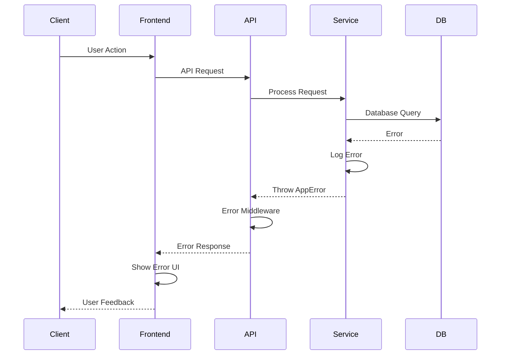

# Error Handling Strategy

## Error Flow



## Error Response Format

```typescript
interface ApiError {
  error: {
    code: string;
    message: string;
    details?: Record<string, any>;
    timestamp: string;
    requestId: string;
  };
}
```

## Frontend Error Handling

```typescript
// utils/errorHandler.ts
export class ErrorBoundary extends React.Component {
  componentDidCatch(error: Error, errorInfo: React.ErrorInfo) {
    console.error('Error caught by boundary:', error, errorInfo);
    Sentry.captureException(error, { contexts: { react: errorInfo } });
  }

  render() {
    if (this.state.hasError) {
      return <ErrorFallback />;
    }
    return this.props.children;
  }
}

// API error handling
export const handleApiError = (error: AxiosError) => {
  if (error.response?.data?.error) {
    const apiError = error.response.data.error;
    toast.error(apiError.message);

    if (apiError.code === 'AUTH_EXPIRED') {
      // Trigger token refresh
    }
  } else {
    toast.error('Something went wrong. Please try again.');
  }

  Sentry.captureException(error);
};
```

## Backend Error Handling

```typescript
// middleware/errorHandler.ts
export const errorHandler = (
  err: Error | AppError,
  req: Request,
  res: Response,
  next: NextFunction
) => {
  const requestId = req.id;

  logger.error({
    requestId,
    error: err.message,
    stack: err.stack,
    path: req.path,
    method: req.method,
  });

  if (err instanceof AppError) {
    return res.status(err.statusCode).json({
      error: {
        code: err.code,
        message: err.message,
        details: err.details,
        timestamp: new Date().toISOString(),
        requestId,
      },
    });
  }

  // Generic error
  res.status(500).json({
    error: {
      code: 'INTERNAL_ERROR',
      message: 'An unexpected error occurred',
      timestamp: new Date().toISOString(),
      requestId,
    },
  });
};
```
