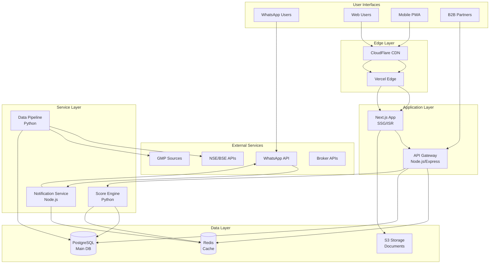

# High Level Architecture

## Technical Summary

IPODhan employs a modern microservices architecture with a React/Next.js frontend and Node.js backend, optimized for real-time IPO data processing and intelligent scoring. The system uses a polyrepo structure with separate services for data ingestion, score calculation, web interface, and notification orchestration, deployed on AWS/Vercel infrastructure. API-first design enables B2B partnerships while WhatsApp integration provides ambient intelligence delivery. Redis caching and CDN optimization ensure sub-2-second page loads during peak IPO periods. This architecture achieves the PRD's goal of simplifying IPO decisions to a single 0-100 score while maintaining the flexibility to scale from 100 WhatsApp users to 1 million+ through API distribution.

## Platform and Infrastructure Choice

**Platform:** Hybrid Cloud (Vercel + AWS)
**Key Services:**
- Vercel: Web hosting, edge functions, automatic scaling
- AWS: RDS PostgreSQL, ElastiCache Redis, S3 storage, SQS queues, Lambda functions
- WhatsApp Business API (Twilio)
- CloudFlare CDN

**Deployment Regions:**
- Primary: Mumbai (ap-south-1) for AWS services
- Edge: Global via Vercel's network
- CDN: CloudFlare global PoPs

## Repository Structure

**Structure:** Polyrepo with clear service boundaries
**Package Management:** npm workspaces for shared code
**Package Organization:**
- `ipodhan-web` - User-facing Next.js application
- `ipodhan-backend` - REST API service
- `ipodhan-data-pipeline` - Python-based data ingestion
- `ipodhan-score-engine` - Score calculation service
- `ipodhan-notifications` - Multi-channel notification service
- `ipodhan-shared` - Shared types and utilities (npm package)

## High Level Architecture Diagram

## Architectural Patterns

- **Jamstack Architecture:** Static site generation with serverless APIs - *Rationale:* Optimal performance and scalability for content-heavy IPO information
- **Microservices Pattern:** Separate services for data, scoring, notifications - *Rationale:* Independent scaling and failure isolation for critical components
- **Cache-First Pattern:** Redis caching for all read operations - *Rationale:* Handle 100K concurrent users during peak IPO periods
- **Event-Driven Updates:** WebSocket/SSE for real-time subscription data - *Rationale:* Live updates critical for IPO investment decisions
- **Progressive Web App:** Offline-capable mobile experience - *Rationale:* Reach users without app store distribution
- **API Gateway Pattern:** Centralized entry point for all API calls - *Rationale:* Unified authentication, rate limiting, and monitoring
- **Repository Pattern:** Abstract data access logic - *Rationale:* Database migration flexibility and testability
- **Component-Based UI:** Reusable React components with TypeScript - *Rationale:* Maintainability across large codebase
- **BFF Pattern:** Backend for Frontend optimization - *Rationale:* Tailored API responses for web vs WhatsApp channels
