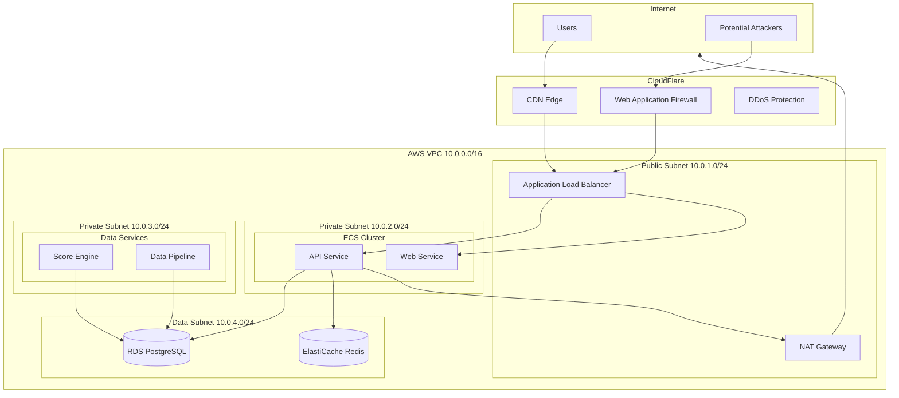

# Network Security Configuration

## Infrastructure Security Architecture

### Network Topology



### Security Group Configuration

```terraform
# infrastructure/terraform/security_groups.tf

# ALB Security Group
resource "aws_security_group" "alb" {
  name        = "ipodhan-alb-sg"
  description = "Security group for Application Load Balancer"
  vpc_id      = aws_vpc.main.id

  ingress {
    from_port   = 443
    to_port     = 443
    protocol    = "tcp"
    cidr_blocks = ["0.0.0.0/0"] # CloudFlare IPs would be more restrictive
    description = "HTTPS from CloudFlare"
  }

  ingress {
    from_port   = 80
    to_port     = 80
    protocol    = "tcp"
    cidr_blocks = ["0.0.0.0/0"]
    description = "HTTP from CloudFlare (redirect to HTTPS)"
  }

  egress {
    from_port   = 0
    to_port     = 0
    protocol    = "-1"
    cidr_blocks = ["0.0.0.0/0"]
    description = "Allow all outbound"
  }

  tags = {
    Name = "ipodhan-alb-sg"
  }
}

# ECS Service Security Group
resource "aws_security_group" "ecs_service" {
  name        = "ipodhan-ecs-service-sg"
  description = "Security group for ECS services"
  vpc_id      = aws_vpc.main.id

  ingress {
    from_port       = 3000
    to_port         = 4000
    protocol        = "tcp"
    security_groups = [aws_security_group.alb.id]
    description     = "HTTP from ALB"
  }

  egress {
    from_port   = 0
    to_port     = 0
    protocol    = "-1"
    cidr_blocks = ["0.0.0.0/0"]
    description = "Allow all outbound"
  }

  tags = {
    Name = "ipodhan-ecs-service-sg"
  }
}

# RDS Security Group
resource "aws_security_group" "rds" {
  name        = "ipodhan-rds-sg"
  description = "Security group for RDS PostgreSQL"
  vpc_id      = aws_vpc.main.id

  ingress {
    from_port       = 5432
    to_port         = 5432
    protocol        = "tcp"
    security_groups = [
      aws_security_group.ecs_service.id,
      aws_security_group.lambda.id
    ]
    description = "PostgreSQL from ECS and Lambda"
  }

  tags = {
    Name = "ipodhan-rds-sg"
  }
}

# Redis Security Group
resource "aws_security_group" "redis" {
  name        = "ipodhan-redis-sg"
  description = "Security group for ElastiCache Redis"
  vpc_id      = aws_vpc.main.id

  ingress {
    from_port       = 6379
    to_port         = 6379
    protocol        = "tcp"
    security_groups = [
      aws_security_group.ecs_service.id,
      aws_security_group.lambda.id
    ]
    description = "Redis from ECS and Lambda"
  }

  tags = {
    Name = "ipodhan-redis-sg"
  }
}
```

### WAF Rules Configuration

```terraform
# infrastructure/terraform/waf.tf

resource "aws_wafv2_web_acl" "main" {
  name  = "ipodhan-waf"
  scope = "REGIONAL"

  default_action {
    allow {}
  }

  # Rate limiting rule
  rule {
    name     = "RateLimitRule"
    priority = 1

    statement {
      rate_based_statement {
        limit              = 2000
        aggregate_key_type = "IP"
      }
    }

    action {
      block {}
    }

    visibility_config {
      sampled_requests_enabled   = true
      cloudwatch_metrics_enabled = true
      metric_name                = "RateLimitRule"
    }
  }

  # SQL Injection protection
  rule {
    name     = "SQLiProtection"
    priority = 2

    statement {
      managed_rule_group_statement {
        vendor_name = "AWS"
        name        = "AWSManagedRulesSQLiRuleSet"
      }
    }

    override_action {
      none {}
    }

    visibility_config {
      sampled_requests_enabled   = true
      cloudwatch_metrics_enabled = true
      metric_name                = "SQLiProtection"
    }
  }

  # XSS protection
  rule {
    name     = "XSSProtection"
    priority = 3

    statement {
      managed_rule_group_statement {
        vendor_name = "AWS"
        name        = "AWSManagedRulesKnownBadInputsRuleSet"
      }
    }

    override_action {
      none {}
    }

    visibility_config {
      sampled_requests_enabled   = true
      cloudwatch_metrics_enabled = true
      metric_name                = "XSSProtection"
    }
  }

  visibility_config {
    sampled_requests_enabled   = true
    cloudwatch_metrics_enabled = true
    metric_name                = "ipodhan-waf"
  }
}
```
