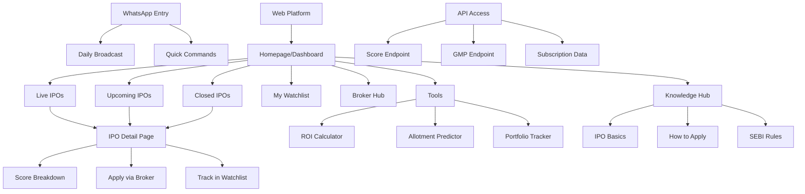
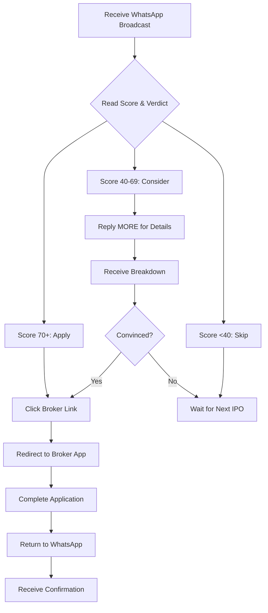
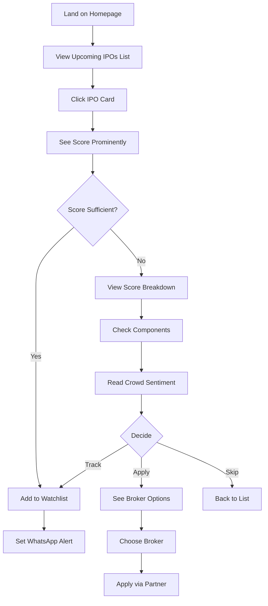
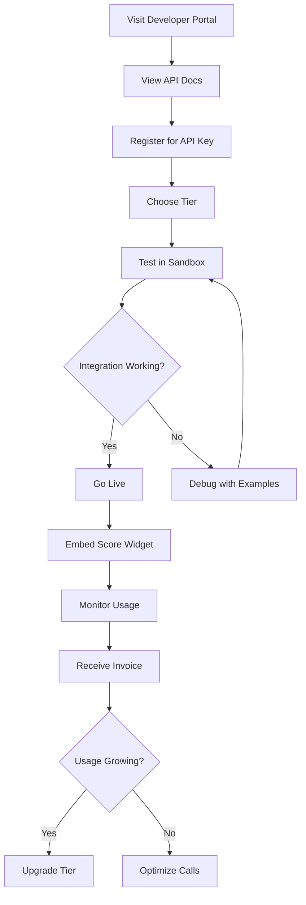

# IPODhan UI/UX Specification

**Version:** 1.0
**Date:** January 2025
**Author:** Sally (UX Expert)
**Status:** Complete

## Table of Contents
1. [Introduction](#introduction)
2. [Overall UX Goals & Principles](#overall-ux-goals--principles)
3. [Information Architecture](#information-architecture-ia)
4. [User Flows](#user-flows)
5. [Wireframes & Mockups](#wireframes--mockups)
6. [Component Library / Design System](#component-library--design-system)
7. [Branding & Style Guide](#branding--style-guide)
8. [Accessibility Requirements](#accessibility-requirements)
9. [Responsiveness Strategy](#responsiveness-strategy)
10. [Animation & Micro-interactions](#animation--micro-interactions)
11. [Performance Considerations](#performance-considerations)
12. [Next Steps](#next-steps)

---

## Introduction

This document defines the user experience goals, information architecture, user flows, and visual design specifications for IPODhan's user interface. It serves as the foundation for visual design and frontend development, ensuring a cohesive and user-centered experience.

### Change Log
| Date | Version | Description | Author |
|------|---------|-------------|--------|
| 2025-01 | 1.0 | Initial UI/UX specification created | Sally |

---

## Overall UX Goals & Principles

### Target User Personas

**1. The Overwhelmed Beginner**
- First-time IPO investor, 25-35 years old
- Has demat account but finds existing platforms intimidating
- Seeks simple yes/no guidance without financial jargon
- Prefers WhatsApp/mobile-first interactions

**2. The Time-Strapped Professional**
- Working professionals with disposable income
- Interested in IPOs but lacks time for research
- Values efficiency and instant decisions
- Trusts data-driven recommendations

**3. The Traditional Investor**
- 40+ years, invests through offline channels
- Relies on broker advice and word-of-mouth
- Needs digital bridge that feels familiar
- Values trust and transparency over features

### Usability Goals

- **Zero Learning Curve:** New users complete their first IPO decision within 30 seconds
- **Instant Clarity:** IPODhan Score understood without explanation - like a restaurant rating
- **Frictionless Access:** No signup required for basic features, progressive engagement model
- **Trust Through Transparency:** Users understand when and why we're uncertain
- **Mobile-First Excellence:** Core experience optimized for one-thumb mobile usage

### Design Principles

1. **Radical Simplification** - Remove everything except what enables the decision
2. **Progressive Disclosure** - Start with score, reveal complexity only when requested
3. **Ambient Intelligence** - Decisions come to users via WhatsApp/notifications, not requiring platform visits
4. **Trust Through Humility** - Admit limitations, show crowdsourced wisdom, avoid false certainty
5. **Behavioral Bridges** - Leverage existing habits (WhatsApp checking) rather than creating new ones

---

## Information Architecture (IA)

### Site Map / Screen Inventory



### Navigation Structure

**Primary Navigation:** Minimal top bar with IPODhan Score logo, Live/Upcoming/Closed tabs, and WhatsApp connect button

**Secondary Navigation:** Contextual tools appear within IPO detail pages - calculators, broker links, and educational resources surface based on user actions

**Breadcrumb Strategy:** Not needed due to flat hierarchy - maximum 2 levels deep with clear back navigation

---

## User Flows

### Flow 1: First-Time IPO Decision via WhatsApp

**User Goal:** Make first IPO investment decision without visiting any platform

**Entry Points:** WhatsApp broadcast message, Friend's forward, Social media link

**Success Criteria:** User understands IPO verdict and takes action (apply/skip) within 30 seconds



**Edge Cases & Error Handling:**
- User doesn't have demat account → Provide quick setup link with partner broker
- Broker app not installed → Fallback to mobile web application
- User wants more info → Progressive disclosure via "MORE" command
- Network issues → Offline-capable score cards cached in WhatsApp

**Notes:** This flow deliberately bypasses our web platform entirely - radical simplification in action

### Flow 2: IPO Research on Web Platform

**User Goal:** Research upcoming IPO before the listing date

**Entry Points:** Google search, Direct URL, WhatsApp "View on Web" link

**Success Criteria:** User finds IPO, understands score, and sets reminder for opening date



**Edge Cases & Error Handling:**
- IPO not found → Show similar upcoming IPOs
- Score not yet available → Show "Analysis in Progress" with ETA
- All brokers showing errors → Provide manual application guide
- User not on WhatsApp → Email alert fallback

### Flow 3: API Integration Partner Flow

**User Goal:** Third-party platform wants to display IPODhan scores

**Entry Points:** Developer portal, Sales outreach, API documentation

**Success Criteria:** Partner successfully integrates and displays live scores within 1 hour



**Edge Cases & Error Handling:**
- API rate limit hit → Clear error message with upgrade path
- Invalid API key → Auto-email with reset link
- Score calculation delayed → Return cached score with timestamp
- Partner wants custom scoring → Redirect to enterprise sales

---

## Wireframes & Mockups

**Primary Design Files:** Figma - [To be created with component system based on specs]

### Key Screen Layouts

#### 1. WhatsApp Broadcast Message

**Purpose:** Deliver daily IPO verdicts in scannable, actionable format

**Key Elements:**
- IPODhan Score (large, color-coded number)
- Verdict emoji (✅/🤔/❌) with clear action word
- One-line reasoning in plain language
- Quick action buttons (APPLY/MORE/SKIP)

**Interaction Notes:** Messages must work in both personal and group chats, support quick replies for commands, maintain readability in notification preview

**Design File Reference:** WhatsApp templates to be created in Figma mobile frames

#### 2. Homepage/Dashboard (Web)

**Purpose:** Immediate IPO intelligence without cognitive overload

**Key Elements:**
- Hero section with today's best IPO (score + verdict)
- Three tabs: Live | Upcoming | Closed (with counts)
- IPO cards showing score, name, dates, GMP trend sparkline
- WhatsApp connect CTA floating button
- Search bar (hidden initially, appears on scroll)

**Interaction Notes:** Score is the visual hierarchy leader on every card, progressive disclosure on hover/tap, infinite scroll with lazy loading

**Design File Reference:** Desktop and mobile responsive layouts in main Figma file

#### 3. IPO Detail Page

**Purpose:** Provide complete IPO intelligence while maintaining score as primary decision driver

**Key Elements:**
- Sticky header with score and apply button
- Score breakdown meter (4 components visualized)
- Real-time subscription status with live updates
- Crowdsourced sentiment chart
- Key metrics cards (lot size, price band, dates)
- Broker application options grid
- Related IPOs carousel

**Interaction Notes:** Score remains visible while scrolling, Apply button transforms based on date (Upcoming/Live/Closed), Components animate in as user scrolls

**Design File Reference:** Detailed component specifications in Figma components file

#### 4. API Developer Portal

**Purpose:** Enable partners to integrate IPODhan scores within 60 minutes

**Key Elements:**
- Interactive API playground above the fold
- Live score widget demo
- Code examples in multiple languages (tabs)
- Pricing tiers comparison table
- One-click sandbox access
- Usage dashboard for existing partners

**Interaction Notes:** Copy-paste-ready code snippets, real-time endpoint testing, No signup required for documentation viewing

**Design File Reference:** Developer portal templates in separate Figma file

---

## Component Library / Design System

**Design System Approach:** Build a lightweight, score-centric component system optimized for speed and clarity. Components should work across WhatsApp, web, and partner embeds.

### Core Components

#### 1. ScoreDisplay

**Purpose:** The hero element of IPODhan - displays the 0-100 score with immediate visual understanding

**Variants:**
- Large (Detail pages): 120px with animated fill
- Medium (Cards): 48px with colored background
- Small (Lists): 24px inline with text
- Micro (Badges): 16px for dense layouts

**States:**
- Loading: Skeleton pulse animation
- Live: Subtle breathing animation
- Final: Static display
- Error: Greyed out with retry icon

**Usage Guidelines:** Always pair with verdict text (Apply/Consider/Skip). Use semantic colors: green (70-100), amber (40-69), red (0-39). Include ARIA labels for accessibility.

#### 2. IPOCard

**Purpose:** Primary content unit displaying essential IPO information at a glance

**Variants:**
- Compact: Score, name, dates (for lists)
- Standard: Adds GMP, subscription status
- Expanded: Includes mini charts, broker CTAs
- WhatsApp: Text-only formatted version

**States:**
- Default: Neutral background
- Hover: Elevation increase, show actions
- Selected: Border highlight
- Disabled: Reduced opacity for closed IPOs

**Usage Guidelines:** Score always leads visual hierarchy. Use progressive disclosure - start compact, expand on interaction. Ensure touch targets meet 44px minimum.

#### 3. VerdictBadge

**Purpose:** Translate scores into clear action recommendations

**Variants:**
- Primary: ✅ Apply | 🤔 Consider | ❌ Skip
- Detailed: Includes one-line reasoning
- Confidence: Shows certainty level (High/Medium/Low)

**States:**
- Static: Default display
- Pulsing: For time-sensitive IPOs
- Muted: For closed IPOs

**Usage Guidelines:** Always accompanies ScoreDisplay. Use consistent emoji across all platforms. Ensure color-blind accessible through icons + text.

#### 4. SubscriptionMeter

**Purpose:** Show real-time IPO subscription status across categories

**Variants:**
- Simple: Overall subscription percentage
- Detailed: QIB, NII, Retail breakdowns
- Comparative: vs similar IPOs
- Trend: With time-series sparkline

**States:**
- Updating: Live WebSocket updates with shimmer
- Static: For closed IPOs
- Projected: For upcoming based on trends

**Usage Guidelines:** Update maximum once per second to avoid distraction. Use accessible color gradients. Include numeric values alongside visual representation.

#### 5. BrokerCTA

**Purpose:** Enable one-click IPO applications through partner brokers

**Variants:**
- Single: One preferred broker
- Grid: Multiple broker options
- Comparison: With fees/features
- WhatsApp: Deep-link format

**States:**
- Available: Full color, ready to click
- Unavailable: Greyed with reason (KYC pending, etc.)
- Processing: Loading state after click
- Completed: Success checkmark

**Usage Guidelines:** Clearly show broker name and fees. Deep-link directly to application when possible. Provide fallback for app-not-installed scenario.

#### 6. WhatsAppConnector

**Purpose:** Connect web users to WhatsApp broadcasts for ambient intelligence

**Variants:**
- Floating FAB: Mobile persistent button
- Banner: Top/bottom promotional strip
- Inline: Within content for contextual prompts
- QR Code: Desktop to mobile bridge

**States:**
- Default: Green WhatsApp branding
- Activated: Success confirmation
- Error: Retry with troubleshooting

**Usage Guidelines:** Make value prop clear ("Get daily IPO verdicts on WhatsApp"). Use official WhatsApp brand colors/logo. Ensure one-click connection where possible.

### Design Token Structure

```javascript
// Core tokens for consistent theming
tokens: {
  score: {
    high: { bg: '#10B981', text: '#FFFFFF' },
    medium: { bg: '#F59E0B', text: '#000000' },
    low: { bg: '#EF4444', text: '#FFFFFF' }
  },
  states: {
    live: { indicator: '#10B981', pulse: true },
    upcoming: { indicator: '#3B82F6', pulse: false },
    closed: { indicator: '#6B7280', pulse: false }
  }
}
```

---

## Branding & Style Guide

### Visual Identity

**Brand Guidelines:** IPODhan Visual Identity System v1.0 - "Intelligence Made Simple"

### Color Palette

| Color Type | Hex Code | Usage |
|------------|----------|-------|
| Primary | #10B981 | Strong Apply signals, success states, positive scores (70-100) |
| Secondary | #3B82F6 | Links, information, upcoming IPOs, primary CTAs |
| Accent | #8B5CF6 | Premium features, special insights, AI-powered elements |
| Success | #10B981 | Positive feedback, confirmations, high scores |
| Warning | #F59E0B | Consider verdicts, medium scores (40-69), cautions |
| Error | #EF4444 | Skip verdicts, low scores (0-39), error states |
| Neutral | #111827, #6B7280, #F3F4F6 | Text hierarchy, borders, backgrounds |

### Typography

#### Font Families
- **Primary:** Inter - Clean, highly legible, works across all scripts including Devanagari
- **Secondary:** DM Sans - For marketing and display headers
- **Monospace:** JetBrains Mono - For numerical data, scores, financial figures

#### Type Scale

| Element | Size | Weight | Line Height |
|---------|------|--------|-------------|
| H1 | 36px | 700 | 1.2 |
| H2 | 28px | 600 | 1.3 |
| H3 | 20px | 600 | 1.4 |
| Body | 16px | 400 | 1.6 |
| Small | 14px | 400 | 1.5 |

### Iconography

**Icon Library:** Custom IPODhan icon set based on Lucide/Heroicons

**Usage Guidelines:**
- Use filled icons for primary actions (Apply, Subscribe)
- Use outlined icons for secondary actions (Share, Info)
- Maintain 2px stroke width for consistency
- Always pair icons with text labels for clarity

### Spacing & Layout

**Grid System:** 4px baseline grid with 8/16/24/32/48/64px spacing scale

**Spacing Scale:**
- xs: 4px (tight elements)
- sm: 8px (related items)
- md: 16px (sections)
- lg: 24px (major breaks)
- xl: 32px (page sections)
- 2xl: 48px (hero spacing)

### Voice & Tone

**Brand Voice Principles:**
1. **Clear, not clever** - "Skip this IPO" not "This opportunity may not align with optimal investment parameters"
2. **Confident yet humble** - "Score: 72 (Usually profitable)" not "Guaranteed returns!"
3. **Friend, not advisor** - "Most investors are applying" not "Our analysis recommends"
4. **Action-oriented** - "Apply now" not "Consider applying"

---

## Accessibility Requirements

### Compliance Target

**Standard:** WCAG 2.1 Level AA compliance with selective AAA criteria for critical flows

### Key Requirements

**Visual:**
- Color contrast ratios: Minimum 4.5:1 for normal text, 3:1 for large text, 7:1 for score displays
- Focus indicators: 2px solid outline with 2px offset, color: #3B82F6, visible on all interactive elements
- Text sizing: Base 16px minimum, user scalable to 200% without horizontal scroll

**Interaction:**
- Keyboard navigation: Full functionality via keyboard, logical tab order, skip links for navigation
- Screen reader support: ARIA labels for scores, live regions for real-time updates, semantic HTML structure
- Touch targets: Minimum 44x44px, 8px spacing between targets, larger for primary CTAs (Apply buttons)

**Content:**
- Alternative text: Descriptive alt text for score visualizations, charts described in data tables
- Heading structure: Logical h1-h6 hierarchy, one h1 per page, descriptive headings for navigation
- Form labels: Visible labels for all inputs, error messages linked to fields, inline validation with clear instructions

### Testing Strategy

**Multi-layered Approach:**
1. **Automated Testing:** axe-core integration in CI/CD pipeline
2. **Manual Testing:** Keyboard navigation, screen reader testing (NVDA/JAWS)
3. **User Testing:** Include users with disabilities in beta testing
4. **WhatsApp Accessibility:** Ensure broadcasts work with TalkBack/VoiceOver

### Special Considerations for Indian Users

**Language & Localization:**
- Support for screen readers in Hindi and regional languages
- Number formatting for Indian numbering system (lakhs/crores)
- RTL support preparation for Urdu users

**Low-Vision Support:**
- High contrast mode that maintains score color meanings
- Zoom support up to 400% for elderly users
- Large button mode for essential actions

**Cognitive Accessibility:**
- Plain language explanations for all financial terms
- Progressive disclosure to avoid information overload
- Consistent patterns throughout the experience
- Time limits only where absolutely necessary (with extensions)

**Mobile Accessibility:**
- One-handed operation for all critical paths
- Voice input support for search and commands
- Reduced motion options for users sensitive to animations

### WhatsApp-Specific Accessibility

**Message Formatting:**
- Use clear Unicode symbols (✅❌) that work with screen readers
- Structure messages with clear sections using line breaks
- Avoid ASCII art or complex formatting
- Provide text-only alternatives for all information

---

## Responsiveness Strategy

### Breakpoints

| Breakpoint | Min Width | Max Width | Target Devices |
|------------|-----------|-----------|----------------|
| Mobile | 320px | 639px | Feature phones, small smartphones (Redmi, Realme) |
| Tablet | 640px | 1023px | iPads, Android tablets, large phones in landscape |
| Desktop | 1024px | 1439px | Laptops, desktop monitors |
| Wide | 1440px | - | Large monitors, ultra-wide displays |

### Adaptation Patterns

**Layout Changes:**
- Mobile: Single column, stacked cards, bottom navigation
- Tablet: 2-column grid for IPO cards, side panel for filters
- Desktop: 3-4 column grid, persistent sidebar, floating tools
- Wide: Maximum 1440px content width, centered with margins

**Navigation Changes:**
- Mobile: Bottom tab bar with 4 items max, hamburger for overflow
- Tablet: Top navigation bar, collapsible sidebar
- Desktop: Full horizontal navigation, exposed filters
- Wide: Mega-menu dropdowns, quick access panels

**Content Priority:**
- Mobile: Score → Verdict → Apply button (above fold), details below
- Tablet: Add subscription status and GMP to initial view
- Desktop: Show full breakdown and charts immediately
- Wide: Display comparison tables and related IPOs sidebar

**Interaction Changes:**
- Mobile: Swipe gestures for tabs, pull-to-refresh, long-press for options
- Tablet: Hover previews, drag-and-drop for watchlist
- Desktop: Right-click context menus, keyboard shortcuts
- Wide: Multi-panel layouts with resizable sections

### Mobile-First Optimizations

**For Indian Mobile Users:**
- Optimize for 4G/3G with aggressive lazy loading
- Service worker for offline score viewing
- Data saver mode (no auto-playing videos, compressed images)
- Quick actions accessible with thumb (bottom 60% of screen)

**WhatsApp Integration Priority:**
- Mobile: Prominent WhatsApp connect button (floating)
- Tablet/Desktop: QR code for mobile connection
- Deep links that work across devices

### Component Adaptations

**ScoreDisplay:**
- Mobile: 64px centered with verdict below
- Tablet: 80px with inline verdict
- Desktop: 120px with animated fill effects

**IPOCard:**
- Mobile: Full-width cards with essential info
- Tablet: 2-up grid with expanded details
- Desktop: 3-4 column grid with hover states

**BrokerCTA:**
- Mobile: Stacked list with clear tap targets
- Tablet: 2-column grid
- Desktop: Horizontal carousel with logos

### Performance Budget by Breakpoint

**Mobile (Critical Path):**
- Initial bundle: <100KB
- Time to Interactive: <3s on 3G
- First Contentful Paint: <1.5s

**Tablet:**
- Initial bundle: <200KB
- Enhanced interactions after core load

**Desktop:**
- Full features: <500KB total
- Rich interactions and animations

### Special Considerations

**Feature Phone Support:**
- Basic HTML version for <320px screens
- Text-only mode for 2G connections
- SMS fallback for critical alerts

**Landscape Orientation:**
- Mobile landscape: Show side-by-side comparison
- Tablet landscape: Optimize for video content
- Lock orientation for critical flows (Apply process)

### Testing Matrix

**Priority Devices:**
1. Xiaomi Redmi series (most popular in India)
2. OnePlus Nord series
3. iPhone 12/13 mini
4. iPad 10.2"
5. 1080p desktop
6. 1366x768 laptop (common resolution)

---

## Animation & Micro-interactions

### Motion Principles

**IPODhan Motion Philosophy:**
1. **Purposeful, not playful** - Every animation clarifies state change or guides attention
2. **Performance-first** - CSS-only animations, no JavaScript for core interactions
3. **Respect user preference** - Honor prefers-reduced-motion settings
4. **Subtle reinforcement** - Motion supports the score-first mental model

### Key Animations

- **Score Reveal:** Number counts up from 0 to final score (Duration: 800ms, Easing: ease-out)
- **Live Pulse:** Subscription status softly pulses when IPO is live (Duration: 2s loop, Easing: ease-in-out)
- **Score Change:** Smooth transition with brief glow when score updates (Duration: 300ms, Easing: ease-in-out)
- **Card Expansion:** Progressive disclosure on tap/click (Duration: 250ms, Easing: cubic-bezier(0.4, 0, 0.2, 1))
- **Success Confirmation:** Checkmark draws in after Apply action (Duration: 400ms, Easing: ease-out)
- **Loading Skeleton:** Shimmer effect while data loads (Duration: 1.5s loop, Easing: linear)
- **Tab Switch:** Smooth slide between Live/Upcoming/Closed (Duration: 200ms, Easing: ease-out)
- **WhatsApp Connect:** Button scales up with ripple on success (Duration: 300ms, Easing: ease-out)

### Interaction Feedback

**Immediate Response (<100ms):**
- Hover states on desktop
- Touch highlights on mobile
- Focus rings on keyboard navigation

**Fast Feedback (100-300ms):**
- Button press animations
- Form validation indicators
- Toggle switches

**Smooth Transitions (300-600ms):**
- Page transitions
- Modal appearances
- Data updates

### Performance Optimizations

**Mobile-Specific:**
- Disable parallax scrolling
- Use transform/opacity only (GPU accelerated)
- Reduce particle effects to critical moments
- Implement will-change sparingly

**Reduced Motion Mode:**
- Instant score display (no count-up)
- Fade transitions instead of slides
- Static subscription status
- No decorative animations

### State Transitions

**IPO Status Changes:**
- Upcoming → Live: Green pulse animation starts
- Live → Closed: Fade to grey with subtle scale down
- Score Update: Brief highlight with directional indicator (↑↓)

**User Actions:**
- Add to Watchlist: Star fills with bounce
- Apply Click: Button transforms to loading, then success
- Share: Ripple effect from touch point

### Loading & Feedback Patterns

**Progressive Loading:**
1. Show layout skeleton immediately
2. Load score first (hero content)
3. Fill supporting data progressively
4. Enable interactions as they become available

**Error Recovery:**
- Shake animation on validation errors
- Fade in error messages below fields
- Retry button with rotation animation

### WhatsApp-Specific Animations

Since WhatsApp doesn't support rich animations:
- Use emoji state changes (⏳→✅)
- Text-based progress indicators (... → Done!)
- Strategic line breaks for visual rhythm

---

## Performance Considerations

### Performance Goals
- **Page Load:** <2 seconds on 4G
- **Interaction Response:** <100ms for user input feedback
- **Animation FPS:** Consistent 60fps for all animations

### Design Strategies
- Implement CSS-only animations to avoid JavaScript overhead
- Use GPU-accelerated properties (transform, opacity)
- Lazy-load animation libraries only when needed
- Pre-load critical animations during idle time

---

## Next Steps

### Immediate Actions
1. Review specification with stakeholders for alignment
2. Create detailed Figma designs based on these specifications
3. Build component library in code with Storybook documentation
4. Conduct usability testing with target user personas
5. Set up accessibility testing pipeline

### Design Handoff Checklist
- ✅ All user flows documented
- ✅ Component inventory complete
- ✅ Accessibility requirements defined
- ✅ Responsive strategy clear
- ✅ Brand guidelines incorporated
- ✅ Performance goals established

### Checklist Results

_To be completed after running UI/UX checklist against this document_