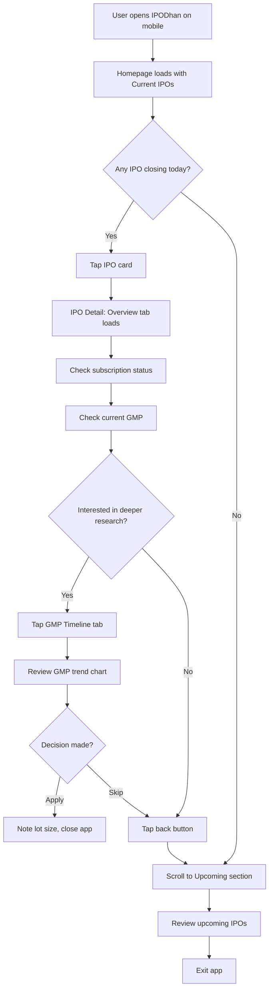
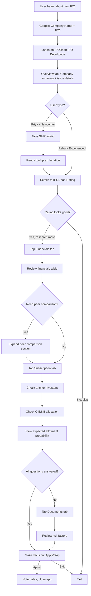
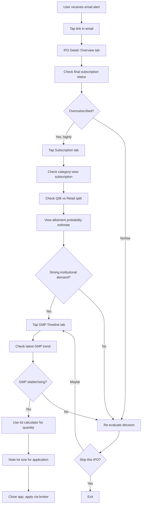

# IPODhan UI/UX Specification

This document defines the user experience goals, information architecture, user flows, and visual design specifications for IPODhan's user interface. It serves as the foundation for visual design and frontend development, ensuring a cohesive and user-centered experience.

## Overall UX Goals & Principles

### Target User Personas

#### 1. Active Retail IPO Investor (Rahul)
- **Demographics:** 32 years, Software Engineer, Pune, ₹12 LPA
- **Experience:** 3 years in stock market, applies to 5-8 IPOs/year
- **Behavior:** Mobile-heavy user checking IPOs during commute/breaks, cross-references multiple sources
- **Values:** Speed, accuracy, and efficiency over extensive content
- **Pain Points:** Time wasted aggregating data from 3-4 sources, slow/ad-heavy competitor sites, missed deadlines, uncertain about interpreting subscription numbers and GMP trends

#### 2. IPO Newcomer (Priya)
- **Demographics:** 26 years, Marketing Manager, Bangalore, ₹7 LPA
- **Experience:** 6 months investing experience, applied to first IPO recently
- **Behavior:** Learning through YouTube/social media, overwhelmed by jargon, seeks simple guidance
- **Values:** Educational content, clear recommendations, straightforward explanations
- **Pain Points:** Doesn't understand IPO terminology (DRHP, GMP, QIB, NII), confused by conflicting opinions, intimidated by dense technical sites

### Usability Goals

1. **Speed & Efficiency:** Active users like Rahul can access real-time IPO data and make decisions within 2-3 minutes
2. **Ease of Learning:** Newcomers like Priya can understand IPO basics and evaluate their first IPO within 10 minutes
3. **Mobile-First Performance:** Pages load in < 2 seconds on 3G mobile connections
4. **Clarity & Simplicity:** Complex financial data presented in scannable, digestible formats
5. **Trust & Reliability:** Accurate, real-time data with clear sources builds user confidence

### Design Principles

#### 1. Speed is a Feature
Faster load times and instant data access are competitive advantages. Minimize animations, optimize images, prioritize critical content first. Target: <2 seconds initial page load vs. competitors' 3-5 seconds.

#### 2. Progressive Disclosure for Complexity
Show essential IPO metrics upfront (load in <2s). Organize advanced data (financials, anchor investors, DRHP) in lazy-loaded tabs and expandable sections. **All data competitors show is available—just intelligently structured.**

**3-Tier Information Architecture:**
- **Tier 1 (Always Visible):** Company name, price band, dates, subscription status, GMP, rating
- **Tier 2 (One Click):** Detailed financials, peer comparison, anchor investors, risk factors
- **Tier 3 (On Demand):** DRHP documents, historical statements, management backgrounds

Priya sees simplicity by default; Rahul finds comprehensive depth with one click. This ensures we match Chittorgarh's data completeness while maintaining superior speed and clarity.

#### 3. Educational by Default
Every complex term (GMP, QIB, NII, DRHP, anchor investors) gets an inline tooltip or help icon. "Should You Apply?" sections use plain language with pros/cons. This principle is **unique** among competitors and directly targets newcomer acquisition.

#### 4. Mobile-First, Always
Design for mobile viewport first, then enhance for desktop. Rahul's commute checks and Priya's mobile-primary behavior demand this approach. Use responsive breakpoints, touch-friendly targets (min 44x44px), and thumb-zone optimization.

#### 5. Data Visualization Over Text
Use charts for GMP trends, subscription progress bars, color-coded status badges, interactive timeline graphics. Visual > textual for quick comprehension. Example: GMP trend chart (our differentiator vs. Chittorgarh's text table).

#### 6. No Ads, Ever
Zero advertisements ensures fast loads, clean interface, and user trust. This is a core competitive advantage against ad-heavy competitors (Chittorgarh, Moneycontrol).

### Change Log

| Date | Version | Description | Author |
|------|---------|-------------|--------|
| 2025-10-05 | 1.0 | Initial UX Goals & Principles defined | Sally (UX Expert) |
| 2025-10-05 | 1.1 | Added Information Architecture and User Flows | Sally (UX Expert) |
| 2025-10-05 | 1.2 | Added 15 core screen wireframes with competitive analysis | Sally (UX Expert) |
| 2025-10-05 | 1.3 | Added 4 competitive gap screens (Allotment, BOA, News, Holidays); Updated IA/sitemap | Sally (UX Expert) |
| 2025-10-05 | 1.4 | Added 2 MVP enhancement screens (Valuation Calculator, Allotment Tips); Added Phase 2/3 roadmap | Sally (UX Expert) |
| 2025-10-05 | 1.5 | Added 5 critical missing features (IPO Comparison, Enhanced Calendar/Archive/Forms, Registrar Directory); Total 26 screens | Sally (UX Expert) |
| 2025-10-05 | 1.6 | **Production-Ready Refinements:** Added complete Design System Foundation (color palette, typography, spacing, breakpoints, component library, accessibility standards, icon system, animations, loading states, empty states), SEO Optimization Strategy (URL structure, meta tags, structured data, technical SEO), Success Metrics & KPIs (performance, engagement, feature adoption, traffic, conversions) | Sally (UX Expert) |

## Information Architecture (IA)

### Site Map / Screen Inventory

```mermaid
graph TD
    A[Homepage/Dashboard] --> B[Current IPOs]
    A --> C[Upcoming IPOs]
    A --> D[Closed IPOs]
    A --> E[SME IPOs]
    A --> F[Educational Hub]
    A --> G[Search Results]
    A --> I[IPO News]
    A --> J[Tools]

    B --> B1[Mainboard Current]
    B --> B2[Rights/NCDs Current]

    C --> C1[Mainboard Upcoming]
    C --> C2[SME Upcoming]
    C --> C3[Rights/NCDs Upcoming]
    C --> C4[SEBI Filed]
    C --> C5[Calendar View]

    D --> D1[Recently Listed]
    D --> D2[Historical Archive]

    E --> E1[SME Current]
    E --> E2[SME Upcoming]
    E --> E3[SME Closed]

    H[IPO Detail Page] --> H1[Overview Tab]
    H --> H2[Financials Tab]
    H --> H3[Subscription Tab]
    H --> H4[GMP Timeline Tab]
    H --> H5[Documents Tab]
    H --> H6[Basis of Allotment Section]

    B --> H
    C --> H
    D --> H
    E --> H
    G --> H

    F --> F1[IPO Basics Guide]
    F --> F2[How to Apply]
    F --> F3[IPO Glossary]
    F --> F4[FAQs]
    F --> F5[SME vs Mainboard]
    F --> F6[Market Holidays]
    F --> F7[IPO Allotment Tips]

    I --> I1[All News]
    I --> I2[New Filings]
    I --> I3[IPO Launches]
    I --> I4[Listing Updates]
    I --> I5[Market News]

    J --> J1[Allotment Status Checker]
    J --> J2[Lot Calculator]
    J --> J3[IPO Comparison Tool]
    J --> J4[Registrar Directory]

    J1 --> H6
    J3 --> H
```



### Navigation Structure

**Primary Navigation:**

- **Desktop:** Horizontal navigation bar with 8 main items:
  - **Home** - Dashboard with current IPOs across all categories
  - **Upcoming** - All upcoming IPOs (Mainboard + SME + Rights/NCDs)
  - **Closed** - Recently listed and historical IPOs
  - **SME IPOs** - Dedicated section for SME listings (current, upcoming, closed)
  - **News** - IPO news, announcements, and SEBI filings
  - **Tools** - Dropdown: Allotment Status Checker, IPO Comparison, Lot Calculator, Registrar Directory
  - **Learn** - Educational hub for IPO basics and guides
  - **Search** - Global search icon (opens search overlay)

- **Mobile:** Bottom navigation bar (thumb-friendly) with 5 icons:
  - 🏠 **Home**
  - 📅 **Upcoming**
  - 🏢 **SME**
  - 📰 **News**
  - ☰ **More** (opens drawer with: Learn, Tools, Closed, Search)

  *(Note: Bottom nav optimized for most-used sections)*

**Secondary Navigation:**

- **Filter Bar (on Listings):**
  - Category chips: All | Mainboard | SME | Rights | NCD
  - Sector dropdown: All Sectors | Technology | Finance | Manufacturing | Healthcare | etc.
  - Sort: Closing Soon | Opening Soon | Subscription (High to Low) | GMP (High to Low)

- **IPO Detail Tabs:**
  - Overview (Tier 1 - loads immediately)
  - Financials (Tier 2 - lazy loaded)
  - Subscription (Tier 2 - lazy loaded)
  - GMP Timeline (Tier 2 - lazy loaded)
  - Documents (Tier 3 - lazy loaded)

**Breadcrumb Strategy:**

- **Show breadcrumbs on:**
  - IPO detail pages: `Home > Current IPOs > Technology > [Company Name]`
  - Educational content: `Home > Learn > IPO Basics`

- **Skip breadcrumbs on:**
  - Homepage and main listing pages (shallow hierarchy, obvious context)

- **Mobile breadcrumbs:**
  - Replace with back button in header
  - Show current page title only (e.g., "[Company Name] IPO Details")

## User Flows

### User Flow 1: Morning IPO Check (Rahul's Use Case)

**User Goal:** Quickly review current IPO status during morning commute (5 minutes on mobile)

**Entry Points:**
- Direct URL: ipodhan.com
- Bookmark on mobile browser
- Google search: "current IPO India"

**Success Criteria:**
- User checks subscription status of closing IPOs in <30 seconds
- User identifies 1-2 IPOs worth deeper research
- User sets reminder/alert for listing date

#### Flow Diagram



#### Edge Cases & Error Handling:
- **No current IPOs:** Show "No IPOs currently open" message with upcoming IPOs preview
- **Slow network (3G):** Show skeleton loaders for cards, ensure Tier 1 data loads first
- **Outdated subscription data:** Display last update timestamp (e.g., "Updated 45 mins ago") - hourly updates
- **Missing GMP data:** Show "GMP data unavailable" instead of leaving blank

**Notes:**
- Critical path must work offline-first (cache last homepage data in service worker)
- Subscription status must be above the fold on IPO detail page (no scrolling)
- Back button returns to exact scroll position on homepage (preserve context)
- **Competitive advantage:** Subscription + GMP visible on card (no click needed) - 4-6x faster than Chittorgarh

---

### User Flow 2: IPO Research & Evaluation (Rahul + Priya)

**User Goal:** Research newly announced IPO to decide whether to apply

**Entry Points:**
- Social media link (WhatsApp/Twitter)
- Google search: "[Company Name] IPO"
- IPODhan homepage search

**Success Criteria:**
- User understands company background, issue details, and risks
- User sees IPODhan rating/recommendation
- User makes informed apply/skip decision
- (Priya) User learns what key terms mean via tooltips

#### Flow Diagram



#### Edge Cases & Error Handling:
- **IPO not found in search:** Suggest similar company names, show "Request IPO addition" form
- **Incomplete data (e.g., no financials yet):** Show "Data pending DRHP release" message
- **User clicks DRHP link:** Open in new tab, don't navigate away from IPODhan
- **(Priya) Overwhelmed by financial jargon:** Educational tooltips on all technical terms (GMP, QIB, NII, DRHP, anchor investors, etc.)
- **Allotment probability unavailable:** Show only when subscription data is available (after IPO opens)

**Notes:**
- SEO critical for this flow (many users enter via Google)
- Tooltips must work on both hover (desktop) and tap (mobile)
- IPODhan rating/score must be prominent (above fold, visually distinct)
- "Why this rating?" expandable section for transparency
- **Unique feature:** Educational tooltips (no competitor has this - Priya acquisition strategy)
- **Allotment probability calculator:** Shows estimated chances based on subscription level (e.g., "High subscription - apply for multiple lots for better chances")

---

### User Flow 3: Pre-Closing Day Check (Rahul)

**User Goal:** Make final decision on application quantity based on latest subscription numbers

**Entry Points:**
- Email alert: "IPO closing tomorrow"
- Saved bookmark/watchlist (Phase 2)
- Direct navigation from homepage

**Success Criteria:**
- User sees final subscription numbers (updated hourly)
- User reviews updated GMP estimate
- User sees expected allotment probability
- User decides on lot quantity

#### Flow Diagram



#### Edge Cases & Error Handling:
- **Email link broken:** Graceful fallback to homepage with IPO search
- **Subscription data outdated:** Prominent "Last updated: X mins ago" timestamp (hourly updates)
- **GMP data unavailable on closing day:** Show "GMP data frozen at market close"
- **Application deadline passed:** Show "IPO closed" banner, remove CTA
- **High oversubscription:** Allotment calculator shows realistic expectations (e.g., "87x oversubscribed - expect partial allotment or lottery-based allocation")

**Notes:**
- Email must include current subscription status + delta from previous day (e.g., "Subscription increased from 3.2x to 5.7x")
- Subscription updates: Hourly during market hours (9 AM - 5 PM), matches Chittorgarh frequency
- "Lot size calculator" widget: Input investment amount, show suggested lots
- **Allotment probability feature:** Shows expected allotment chances based on subscription level and category (Retail/HNI)
  - Example: "Retail 12.5x subscribed → Apply for 2+ lots for better allotment chances"
  - Example: "Low subscription (0.8x) → Guaranteed allotment likely"
- Email → direct deep link to IPO detail (vs Chittorgarh's homepage redirect)

## Design System Foundation

### Color Palette

**Primary Colors:**
- **Primary Blue:** `#1E40AF` - Trust, financial stability, professionalism
  - Light variant: `#3B82F6`
  - Dark variant: `#1E3A8A`
- **Secondary Green:** `#10B981` - Positive returns, growth, success
  - Light variant: `#34D399`
  - Dark variant: `#059669`
- **Accent Amber:** `#F59E0B` - Alerts, premium features, highlights
  - Light variant: `#FBBf24`
  - Dark variant: `#D97706`

**Semantic Colors:**
- **Error Red:** `#EF4444` - Negative returns, risks, alerts
- **Warning Orange:** `#F97316` - Caution, important notices
- **Info Blue:** `#3B82F6` - Information, tooltips
- **Success Green:** `#10B981` - Confirmations, positive actions

**Neutral Scale (Gray):**
- 50: `#F9FAFB` (Backgrounds)
- 100: `#F3F4F6` (Light backgrounds)
- 200: `#E5E7EB` (Borders)
- 300: `#D1D5DB` (Disabled states)
- 400: `#9CA3AF` (Placeholder text)
- 500: `#6B7280` (Secondary text)
- 700: `#374151` (Body text)
- 900: `#111827` (Headings)

**Background:**
- Light mode: White `#FFFFFF`
- Dark mode (Phase 2): `#0F172A`

### Typography

**Font Family:**
- Primary: `Inter` (Google Fonts)
- Fallback: `-apple-system, BlinkMacSystemFont, 'Segoe UI', Roboto, sans-serif`
- Data/Numbers: Tabular numerals enabled for ₹ figures

**Type Scale:**

**Desktop:**
- H1 (Page Titles): `32px / Bold / 40px line-height`
- H2 (Section Headings): `24px / Bold / 32px line-height`
- H3 (Card Headings): `20px / Semibold / 28px line-height`
- H4 (Subheadings): `18px / Semibold / 24px line-height`
- Body Large: `16px / Regular / 24px line-height`
- Body: `16px / Regular / 24px line-height`
- Body Small: `14px / Regular / 20px line-height`
- Caption: `12px / Medium / 16px line-height`

**Mobile:**
- H1: `24px / Bold / 32px line-height`
- H2: `20px / Bold / 28px line-height`
- H3: `18px / Semibold / 24px line-height`
- H4: `16px / Semibold / 22px line-height`
- Body: `14px / Regular / 20px line-height`
- Body Small: `12px / Regular / 18px line-height`
- Caption: `11px / Medium / 14px line-height`

**Font Weights:**
- Regular: 400
- Medium: 500
- Semibold: 600
- Bold: 700

### Spacing System

**8px Base Grid:**
- xs: `4px` (0.5 units)
- sm: `8px` (1 unit)
- md: `16px` (2 units)
- lg: `24px` (3 units)
- xl: `32px` (4 units)
- 2xl: `48px` (6 units)
- 3xl: `64px` (8 units)

**Component Spacing:**
- Card padding: `16px` mobile, `24px` desktop
- Section margins: `24px` mobile, `48px` desktop
- List item spacing: `12px` vertical gap

### Responsive Breakpoints

**Breakpoint Strategy:**
- **Mobile (xs):** `320px - 639px` (default, single column, bottom nav)
- **Mobile Large (sm):** `640px - 767px` (single column, bottom nav)
- **Tablet (md):** `768px - 1023px` (2-column grid, hybrid nav)
- **Desktop (lg):** `1024px - 1279px` (3-column grid, top nav)
- **Desktop XL (xl):** `1280px+` (4-column grid, top nav with sidebar)

**Adaptive Behavior:**
- **Mobile (xs-sm):** Bottom navigation (5 icons), single-column cards, hamburger menu for "More"
- **Tablet (md):** Bottom nav + collapsible sidebar for filters, 2-column card grid, tap tooltips
- **Desktop (lg-xl):** Horizontal top nav, persistent sidebar filters, 3-4 column cards, hover tooltips

**Grid System:**
- Mobile: 1 column, 16px gutters
- Tablet: 2 columns, 24px gutters
- Desktop: 3-4 columns (auto-fit), 32px gutters

### Component Library (MVP Priority)

**Core Components (Must Build First):**

1. **IPO Card**
   - Used on: Homepage, listings, search results
   - States: Default, hover, pressed, loading (skeleton)
   - Variants: Current (with subscription data), Upcoming, Closed (with listing gains)

2. **Tabs**
   - Used on: IPO Detail navigation
   - Style: Underline indicator, smooth slide transition
   - States: Active, inactive, disabled

3. **Modal/Dialog**
   - Used on: Tooltips, calculators, allotment checker, "Why this rating?"
   - Sizes: Small (tooltips), Medium (calculators), Large (forms)
   - Backdrop: Semi-transparent black (80% opacity)

4. **Progress Bar**
   - Used on: Subscription status, GMP progress
   - Variants: Linear, circular (loading)
   - Color-coded: <1x (red), 1-5x (yellow), >5x (green)

5. **Badge/Status Indicator**
   - Used on: IPO status, category tags, performance labels
   - Variants: `Open Now` (green), `Upcoming` (blue), `Closed` (gray), `Closing Today` (red)

6. **Rating Stars**
   - Used on: IPODhan rating display
   - Variants: Filled, half-filled, empty
   - Interactive: Click to see rating methodology

7. **Charts (Data Visualization)**
   - **Line Chart:** GMP trends over time
   - **Bar Chart:** Subscription category breakdown, financial trends
   - **Progress Bar:** Subscription status
   - **Sparkline:** 7-day stock price preview (closed IPOs)
   - Library: Chart.js or Recharts (React)

8. **Tooltip**
   - Used on: All educational term explanations (GMP, QIB, NII, etc.)
   - Behavior: Desktop = hover (300ms delay), Mobile = tap
   - Max width: 280px, close button on mobile

9. **Button**
   - **Primary:** Solid background, high contrast (CTAs like "View Details", "Apply via Broker")
   - **Secondary:** Outline style, lower visual weight ("Learn More")
   - **Tertiary:** Text-only, minimal style (links, "Read More")
   - **Icon Button:** Search, filter, share, bookmark icons
   - Sizes: Small (32px height), Medium (40px), Large (48px mobile, 56px desktop)

10. **Form Inputs**
    - **Text Input:** Search bars, PAN entry, calculator inputs
    - **Dropdown/Select:** Filters (sector, year, registrar)
    - **Checkbox:** Multi-select filters
    - **Radio Buttons:** Single-select (Mainboard vs SME)
    - **Search with Autocomplete:** IPO search, glossary search
    - States: Default, focus, error, disabled

**Secondary Components (Build After MVP Core):**

11. **Accordion/Expandable Section**
    - Used on: FAQs, "Read More" sections, filter panels
    - Icon: Chevron down/up

12. **Breadcrumbs**
    - Used on: IPO detail pages, educational content
    - Desktop only (replaced by back button on mobile)

13. **Skeleton Loader**
    - Used on: Card loading, tab lazy-loading
    - Style: Shimmering gradient animation (CSS)

14. **Empty State**
    - Used on: No search results, no current IPOs, no comparison selected
    - Includes: Illustration, message, CTA button

15. **Pagination**
    - Used on: News page, historical IPO archive
    - Style: Numbers + prev/next arrows, infinite scroll on mobile

### Accessibility Standards

**WCAG 2.1 Level AA Compliance:**

1. **Touch Targets:**
   - Minimum size: `44x44px` (WCAG 2.5.5)
   - Mobile buttons: `48px` height minimum
   - Spacing between targets: `8px` minimum

2. **Color Contrast:**
   - Text on background: Minimum `4.5:1` ratio
   - Large text (18px+): Minimum `3:1` ratio
   - Interactive elements: `3:1` contrast for borders/icons

3. **Keyboard Navigation:**
   - All interactive elements focusable via Tab key
   - Focus indicator: 2px blue outline (`#3B82F6`)
   - Skip to main content link (for screen readers)

4. **Screen Reader Support:**
   - ARIA labels on all icons/icon buttons
   - Alt text on all images/logos
   - Live regions for dynamic content (subscription updates)
   - Semantic HTML (`<nav>`, `<main>`, `<article>`, `<aside>`)

5. **Motion & Animation:**
   - Respect `prefers-reduced-motion` media query
   - Disable animations for users with motion sensitivity
   - No auto-playing videos or flashing content

### Icon System

**Icon Library:** Heroicons (MIT license, matches Inter font well)

**Common Icons:**
- Navigation: Home, Search, Menu, Close, ChevronRight, ChevronDown
- Actions: Star (rating), Bookmark, Share, Download, ExternalLink
- Status: CheckCircle (success), XCircle (error), InformationCircle (info), ExclamationTriangle (warning)
- Data: TrendingUp, TrendingDown, Calendar, Clock, CurrencyRupee
- UI: Filter, Sort, Refresh, Eye (view), EyeSlash (hide)

**Icon Sizes:**
- Small: `16px` (inline with text)
- Medium: `20px` (buttons, cards)
- Large: `24px` (prominent actions)

### Animation & Motion

**Performance-Optimized Micro-Interactions:**

**Allowed Animations (≤200ms):**
- ✅ **Button Press:** Scale down to `0.98x` on tap (tactile feedback)
- ✅ **Tab Switch:** Horizontal slide transition using CSS `transform: translateX()`
- ✅ **Modal Open:** Fade in + scale from `0.95 → 1.0` (150ms cubic-bezier easing)
- ✅ **Tooltip Appear:** Fade in with `100ms` delay on hover, instant on mobile tap
- ✅ **Skeleton Shimmer:** CSS gradient animation (shimmer left-to-right, 1.5s loop)
- ✅ **Pull-to-Refresh:** Bounce animation on mobile (spring physics)
- ✅ **Progress Bar Fill:** Smooth width transition (300ms ease-out)
- ✅ **Loading Spinner:** Rotating circle (1s linear infinite)

**Prohibited (Performance Impact):**
- ❌ Parallax scrolling effects
- ❌ Transitions >300ms duration
- ❌ Auto-playing videos or GIFs
- ❌ Complex SVG path animations
- ❌ Heavy JavaScript-driven animations (use CSS transforms only)

**Easing Functions:**
- Default: `cubic-bezier(0.4, 0.0, 0.2, 1)` (Material Design standard)
- Bounce: `cubic-bezier(0.68, -0.55, 0.265, 1.55)` (pull-to-refresh)

### Loading State Strategy

**Tier 1 Data (<2s load time):**
- **Show:** Skeleton loaders for IPO cards (shimmer animation)
- **Critical Path:** Company name, price band, dates, subscription, GMP, rating
- **No Spinners:** Use placeholder skeletons that match final card layout

**Tier 2 Data (Lazy-loaded tabs):**
- **On First Tab Click:** Show centered spinner with "Loading..." text (500ms delay before spinner appears to avoid flash)
- **Cache Strategy:** Store loaded tab data in `sessionStorage` to avoid re-fetch on tab revisit
- **Timeout:** If load takes >5s, show error message with retry button

**Tier 3 Data (On-demand documents):**
- **Document Links:** Load immediately (external PDFs open in new tab)
- **Download Buttons:** Show progress indicator `0-100%` using browser download API

**Error States:**
- **Network Error (Offline):** Show banner: "Offline - Last updated X mins ago" (amber background)
- **Data Missing:** Show placeholder: "Data pending DRHP release" (gray background)
- **API Timeout:** Show retry button: "Failed to load. Try again" with refresh icon

**Offline-First Architecture:**
- Cache last homepage data using Service Worker
- Show cached data with "Offline" indicator
- Auto-refresh when network restored

### Empty State Specifications

**Homepage (No Current IPOs):**
- **Illustration:** Calendar icon with "No IPOs Open Today"
- **Message:** "There are no IPOs currently accepting applications."
- **CTA:** [View Upcoming IPOs] button (primary style)
- **Fallback:** Show "Recently Closed" section below

**Upcoming IPOs (No Upcoming):**
- **Illustration:** Checkmark with "All Caught Up!"
- **Message:** "No upcoming IPOs announced yet. Check back soon or explore past IPOs."
- **CTA:** [View Closed IPOs Performance] button

**Search (No Results):**
- **Already specified in Screen 8** ✅
- **Message:** "No IPOs found matching '[query]'"
- **Suggestions:** Similar company names or "Try searching for 'Tech' or 'Zomato'"
- **CTA:** [Request IPO Addition] button

**Comparison Tool (No Selection):**
- **Already specified in Screen 22** ✅
- **Message:** "Select 2 or more IPOs to start comparing"
- **CTA:** Suggested comparisons chips: [Compare Current IPOs] [Compare Top 3 GMPs]

**Glossary (Search No Match):**
- **Message:** "No terms found for '[query]'"
- **Suggestions:** "Try searching for 'IPO', 'GMP', or 'Subscription'"
- **CTA:** [Suggest a Term] link to feedback form

**News (No Articles):**
- **Message:** "No news articles available for this category"
- **CTA:** [View All News] or [Subscribe to Newsletter]

**Allotment Checker (No Recent IPOs):**
- **Message:** "No IPOs have closed recently. Allotment status available 5-7 days after IPO closes."
- **CTA:** [View Current IPOs]

## Wireframes & Mockups

### Primary Design Files

**Design Tool:** Figma (recommended for collaboration and developer handoff)

**Design File Link:** [To be added once design work begins]

**Design Deliverables:**
1. Component Library (Figma components matching Design System above)
2. Mobile wireframes (320px, 375px, 428px viewports)
3. Desktop wireframes (1280px, 1440px viewports)
4. Interactive prototype (key user flows)
5. Developer handoff (CSS variables, spacing tokens, color palette)

### Key Screen Layouts


#### Screen 1: Homepage / IPO Dashboard (Mobile)

**Purpose:** Primary landing page showing current, upcoming, and recently closed IPOs with quick filtering

**Key Elements:**
- **Header:** IPODhan logo (left), Search icon (right)
- **Filter Bar:** Horizontal scrolling chips [All] [Mainboard] [SME] [Rights] [NCD]
- **Section: Current IPOs** (collapsible, expanded by default)
  - IPO Cards (vertically stacked):
    - Company logo + name
    - Price band: ₹X - ₹Y
    - Dates: Opens DD MMM | Closes DD MMM
    - Subscription: `5.2x` with progress bar
    - GMP: `₹45 (22%)` with trend icon ▲
    - IPODhan Rating: ⭐⭐⭐⭐ (4/5)
    - [View Details] button
  - "Closing Today" badge (red) on urgent IPOs
- **Section: Upcoming IPOs** (collapsible)
  - Similar card layout, no subscription data
  - "Opens in X days" countdown
- **Section: Recently Closed** (collapsible, collapsed by default)
  - Listing performance badge: "Listed at ₹X (+15%)"
- **Bottom Navigation:** [Home] [Upcoming] [SME] [Learn] [Search]

**Interaction Notes:**
- Pull-to-refresh gesture updates subscription data
- Long-press on card shows quick preview modal
- Swipe left on card to bookmark (Phase 2)
- Skeleton loaders for cards during load

**Design File Reference:** [Figma: Homepage-Mobile-v1]

---

#### Screen 2: IPO Detail Page - Overview Tab (Mobile)

**Purpose:** Comprehensive IPO information with progressive disclosure via tabs

**Key Elements:**
- **Header:** Back button, Company Name, Bookmark icon, Share icon
- **Hero Section:**
  - Company logo (large)
  - Company name + sector tag
  - IPODhan Rating: ⭐⭐⭐⭐ (4/5) + "Why this rating?" link
  - Status badge: "Open Now" / "Upcoming" / "Closed"
- **Tab Navigation:** [Overview] [Financials] [Subscription] [GMP Timeline] [Documents]
- **Overview Tab Content (Tier 1):**
  - **Key Dates Card:**
    - Open: DD MMM YYYY
    - Close: DD MMM YYYY
    - Allotment: DD MMM YYYY (expected)
    - Listing: DD MMM YYYY (expected)
  - **Issue Details Card:**
    - Price Band: ₹X - ₹Y
    - Lot Size: X shares (₹Y,YYY min investment)
    - Issue Size: ₹X,XXX crore
    - Fresh Issue: ₹X cr | OFS: ₹Y cr
  - **Live Status Card** (if IPO open):
    - Subscription: `5.2x` with category breakdown visual
    - GMP: `₹45 (22% premium)` with tooltip 🛈
    - Last Updated: "45 mins ago"
  - **Allotment Probability Estimator** (if subscribed):
    - "Retail 12.5x subscribed"
    - "Apply for 2+ lots for better allotment chances"
    - [Calculate Lots] button → opens lot calculator modal
  - **Company Summary (expandable):**
    - 2-3 sentence plain language summary
    - "Read more" expands to full description
  - **Quick Recommendation:**
    - "Should You Apply?" section
    - ✅ Pros (bullet points)
    - ⚠️ Cons (bullet points)
  - **CTA Button:** [Apply via Broker] (external link disclaimer)

**Interaction Notes:**
- All tooltip icons (🛈) show plain-English explanations on tap
- "Why this rating?" opens modal with rating methodology
- Lot calculator modal: Input amount → shows suggested lots + total investment
- Smooth tab transitions (no full page reload)
- Offline mode: Show cached data with "Offline - Last updated X" banner

**Design File Reference:** [Figma: IPO-Detail-Overview-v1]

---

#### Screen 3: IPO Detail Page - Subscription Tab (Mobile)

**Purpose:** Detailed subscription breakdown for informed decision-making

**Key Elements:**
- **Overall Subscription Card:**
  - Large visual: `12.5x subscribed`
  - Progress bar with category color coding
- **Category-Wise Breakdown:**
  - Table/Card view:
    - QIB (Qualified Institutional Buyers): `15.2x`
    - NII (Non-Institutional Investors): `8.7x`
    - Retail: `12.5x`
    - Employees: `2.1x` (if applicable)
  - Each with tooltip explaining category
- **Allotment Probability Card:**
  - "Based on 12.5x retail subscription:"
  - "High demand - Multiple applications recommended"
  - "Estimated allotment: 8-12 shares per lot" (if applicable)
- **Anchor Investors (expandable):**
  - List of institutional investors
  - Investment amounts
  - "What are anchor investors?" tooltip
- **Subscription Timeline Chart:**
  - Day-wise subscription progression
  - X-axis: Days (Day 1, Day 2, Day 3)
  - Y-axis: Subscription times
- **Last Updated:** Timestamp with refresh icon

**Interaction Notes:**
- Pull-to-refresh updates subscription data (hourly limit)
- Tap on category (QIB/NII/Retail) shows detailed explanation modal
- Anchor investor list: Tap to see investor profile (Phase 2)

**Design File Reference:** [Figma: IPO-Detail-Subscription-v1]

---

#### Screen 4: Educational Hub - IPO Glossary (Mobile)

**Purpose:** Help newcomers (Priya) learn IPO terminology in simple language

**Key Elements:**
- **Header:** Back button, "IPO Glossary" title, Search icon
- **Alphabetical Navigation:** [A] [B] [C] [D] ... [Z] sticky tabs
- **Term List (expandable cards):**
  - **GMP (Grey Market Premium)** ▼
    - Expanded: "The unofficial price at which IPO shares trade before listing. A positive GMP suggests market expects listing gains."
    - Example: "If IPO price is ₹100 and GMP is ₹20, shares may list around ₹120."
    - Related terms: [Premium] [Listing Price]
  - **QIB (Qualified Institutional Buyers)** ▼
  - **Anchor Investors** ▼
  - **DRHP (Draft Red Herring Prospectus)** ▼
  - etc.
- **Search Bar:** Live filter as user types
- **"Suggest a Term" CTA:** Link to feedback form

**Interaction Notes:**
- Tap term to expand/collapse explanation
- Share button on each term (copy link or share definition)
- Bookmark frequently viewed terms (Phase 2)

**Design File Reference:** [Figma: Educational-Glossary-v1]

---

#### Screen 5: Upcoming IPOs Page (Mobile)

**Purpose:** Display all upcoming IPOs with calendar view and notification options

**Key Elements:**
- **Header:** "Upcoming IPOs" title, View toggle [List | Calendar], Filter icon
- **Filter Bar:** [All] [Mainboard] [SME] [Rights] [NCD] [SEBI Filed]
- **SEBI Filed Section (collapsible):**
  - IPOs that filed with SEBI but no open date announced
  - "Expected in Q1 2025" date ranges
  - [Notify Me] button on each card
- **Upcoming IPOs List:**
  - Company name + logo
  - Expected open date (or date range)
  - Price band estimate (if available)
  - Issue size
  - Sector tag
  - [Notify Me When Opens] button
- **Calendar View (toggle):**
  - Monthly calendar grid
  - IPO dots on expected open dates
  - Tap date to see IPOs opening that day
- **Sort Options:** [Opening Soon] [Issue Size] [Sector]

**Interaction Notes:**
- "Notify Me" stores email/phone for alert when IPO opens
- Calendar view color-codes by category (Mainboard=blue, SME=orange)
- Pull-to-refresh updates expected dates

**Design File Reference:** [Figma: Upcoming-IPOs-v1]

---

#### Screen 6: Closed/Listed IPOs Page (Mobile)

**Purpose:** Track historical IPO performance and analyze past offerings

**Key Elements:**
- **Header:** "Closed IPOs" title, Filter icon
- **Time Range Filter:** [Last 7 Days] [Last 30 Days] [Last 6 Months] [Last Year] [All Time]
- **Performance Filter:** [All] [Big Winners >50%] [Moderate 10-50%] [Flat ±10%] [Losers <-10%]
- **IPO Cards:**
  - Company name + logo
  - Listing performance badge: "Listed at ₹250 (+67%)" with color coding
  - Current stock price: "Now: ₹420 (+120% from listing)"
  - 7-day price sparkline chart (mini preview)
  - Final subscription: "15.2x subscribed"
  - Allotment status: "✓ Allotment finalized on DD MMM"
  - [View Details] button
- **Sort Options:** [Recent First] [Listing Gains %] [Current Returns %]

**Interaction Notes:**
- Green badge for positive listing, red for negative
- Sparkline shows stock price trend since listing (7-day snapshot)
- Tap sparkline to see full stock chart (Phase 2: integrate with stock price API)

**Design File Reference:** [Figma: Closed-IPOs-v1]

---

#### Screen 7: SME IPOs Dedicated Page (Mobile)

**Purpose:** Dedicated section for SME IPOs with risk awareness and platform filtering

**Key Elements:**
- **Risk Banner (prominent, top):**
  - ⚠️ "SME IPOs carry higher risk and lower liquidity. Suitable for experienced investors only."
  - [Learn More About SME Risks] link
- **Platform Filter:** [All] [NSE Emerge] [BSE SME]
- **Status Tabs:** [Current] [Upcoming] [Closed]
- **"New to SME IPOs?" Card:**
  - Brief explainer (2-3 sentences)
  - [Read SME vs Mainboard Guide] link
- **SME IPO Cards:**
  - Standard IPO card layout
  - Additional: Platform badge (NSE Emerge / BSE SME)
  - Lot size prominently shown (often higher investment than mainboard)
  - Lock-in period tooltip: "Promoter lock-in: 3 years"

**Interaction Notes:**
- Risk banner dismissible but reappears on next session (ensure awareness)
- Platform filter affects both current and upcoming sections

**Design File Reference:** [Figma: SME-IPOs-v1]

---

#### Screen 8: Search Results Page (Mobile)

**Purpose:** Fast, intelligent search with auto-complete and smart filtering

**Key Elements:**
- **Search Bar (top, expanded):**
  - Auto-complete dropdown as user types (3+ characters)
  - Recent searches: "Recent: Zomato IPO, Tech IPOs"
  - Popular searches: "Trending: [Company A], [Company B]"
- **Result Grouping:**
  - **Current IPOs (X results):** Card list
  - **Upcoming IPOs (X results):** Card list
  - **Closed IPOs (X results):** Card list
- **Smart Filters (post-search):**
  - [Show Only Open IPOs] quick button
  - [SME Only] [Mainboard Only] chips
- **No Results State:**
  - "No IPOs found matching '[query]'"
  - Suggestions: Similar company names
  - [Request IPO Addition] button

**Interaction Notes:**
- Auto-complete searches company name AND sector (e.g., "tech" shows all tech IPOs)
- Tap recent/popular search to instantly run query
- Search scope: Company name, sector, partial matches

**Design File Reference:** [Figma: Search-Results-v1]

---

#### Screen 9: IPO Detail - Financials Tab (Mobile)

**Purpose:** Present financial data with visual aids and progressive disclosure

**Key Elements:**
- **View Toggle:** [Simple View] [Advanced View]
- **Simple View (default for newcomers):**
  - Revenue trend chart (3-year bar chart)
  - Profit trend chart (3-year bar chart)
  - Key metrics table: Revenue, Profit, P/E ratio (with tooltips)
  - Financial health indicator: 🟢 Profitable / 🟡 Break-even / 🔴 Loss-making
- **Advanced View (power users):**
  - Full financial statements table (3 years + partial current year)
  - Metrics: Revenue, Profit, EPS, RoE, RoA, EBITDA, Debt/Equity (all with tooltips)
  - Quarterly breakdown (if available)
- **Use of Proceeds Section:**
  - Pie chart showing fund allocation
  - Categories: Debt repayment, Expansion, Working capital, Marketing, etc.
  - Amounts and percentages
- **Peer Comparison (expandable):**
  - Table: [Metric] [Company A] [Peer 1] [Peer 2] [Peer 3]
  - Highlight company's position (green if better, red if worse)

**Interaction Notes:**
- All metric names have tooltip icons (🛈)
- Charts are interactive (tap bar to see exact value)
- "Switch to Advanced" button for Rahul, default Simple for Priya

**Design File Reference:** [Figma: IPO-Detail-Financials-v1]

---

#### Screen 10: IPO Detail - GMP Timeline Tab (Mobile)

**Purpose:** Visualize GMP trends with transparency and disclaimers

**Key Elements:**
- **GMP Disclaimer Banner (top):**
  - ⚠️ "GMP is unofficial and not guaranteed. Actual listing price may vary."
- **Time Range Selector:** [7 Days] [15 Days] [30 Days] [All Time]
- **GMP Stats Summary:**
  - Peak GMP: ₹80 on DD MMM
  - Lowest GMP: ₹20 on DD MMM
  - Average GMP: ₹52
  - Current GMP: ₹65 (Premium: 32%)
- **GMP Trend Chart:**
  - Line chart showing GMP over selected time range
  - X-axis: Dates
  - Y-axis: GMP value (₹) and premium %
  - Tooltip on hover/tap shows exact values
- **GMP Data Table (below chart):**
  - Date | GMP | Premium % | Change
  - Color-coded: Green (increase), Red (decrease)
- **Download GMP Data Button:** [Download CSV] (for power users)
- **GMP Source Note:** "Source: Aggregated from grey market dealers"

**Interaction Notes:**
- Chart zooms when time range changes
- Download CSV exports date-wise GMP data
- If "Subject to Market" vs "Kostak" GMP types exist, show differentiation with tooltip

**Design File Reference:** [Figma: IPO-Detail-GMP-v1]

---

#### Screen 11: IPO Detail - Documents Tab (Mobile)

**Purpose:** Centralized access to all IPO documents with extracted summaries

**Key Elements:**
- **Document Type Explainer (collapsible):**
  - "What's the difference? DRHP vs RHP vs Prospectus" with tooltip
- **Document Links:**
  - [📄 Download DRHP] (Draft Red Herring Prospectus)
  - [📄 Download RHP] (Red Herring Prospectus) - if available
  - [📄 Download Final Prospectus] - if available
  - [📄 Audited Financial Statements]
  - [📋 Sample Application Form] (ASBA/UPI)
- **[Download All Documents (ZIP)] Button**
- **Key Risks Summary (extracted from DRHP):**
  - "Top Risks to Consider:"
  - Bullet list of 5-7 major risk factors in plain language
  - "Read full risk factors in DRHP" link
- **Management Team Section (extracted from DRHP):**
  - Cards with promoter/director names
  - Brief background (1-2 lines)
  - Photo (if available)
  - "View full management details in DRHP" link
- **Quick Links to PDF Sections (if supported):**
  - [Jump to Risks] [Jump to Financials] [Jump to Use of Proceeds]

**Interaction Notes:**
- PDFs open in new tab (don't navigate away from IPODhan)
- Key Risks are human-readable summaries, not verbatim DRHP text
- Management Team section saves users from reading 200+ page PDF

**Design File Reference:** [Figma: IPO-Detail-Documents-v1]

---

#### Screen 12: Educational Hub - IPO Basics Guide (Mobile)

**Purpose:** Interactive, beginner-friendly guide to IPO investing

**Key Elements:**
- **Header:** "IPO Basics" title, Progress bar (if multi-page guide)
- **Table of Contents (collapsible):**
  - What is an IPO?
  - Why do companies go public?
  - How to evaluate an IPO
  - Understanding IPO terminology
  - IPO application process
  - Allotment and listing process
- **Content Sections:**
  - Illustrated step-by-step explanations
  - Diagrams (e.g., IPO timeline flowchart)
  - Real examples: "Example: When Zomato went public..."
  - "Key Takeaway" boxes for each section
- **Interactive Elements:**
  - Expandable "Learn More" sections
  - Inline term tooltips linking to glossary
- **Video Embed (Phase 2):**
  - Embedded YouTube explainer videos (2-3 min each topic)
- **Downloadable Resources:**
  - [📥 Download IPO Investment Checklist (PDF)]
  - [📥 Download IPO Terminology Cheat Sheet (PDF)]
- **Quiz Section (Phase 2):**
  - "Test Your Knowledge" quiz at end of guide
  - 5-10 multiple choice questions
  - Instant feedback + score

**Interaction Notes:**
- Reading progress tracked: "You're 60% through this guide"
- Bookmark button to save progress (Phase 2: requires login)
- Share button to send guide link to friends

**Design File Reference:** [Figma: Educational-IPO-Basics-v1]

---

#### Screen 13: Educational Hub - How to Apply (Mobile)

**Purpose:** Practical, step-by-step guide for IPO application via UPI/ASBA

**Key Elements:**
- **Method Selection:**
  - ASBA vs UPI explanation (UPI is now standard for retail)
- **Broker-Specific Guides:**
  - [Zerodha] [Groww] [Upstox] [Angel One] [Others]
  - Tap to see broker-specific screenshots and steps
- **Step-by-Step Guide (with screenshots):**
  - Step 1: Log into your broker app (screenshot)
  - Step 2: Navigate to IPO section (screenshot)
  - Step 3: Select IPO and enter bid details (screenshot)
  - Step 4: UPI mandate approval (screenshot)
  - Step 5: Application confirmation (screenshot)
- **Video Walkthrough:**
  - Embedded screen recording showing full application process
  - 3-5 minutes, covering common broker app
- **Troubleshooting Section:**
  - Common errors and fixes:
    - "UPI mandate failed" → Solutions
    - "Invalid PAN" → How to update PAN
    - "Application blocked" → Demat account issues
- **Important Reminders Checklist:**
  - ✓ Check bank balance before applying
  - ✓ Ensure PAN linked to Demat
  - ✓ UPI app installed and active
  - ✓ Apply before closing time (usually 5 PM)

**Interaction Notes:**
- Broker guide selector persists (remembers user's broker choice)
- Video player with playback controls
- Copy-paste friendly error codes in troubleshooting

**Design File Reference:** [Figma: Educational-How-To-Apply-v1]

---

#### Screen 14: Educational Hub - FAQs (Mobile)

**Purpose:** Searchable, categorized answers to common questions

**Key Elements:**
- **Search Bar (top):**
  - Live search within FAQs as user types
  - "Search for help..."
- **Popular FAQs Section (top):**
  - "Most Asked Questions" (top 5 FAQs)
  - Quick access to common queries
- **Category Accordions:**
  - **About IPOs** (collapsible)
    - "What is an IPO?"
    - "What is GMP?"
    - "What is subscription?"
  - **Application Process** (collapsible)
    - "How do I apply for an IPO?"
    - "What is UPI mandate?"
    - "Can I apply for multiple IPOs?"
  - **Allotment & Listing** (collapsible)
    - "How is allotment decided?"
    - "When will I know if I got shares?"
    - "What is listing day?"
  - **IPODhan Platform** (collapsible)
    - "How often is data updated?"
    - "Is IPODhan free?"
    - "How is IPODhan rating calculated?"
  - **Technical Issues** (collapsible)
    - "Page not loading"
    - "Data not updating"
- **Each FAQ Item:**
  - Question (tap to expand)
  - Answer (plain language)
  - "Was this helpful?" [👍 Yes] [👎 No] buttons
  - Related FAQs: "You might also want to know..."
- **"Still Have Questions?" CTA (bottom):**
  - [Contact Us] button linking to contact form

**Interaction Notes:**
- Search highlights matching text in results
- Helpful/Not helpful feedback tracks most useful FAQs
- Related FAQs create easy navigation paths

**Design File Reference:** [Figma: Educational-FAQs-v1]

---

#### Screen 15: Educational Hub - SME vs Mainboard Explainer (Mobile)

**Purpose:** Clear comparison to help investors choose appropriate IPO types

**Key Elements:**
- **Hero Section:**
  - "SME IPOs vs Mainboard IPOs: What's the Difference?"
- **Comparison Table:**
  - Side-by-side columns: [Feature] [Mainboard] [SME]
  - Rows (at least 10):
    - Minimum investment
    - Company size
    - Listing platform
    - Liquidity
    - Risk level (visual risk meter)
    - Promoter lock-in period
    - Regulatory requirements
    - Typical lot size
    - Post-listing obligations
    - Suitable for investors
- **Visual Risk Meter:**
  - Mainboard: Low-Medium risk (green-yellow)
  - SME: High risk (red)
- **Real Examples Section:**
  - "Mainboard Example: Zomato IPO (₹9,375 cr, listed on NSE)"
  - "SME Example: [Company XYZ] (₹50 cr, listed on NSE Emerge)"
  - Case study comparison
- **Who Should Invest Section:**
  - **Mainboard IPOs suitable for:**
    - Beginners
    - Conservative investors
    - Those seeking liquidity
  - **SME IPOs suitable for:**
    - Experienced investors
    - High-risk tolerance
    - Long-term holders (due to lock-in)
- **Interactive Quiz (Phase 2):**
  - "Which IPO Type is Right for You?"
  - 5-question quiz (investment experience, risk tolerance, investment amount)
  - Result: "Based on your answers, Mainboard IPOs are recommended."

**Interaction Notes:**
- Risk meter color-coded and animated
- Examples link to actual IPO detail pages
- Quiz results shareable (social sharing)

**Design File Reference:** [Figma: Educational-SME-vs-Mainboard-v1]

---

#### Screen 16: IPO Allotment Status Checker (Mobile)

**Purpose:** Allow users to check their IPO allotment status by linking to registrar websites

**Key Elements:**
- **Header:** "Check IPO Allotment Status" title, Help icon
- **Explainer Card:**
  - "Find out if you were allotted shares in an IPO"
  - "Allotment results typically available 5-7 days after IPO closes"
- **Input Form:**
  - **Select IPO:** Dropdown showing recently closed IPOs (last 30 days)
  - **Enter PAN:** Text input for PAN number
  - [Check Allotment Status] button
- **How It Works Section (collapsible):**
  - Step-by-step explanation with icons
  - "We redirect you to the official registrar website (Link Intime, KFin, etc.)"
  - "Your PAN is used to fetch allotment details securely"
- **Recently Checked IPOs (if user has history):**
  - List of IPOs user previously checked
  - Quick re-check button
- **Alternative Check Methods:**
  - [Check by Application Number] tab
  - [Check Basis of Allotment] link (goes to Screen 17)
- **Registrar Links (expandable):**
  - Direct links to major registrars:
    - Link Intime India
    - KFin Technologies
    - Bigshare Services
    - Alankit Assignments

**Interaction Notes:**
- Form validation: PAN format check (10 characters, alphanumeric)
- On submit: Opens registrar website in new tab with pre-filled PAN (if API supports)
- If registrar doesn't support deep linking, show instructions: "Click 'IPO Allotment Status' → Select [Company Name] → Enter your PAN"
- Save checked IPOs in localStorage for quick re-access
- Show "Allotment Date" on each IPO option (so users know when to check)

**Design File Reference:** [Figma: Allotment-Checker-v1]

---

#### Screen 17: Basis of Allotment (Integrated into IPO Detail)

**Purpose:** Show allotment status by application number ranges before official intimation

**Key Elements:**
- **Context:** This appears as a new section in IPO Detail page, only visible after "Basis of Allotment finalized" date
- **Banner (if BOA not finalized yet):**
  - "Basis of Allotment: Expected on DD MMM YYYY"
  - [Notify Me] button
- **Banner (if BOA finalized):**
  - "✓ Basis of Allotment finalized on DD MMM YYYY"
  - [Check Your Allotment] button (links to Screen 16 with IPO pre-selected)
- **Registrar Information Card:**
  - Registrar name (e.g., "Link Intime India Pvt Ltd")
  - Registrar website link
  - Registrar contact details
  - [Check on Registrar Website] button
- **Application Number Ranges Table (if available):**
  - Category | Application Range | Shares Allotted | Status
  - Retail | 100001-150000 | 50 shares | ✓ Allotted
  - Retail | 150001-200000 | 0 shares | ✗ Not Allotted
  - HNI | 200001-250000 | 25 shares | ⚠️ Partial
- **Check Your Application:**
  - Input field: "Enter your application number"
  - [Find Status] button
  - Result: "Application #125678 → ✓ Allotted 50 shares"
- **Important Notes:**
  - "This is indicative. Check official allotment on registrar website."
  - "Refunds processed within 7 working days for non-allotted applications"
  - "Shares credited to Demat account within 2 working days"

**Interaction Notes:**
- Only appears in IPO Detail page after allotment date
- If BOA data not available, show link to registrar only
- Application number search is client-side (search within table)
- Show disclaimer: "For official confirmation, please check registrar website"

**Design File Reference:** [Figma: Basis-of-Allotment-v1]

---

#### Screen 18: IPO News & Announcements (Mobile)

**Purpose:** Latest IPO news, SEBI filings, and market updates for SEO and engagement

**Key Elements:**
- **Header:** "IPO News" title, Filter icon, Search icon
- **Filter Bar:**
  - [All News] [New Filings] [IPO Launches] [Listing Updates] [Market News]
- **News Cards (vertically stacked):**
  - **Category Badge:** "New Filing" / "IPO Launch" / "Listing Update" / "Market News"
  - **Headline:** "Company XYZ files DRHP for ₹500 crore IPO"
  - **Summary:** First 2-3 lines of article (if blog post) or auto-generated summary
  - **Metadata:** Date posted, Read time (e.g., "2 min read")
  - **Related IPO Tag:** Link to IPO detail page if news is IPO-specific
  - **Thumbnail Image:** Company logo or generic IPO illustration
  - [Read More] button
- **Trending News Section (top):**
  - "Top Stories Today" (3-5 most viewed articles)
- **Search Bar:**
  - "Search IPO news..."
  - Live search within headlines and content
- **Pagination / Infinite Scroll:**
  - Load more news as user scrolls
- **Newsletter Signup (bottom):**
  - "Get daily IPO news in your inbox"
  - Email input + [Subscribe] button

**Content Strategy:**
- **Auto-aggregated content:**
  - RSS feeds from BSE announcements
  - NSE announcements
  - SEBI filings
  - Economic Times IPO section
  - Moneycontrol IPO news
- **Original content (Phase 2):**
  - IPODhan team analysis
  - Weekly IPO roundups
  - Expert interviews
- **Update frequency:** Hourly check for new announcements

**Interaction Notes:**
- News articles open in same page (not new tab) with back button
- Share buttons on each article (WhatsApp, Twitter, LinkedIn)
- "Related IPOs" section at bottom of article
- SEO-optimized: Each article has unique URL (/news/[slug])

**Design File Reference:** [Figma: IPO-News-v1]

---

#### Screen 19: Market Holidays Calendar (Mobile)

**Purpose:** Show BSE/NSE holiday schedule so users know when IPOs won't be processed

**Key Elements:**
- **Header:** "Market Holidays" title, Year selector dropdown
- **Current Year Badge:** "2025 Market Holidays"
- **Year Selector:** [2024] [2025] [2026]
- **Holiday List (grouped by month):**
  - **Month Header:** "January 2025" (collapsible)
  - **Holiday Cards:**
    - **Date:** 26 Jan 2025 (Saturday)
    - **Holiday:** Republic Day
    - **Market Status:** BSE & NSE Closed
    - **IPO Impact:** "No IPO allotment/listing on this day"
- **Special Trading Days Section:**
  - Muhurat Trading (Diwali)
  - Date and timings
  - "Limited trading hours: 6:00 PM - 7:15 PM"
- **Upcoming Holiday Highlight (top):**
  - "Next Market Holiday: Holi - DD MMM YYYY"
  - Countdown: "X days away"
- **Download Calendar:**
  - [Download as PDF] button
  - [Add to Google Calendar] button
  - [Add to Outlook] button
- **Trading Hours Section (expandable):**
  - "Normal Market Hours"
  - Pre-market: 9:00 AM - 9:15 AM
  - Regular trading: 9:15 AM - 3:30 PM
  - Post-market: 3:40 PM - 4:00 PM
- **IPO-Specific Timings (expandable):**
  - IPO bidding hours: 10:00 AM - 5:00 PM
  - Last day to apply timing: Till 5:00 PM

**Interaction Notes:**
- Collapsible month sections (tap to expand/collapse all)
- Holidays color-coded: National holidays (red), Trading holidays (orange)
- "Add to Calendar" generates .ics file for download
- Auto-highlight current date if viewing current month
- Show past holidays in grey (de-emphasized)

**Design File Reference:** [Figma: Market-Holidays-v1]

---

#### Screen 20: IPO Valuation Calculator (Integrated into Financials Tab)

**Purpose:** Help users calculate fair value of IPO based on P/E ratio and peer comparison

**Key Elements:**
- **Context:** This appears as an expandable section within IPO Detail - Financials Tab (after peer comparison)
- **Section Header:** "💰 IPO Valuation Calculator"
- **Explainer:**
  - "Estimate if the IPO is fairly priced based on industry P/E ratios"
  - "This is a simplified calculation. Always do your own research."
- **Calculator Interface:**
  - **Input Fields (pre-filled from IPO data):**
    - IPO Price: ₹[X] (editable)
    - Earnings Per Share (EPS): ₹[Y] (from financials)
    - Industry Average P/E: [Z]x (editable)
  - **Calculate Button:** [Calculate Fair Value]
- **Results Display:**
  - **Fair Value Estimate:** ₹[Calculated Value]
  - **Valuation Status:**
    - 🟢 "Fairly Priced" (IPO price within ±10% of fair value)
    - 🟡 "Slightly Overvalued" (IPO price 10-20% above fair value)
    - 🔴 "Overvalued" (IPO price >20% above fair value)
    - 🟢 "Undervalued" (IPO price below fair value)
  - **P/E Ratio at IPO Price:** [Calculated P/E]
  - **Comparison Chart:** Bar chart showing:
    - Industry Average P/E
    - IPO P/E
    - Peer Company P/Es
- **Methodology Tooltip (?):**
  - "Fair Value = EPS × Industry Average P/E"
  - "This is a basic valuation method. Consider company growth, moat, and risks."
- **Peer Comparison Table (expandable):**
  - Company | Current P/E | Market Cap | Note
  - Peer 1 | 25.3x | ₹X,XXX cr | Established player
  - Peer 2 | 18.7x | ₹Y,YYY cr | Similar size
- **Disclaimer:**
  - ⚠️ "This calculator provides a simplified estimate only. IPO valuation depends on many factors including growth prospects, market conditions, and company fundamentals. Always consult a financial advisor."
- **Share Results:**
  - [Copy Calculation] button (copies to clipboard)
  - [Share via WhatsApp] button

**Interaction Notes:**
- All inputs editable (allows users to test different scenarios)
- Calculator updates in real-time as user changes inputs
- "Industry Average P/E" auto-populated from peer data, but user can override
- Show "Data not available" if EPS or peer P/E data missing
- Calculation: Fair Value = EPS × Industry Avg P/E; IPO P/E = IPO Price / EPS

**Design File Reference:** [Figma: Valuation-Calculator-v1]

---

#### Screen 21: IPO Allotment Tips Guide (Mobile)

**Purpose:** Educate users on maximizing allotment chances and understanding allotment process

**Key Elements:**
- **Header:** "IPO Allotment Tips" title, Share icon
- **Hero Section:**
  - "Maximize Your Chances of Getting IPO Allotment"
  - Illustration: Happy investor with allotment confirmation
- **Table of Contents (collapsible):**
  - Understanding the Allotment Process
  - Category-wise Allotment Rules
  - Tips to Increase Allotment Chances
  - What to Do After Allotment
  - Common Allotment Mistakes to Avoid
  - Refund Timeline and Process

**Content Sections:**

**1. Understanding the Allotment Process**
- Timeline infographic:
  - IPO Closes → Subscription Data Finalized → Basis of Allotment → Allotment Finalized → Shares Credited → Listing Day
  - Each step with typical timeframes (e.g., "2-3 days after close")
- "How Allotment is Decided" flowchart
- Key terms explained: Proportionate allotment, Lottery system, Application number

**2. Category-wise Allotment Rules**
- **Retail Category:**
  - Minimum lots: 1
  - Maximum investment: ₹2 lakhs
  - Allotment method: Lottery if oversubscribed
  - Tip: "Apply for minimum lots to maximize chances in oversubscribed IPOs"
- **sNII (Small HNI):**
  - Investment: ₹2-10 lakhs
  - Allotment: Proportionate if oversubscribed
- **bNII (Big HNI):**
  - Investment: >₹10 lakhs
  - Allotment: Proportionate if oversubscribed
- **QIB (Institutional):**
  - Reserved: 50% of issue size
  - Not applicable to retail investors

**3. Tips to Increase Allotment Chances**
- ✅ **Apply Early:** "Apply on Day 1 to avoid last-minute rush"
- ✅ **Use Family Demat Accounts:** "Apply from spouse, children's demat accounts (legal, within rules)"
- ✅ **Apply at Cut-off Price:** "Higher price increases chances in price band IPOs"
- ✅ **Check Subscription Trends:** "If heavily oversubscribed, consider applying for 1 lot only (retail lottery)"
- ✅ **Multiple Bids (HNI):** "HNIs can apply for multiple lots to get proportionate allotment"
- ✅ **Avoid Errors:** "Double-check PAN, demat, bank details - errors = rejection"
- ❌ **Don't Apply Multiple Times from Same Demat:** "Only one application per PAN + Demat - duplicates rejected"
- ❌ **Don't Miss UPI Mandate Approval:** "Check UPI app within 1 hour of applying"

**4. What to Do After Allotment**
- **If Allotted:**
  - ✓ Shares credited to demat within 2 working days
  - ✓ Check demat account for share credit
  - ✓ Decide: Hold for listing gains or sell on listing day
  - ✓ Monitor listing date on IPODhan
- **If Not Allotted:**
  - ✗ Refund initiated within 7 working days
  - ✗ Check bank account for UPI reversal
  - ✗ Contact registrar if refund delayed beyond 7 days

**5. Common Allotment Mistakes**
- 🚫 **Applying after 5 PM on closing day** - Applications rejected
- 🚫 **Wrong bank account linked to demat** - Funds blocked but allotment fails
- 🚫 **Not approving UPI mandate** - Application invalid
- 🚫 **Multiple applications from same PAN** - All applications rejected
- 🚫 **Insufficient bank balance** - Application rejected or not processed
- 🚫 **Incorrect PAN-Demat linking** - Application rejected

**6. Refund Timeline**
- Visual timeline:
  - Day 0: IPO closes
  - Day 5-7: Allotment finalized
  - Day 6-8: Refunds initiated for non-allotted
  - Day 8-10: Refunds appear in bank account
  - If delayed beyond Day 12: Contact registrar
- **How to Track Refund:**
  - Check UPI app transaction history
  - Check bank account statement
  - Contact registrar helpline (number provided)

**Interactive Elements:**
- Expandable "Learn More" sections for each tip
- Inline tooltips for terms (PAN, demat, UPI mandate, etc.)
- "Did you know?" callout boxes with interesting facts
- Real example: "In XYZ IPO (50x oversubscribed), retail investors applying for 1 lot had 2% allotment chance vs 0.5% for multiple lots"

**Downloadable Resource:**
- [📥 Download IPO Allotment Checklist (PDF)]
  - Pre-application checklist
  - Post-application checklist
  - Post-allotment checklist

**Related Links:**
- [Check Allotment Status] → Links to Screen 16
- [View Upcoming IPOs] → Links to Upcoming IPOs page
- [IPO Application Guide] → Links to Screen 13

**Design File Reference:** [Figma: Allotment-Tips-Guide-v1]

---

#### Screen 22: IPO Comparison Tool (Mobile)

**Purpose:** Allow users to compare multiple IPOs side-by-side for informed decision-making

**Key Elements:**
- **Header:** "Compare IPOs" title, Clear All button
- **IPO Selection Section:**
  - "Select IPOs to compare (2-4 IPOs)"
  - Search bar with auto-complete
  - Recent/Popular IPOs quick-select chips
  - Selected IPOs shown as removable chips
- **Comparison Table (horizontal scroll on mobile):**
  - **Row Categories:**
    - **Basic Info:**
      - Company Name (with logo)
      - Sector
      - IPO Status (Open/Upcoming/Closed)
      - Price Band
      - Lot Size
      - Min Investment
      - Issue Size
    - **Performance Metrics:**
      - Subscription (Overall)
      - QIB Subscription
      - Retail Subscription
      - Current GMP
      - GMP %
      - Listing Gains % (if closed)
      - Current Price (if closed)
    - **Financials:**
      - Revenue (Latest FY)
      - Profit (Latest FY)
      - P/E Ratio
      - RoE %
      - Debt/Equity
    - **IPODhan Rating:**
      - Star rating (1-5)
      - Valuation status (Fairly Priced/Overvalued/Undervalued)
    - **Dates:**
      - Open Date
      - Close Date
      - Allotment Date
      - Listing Date
- **Visual Indicators:**
  - Color-coding: Best value in green, Worst in red for numerical metrics
  - Winner badge (🏆) for best in each category
- **Action Buttons (bottom):**
  - [View Full Details] for each IPO (links to IPO Detail page)
  - [Share Comparison] (generates shareable image or link)
  - [Save Comparison] (Phase 3 - requires user accounts)
- **Pre-set Comparisons (top section):**
  - "Popular Comparisons" chips:
    - [Compare Current IPOs]
    - [Compare Top 3 GMPs]
    - [Compare Tech Sector IPOs]

**Interaction Notes:**
- Minimum 2 IPOs required to activate comparison
- Maximum 4 IPOs (mobile screen constraint)
- Desktop version allows 5-6 IPOs
- Horizontal scroll for table on mobile (sticky first column with company names)
- Tap any cell to see tooltip with explanation
- "Not Available" shown for missing data (e.g., GMP for upcoming IPOs)
- Comparison persists in URL for sharing (e.g., /compare?ipos=abc,xyz,pqr)

**Empty State:**
- "Select 2 or more IPOs to start comparing"
- Suggested comparisons: "Try comparing today's open IPOs"

**Design File Reference:** [Figma: IPO-Comparison-Tool-v1]

---

#### Screen 5 (Enhanced): Upcoming IPOs Page with Full Event Calendar

**Purpose:** Comprehensive calendar view showing all IPO lifecycle events (open, close, allotment, listing)

**Added Elements (to existing Screen 5):**

**Calendar View Enhancements:**
- **Event Types Shown:**
  - 🟢 IPO Opens
  - 🔴 IPO Closes
  - 🔵 Allotment Expected
  - 🟡 Listing Date
- **Calendar Grid:**
  - Monthly view with all dates
  - Multiple events on single date shown as stacked dots
  - Tap date to see all events in modal/expandable panel
- **Event Details Modal (tap on date):**
  - List of all events on selected date
  - Each event shows: IPO name, event type, time (if applicable)
  - [View IPO Details] link for each
- **Legend (top of calendar):**
  - Color-coded event type legend
  - Toggle to show/hide event types (e.g., hide allotment dates if not interested)
- **Month Navigation:**
  - Previous/Next month arrows
  - "Today" button to jump to current date
  - Month dropdown for quick navigation
- **Filter by Event Type:**
  - [All Events] [IPO Opens] [IPO Closes] [Allotments] [Listings]
- **"This Week" Quick View (above calendar):**
  - Card showing count of each event type this week
  - "5 IPOs opening, 3 closing, 2 listings this week"

**List View (existing, now enhanced):**
- Add event icons next to each IPO card
- Show next upcoming event for each IPO: "Closes in 2 days 🔴"

**Toggle Between Views:**
- [Calendar View] [List View] buttons at top

**Design File Reference:** [Figma: Upcoming-IPOs-Enhanced-v2]

---

#### Screen 6 (Enhanced): Closed IPOs with Historical Archive

**Purpose:** Advanced search and filtering for historical IPO data going back 5-10 years

**Added Elements (to existing Screen 6):**

**Advanced Filters Section (expandable):**
- **Year Filter:**
  - Dropdown: [2024] [2023] [2022] [2021] [2020] [2019-2015] [2014-2010] [All Time]
  - Or year range slider: 2015 -------- 2024
- **Sector Filter (existing, now expanded):**
  - Multi-select checkboxes
  - [Technology] [Finance] [Healthcare] [Manufacturing] [Retail] [Infrastructure] [etc.]
- **Listing Performance Filter (existing, now enhanced):**
  - [All] [Big Winners >50%] [Moderate 10-50%] [Flat ±10%] [Losers <-10%]
  - Add slider: Min gain: -50% -------- Max gain: +200%
- **Subscription Level Filter:**
  - [All] [Undersubscribed <1x] [1-5x] [5-10x] [10-50x] [>50x Highly Oversubscribed]
- **Issue Size Filter:**
  - Dropdown: [All] [<₹100cr] [₹100-500cr] [₹500-1000cr] [>₹1000cr]
- **Mainboard vs SME Filter:**
  - Radio buttons: [All] [Mainboard Only] [SME Only]

**Search Functionality:**
- **Search Bar (enhanced):**
  - "Search by company name, sector, or year..."
  - Auto-complete with suggestions
  - Recent searches saved

**Results Display:**
- **Statistics Panel (top):**
  - "Showing X IPOs matching your criteria"
  - "Average listing gain: +Y%"
  - "Total issue size: ₹Z,ZZZ crore"
- **Export Functionality:**
  - [Download Results as CSV] button
  - Export filtered IPO list with all data points

**Sorting (existing, now expanded):**
- [Recent First] [Listing Date] [Listing Gains %] [Current Returns %] [Issue Size] [Subscription]

**Saved Searches (Phase 3 feature preview):**
- "Save this search" option (requires user accounts)
- For now: URL params allow bookmarking searches

**Design File Reference:** [Figma: Closed-IPOs-Enhanced-v2]

---

#### Screen 11 (Enhanced): Documents Tab with Complete Application Forms

**Purpose:** Comprehensive document access including all application form variants

**Added Elements (to existing Screen 11):**

**Application Forms Section (new):**
- **Section Header:** "📋 IPO Application Forms"
- **Form Types Available:**

  **1. ASBA Form (Physical Application)**
  - [📄 Download ASBA Form (PDF)]
  - Description: "For applying through bank branch (rarely used now)"
  - File size: ~500KB
  - Instructions: "Fill form manually and submit to your bank"

  **2. UPI Application Guide**
  - [📄 Download UPI Application Steps (PDF)]
  - Description: "Most common method - apply via broker app + UPI"
  - Links to broker-specific guides (Screen 13)

  **3. Registrar-Wise Forms:**
  - Dropdown to select registrar
  - Forms change based on registrar:
    - Link Intime India → [Download Link Intime Form]
    - KFin Technologies → [Download KFin Form]
    - Bigshare Services → [Download Bigshare Form]
    - Alankit Assignments → [Download Alankit Form]

  **4. Blank Application Form Templates:**
  - Generic templates for reference
  - [Download Sample Retail Application Form]
  - [Download Sample HNI Application Form]

**How to Fill Application Form Guide:**
- **Expandable Section:** "❓ How to Fill IPO Application Form"
- **Step-by-Step Instructions:**
  - Field-by-field explanation with screenshots
  - Common mistakes to avoid
  - Sample filled form (with dummy data)
  - Video tutorial link (Phase 2)

**Digital Application Links:**
- **Quick Links Section:**
  - "Apply Online via Your Broker:"
  - Buttons linking to major broker IPO pages:
    - [Apply on Zerodha] (external link)
    - [Apply on Groww] (external link)
    - [Apply on Upstox] (external link)
    - [Apply on Angel One] (external link)
  - Disclaimer: "These are external links. IPODhan does not process applications."

**Related Documents (existing, now organized):**
- All existing documents grouped under headers:
  - **IPO Documents:** DRHP, RHP, Prospectus
  - **Financial Statements:** Audited reports
  - **Application Forms:** (new section above)
  - **Registrar Information:** Contact details, website links

**Design File Reference:** [Figma: Documents-Tab-Enhanced-v2]

---

#### Screen 26: Registrar Directory (Mobile)

**Purpose:** Comprehensive database of all IPO registrars with contact information

**Key Elements:**
- **Header:** "IPO Registrars Directory" title, Search icon
- **Search Bar:**
  - "Search registrars..."
  - Filter by registrar name
- **Explainer Card:**
  - "What is a Registrar?"
  - "Registrars manage IPO applications, allotments, and refunds. Contact them for application status, refund queries, or demat-related issues."
  - [Learn More] link to FAQ
- **Registrar Cards (vertically stacked):**

  **Card 1: Link Intime India Pvt. Ltd.**
  - **Logo/Icon:** Company logo
  - **Contact Details:**
    - 📞 Phone: 022-49186000
    - 📧 Email: rnt.helpdesk@linkintime.co.in
    - 🌐 Website: [linkintime.co.in]
    - 🏢 Address: C-101, 247 Park, L.B.S. Marg, Vikhroli (West), Mumbai - 400083
  - **Business Hours:** Mon-Fri: 10:00 AM - 5:00 PM, Sat: 10:00 AM - 2:00 PM
  - **Services:**
    - IPO Allotment Status
    - Refund Status
    - Demat Account Queries
  - **Recent IPOs Handled:**
    - List of 3-5 recent IPOs (links to IPO detail pages)
  - **Action Buttons:**
    - [Call Now] (tel: link)
    - [Email] (mailto: link)
    - [Visit Website] (external link)
    - [Check Allotment Status] (links to their allotment page)

  **Card 2: KFin Technologies Ltd.**
  - (Same structure as above)
  - Phone: 040-67162222
  - Email: einward.ris@kfintech.com
  - Website: kfintech.com

  **Card 3: Bigshare Services Pvt. Ltd.**
  - (Same structure)
  - Phone: 022-62638200
  - Email: investor@bigshareonline.com
  - Website: bigshareonline.com

  **Card 4: Alankit Assignments Ltd.**
  - (Same structure)
  - Phone: 011-42541234
  - Email: rta@alankit.com
  - Website: alankit.com

  **Card 5: Skyline Financial Services Pvt. Ltd.**
  - (Same structure)

  **Card 6: Integrated Registry Management Services Pvt. Ltd.**
  - (Same structure)

- **Total Registrars Listed:** 10-12 major registrars
- **Sort Options:**
  - [Alphabetical] [Most Recent IPOs] [Most Popular]
- **"Can't Find Your Registrar?" Section:**
  - Link to official SEBI registrar list
  - Contact IPODhan support to add missing registrar

**Additional Info Section:**
- **"How to Check Allotment Status" Quick Guide:**
  - Step 1: Find your IPO's registrar (shown on IPO detail page)
  - Step 2: Visit registrar website from directory
  - Step 3: Click "IPO Allotment Status"
  - Step 4: Enter PAN number
  - [Or use our Allotment Checker] → Links to Screen 16

**Common Queries Section (expandable):**
- "What if registrar doesn't respond?"
- "How long does refund take?"
- "Lost application number - what to do?"
- Answers with actionable steps

**Related Links:**
- [Check Allotment Status] → Screen 16
- [IPO Application Guide] → Screen 13
- [FAQs] → Screen 14

**Design File Reference:** [Figma: Registrar-Directory-v1]

---

## Wireframes Summary & Competitive Positioning

**Total Screens Specified:** 26 comprehensive screens for MVP launch

### **Core IPO Screens (1-15):**
1. Homepage / IPO Dashboard
2. IPO Detail - Overview Tab
3. IPO Detail - Subscription Tab
4. Educational Hub - IPO Glossary
5. Upcoming IPOs Page **(Enhanced with Full Event Calendar)**
6. Closed/Listed IPOs Page **(Enhanced with Historical Archive)**
7. SME IPOs Dedicated Page
8. Search Results Page
9. IPO Detail - Financials Tab
10. IPO Detail - GMP Timeline Tab
11. IPO Detail - Documents Tab **(Enhanced with Application Forms)**
12. Educational Hub - IPO Basics Guide
13. Educational Hub - How to Apply
14. Educational Hub - FAQs
15. Educational Hub - SME vs Mainboard Explainer

### **Competitive Gap Screens (16-19):**
16. **IPO Allotment Status Checker** - Addresses Chittorgarh/IPOWatch gap
17. **Basis of Allotment** - Integrated into IPO Detail, matches Chittorgarh feature
18. **IPO News & Announcements** - Matches IPOWatch news section, SEO value
19. **Market Holidays Calendar** - Matches Chittorgarh/IPOWatch utility page

### **MVP Enhancement Screens (20-21):**
20. **IPO Valuation Calculator** - Integrated into Financials Tab, addresses Chittorgarh calculator gap
21. **IPO Allotment Tips Guide** - Educational content addressing competitor gap

### **Critical Missing Features (22-26):**
22. **IPO Comparison Tool** - Side-by-side comparison of 2-4 IPOs (Chittorgarh/InvestorGain have this)
23. **Screen 5 Enhanced** - Full event calendar (open, close, allotment, listing) - Chittorgarh/IPOWatch feature
24. **Screen 6 Enhanced** - Historical archive with year-based search - Chittorgarh/InvestorGain feature
25. **Screen 11 Enhanced** - Complete application forms section - Chittorgarh/IPOWatch feature
26. **Registrar Directory** - Comprehensive contact database - Chittorgarh feature

---

**Competitive Advantages in UI/UX:**

1. **Calendar View for Upcoming IPOs** - Unique, no competitor has this
2. **Stock Price Sparkline on Closed IPOs** - Visual differentiation
3. **Download GMP Data (CSV)** - Power user feature
4. **Simple/Advanced Financial View Toggle** - Serves both Rahul and Priya
5. **Extracted Key Risks & Management Summaries** - Saves users from reading 200-page PDFs
6. **Broker-Specific Application Guides** - Practical, actionable for Priya
7. **Interactive Educational Content** - Quizzes, videos, downloadable resources (Phase 2 enhancements)
8. **Allotment Probability Calculator** - Matches Chittorgarh but better integrated UX
9. **Educational Tooltips Everywhere** - Unique, competitor gap
10. **Mobile-First Native Design** - Superior to all competitors' responsive ports
11. **Integrated Basis of Allotment** - Competitors have separate page, ours is contextual in IPO Detail
12. **Auto-Aggregated News Feed** - Competitors manual, ours automated RSS

**Design Principles Applied Across All Screens:**
- **Speed:** Tier 1 data <2s load, lazy-loaded Tier 2/3
- **Progressive Disclosure:** Tabs, expandable sections, Simple/Advanced toggles
- **Educational:** Tooltips, explainers, guides throughout
- **Mobile-First:** Bottom nav, thumb-friendly, optimized layouts
- **Visual Data:** Charts, sparklines, color-coded badges
- **No Ads:** Clean, fast, trustworthy

**Assumptions:**
- Desktop layouts follow similar patterns with sidebar navigation instead of bottom nav
- Design system/component library details in next section
- Actual visual designs (colors, typography, spacing) deferred to design tool (Figma)

---

## SEO Optimization Strategy

### URL Structure

**Clean, Semantic URLs:**
- **Homepage:** `/`
- **Current IPOs:** `/current-ipos`
- **Upcoming IPOs:** `/upcoming-ipos`
- **Closed IPOs:** `/closed-ipos` (with filters: `/closed-ipos?year=2024&sector=technology`)
- **SME IPOs:** `/sme-ipos` (with tabs: `/sme-ipos?status=current`)
- **IPO Detail:** `/ipo/[company-slug]` (e.g., `/ipo/zomato-limited`, `/ipo/paytm-parent-one97`)
- **News:** `/news` (listing), `/news/[slug]` (article detail)
- **Educational Hub:** `/learn`, `/learn/ipo-basics`, `/learn/glossary`, `/learn/how-to-apply`
- **Tools:** `/tools/allotment-checker`, `/tools/comparison`, `/tools/lot-calculator`, `/tools/registrar-directory`
- **Market Holidays:** `/market-holidays`

**Dynamic Routes (Next.js):**
- `/ipo/[slug]` - IPO detail page
- `/news/[slug]` - News article page
- `/closed-ipos?year=[YYYY]&sector=[sector]` - Filtered archive

### Meta Tags Strategy

**Homepage:**
```html
<title>IPODhan - Current IPO India | Live Subscription, GMP, Dates & Analysis</title>
<meta name="description" content="Track current IPO subscriptions, GMP trends, and get expert ratings. Fast, ad-free IPO data for Indian investors. Covers Mainboard, SME, Rights & NCDs.">
<meta name="keywords" content="IPO India, current IPO, IPO subscription, GMP, grey market premium, IPO dates, IPO rating">
<link rel="canonical" href="https://ipodhan.com/">
```

**IPO Detail Page:**
```html
<title>[Company Name] IPO - Subscription, GMP, Dates, Review | IPODhan</title>
<meta name="description" content="[Company Name] IPO opens [Date]. Price: ₹X-Y, Lot Size: Z shares. Check live subscription, GMP trends, financials, and IPODhan rating.">
<meta name="keywords" content="[Company Name] IPO, [Company Name] subscription, [Company Name] GMP, [Company Name] IPO dates">
<link rel="canonical" href="https://ipodhan.com/ipo/[slug]">
```

**News Article:**
```html
<title>[Headline] | IPODhan IPO News</title>
<meta name="description" content="[First 150 characters of article]">
<meta name="keywords" content="IPO news, [Company Name], SEBI filing, IPO launch">
<link rel="canonical" href="https://ipodhan.com/news/[slug]">
```

**Upcoming IPOs:**
```html
<title>Upcoming IPOs 2025 - Expected Dates & Issue Details | IPODhan</title>
<meta name="description" content="Complete calendar of upcoming IPOs in India. Track expected dates, price bands, issue sizes for Mainboard & SME IPOs. Set alerts for new filings.">
```

**Closed IPOs:**
```html
<title>Closed IPOs - Listing Performance & Historical Data | IPODhan</title>
<meta name="description" content="Track IPO listing gains and current stock prices. Search historical IPOs by year, sector, and performance. Export data for analysis.">
```

### Open Graph & Social Media Tags

**All Pages Include:**
```html
<!-- Open Graph (Facebook, LinkedIn) -->
<meta property="og:title" content="[Page Title]">
<meta property="og:description" content="[Page Description]">
<meta property="og:image" content="https://ipodhan.com/og-image-[page].jpg">
<meta property="og:url" content="https://ipodhan.com/[path]">
<meta property="og:type" content="website"> <!-- or "article" for news -->
<meta property="og:site_name" content="IPODhan">

<!-- Twitter Card -->
<meta name="twitter:card" content="summary_large_image">
<meta name="twitter:title" content="[Page Title]">
<meta name="twitter:description" content="[Page Description]">
<meta name="twitter:image" content="https://ipodhan.com/twitter-card-[page].jpg">
```

**IPO Detail OG Image:**
- Dynamically generated image with:
  - Company logo
  - Price band: ₹X - ₹Y
  - Subscription: 5.2x
  - GMP: ₹45 (22%)
  - IPODhan Rating: ⭐⭐⭐⭐

### Structured Data (Schema.org JSON-LD)

**Homepage - Organization Schema:**
```json
{
  "@context": "https://schema.org",
  "@type": "Organization",
  "name": "IPODhan",
  "url": "https://ipodhan.com",
  "logo": "https://ipodhan.com/logo.png",
  "description": "Fast, ad-free IPO tracking platform for Indian investors",
  "sameAs": [
    "https://twitter.com/ipodhan",
    "https://www.linkedin.com/company/ipodhan"
  ]
}
```

**IPO Detail - Event Schema (for upcoming IPOs):**
```json
{
  "@context": "https://schema.org",
  "@type": "Event",
  "name": "[Company Name] IPO Opens",
  "startDate": "2025-01-15T10:00:00+05:30",
  "endDate": "2025-01-17T17:00:00+05:30",
  "location": {
    "@type": "Place",
    "name": "NSE/BSE India"
  },
  "description": "[Company Name] IPO - Price Band: ₹X-Y, Lot Size: Z shares",
  "organizer": {
    "@type": "Organization",
    "name": "[Company Name]"
  }
}
```

**News Article - Article Schema:**
```json
{
  "@context": "https://schema.org",
  "@type": "NewsArticle",
  "headline": "[Article Headline]",
  "image": "https://ipodhan.com/news-images/[slug].jpg",
  "datePublished": "2025-01-10T09:00:00+05:30",
  "dateModified": "2025-01-10T12:00:00+05:30",
  "author": {
    "@type": "Organization",
    "name": "IPODhan Editorial Team"
  },
  "publisher": {
    "@type": "Organization",
    "name": "IPODhan",
    "logo": {
      "@type": "ImageObject",
      "url": "https://ipodhan.com/logo.png"
    }
  },
  "description": "[Article summary]"
}
```

**IPO Comparison Tool - ItemList Schema:**
```json
{
  "@context": "https://schema.org",
  "@type": "ItemList",
  "itemListElement": [
    {
      "@type": "ListItem",
      "position": 1,
      "item": {
        "@type": "Event",
        "name": "[Company A] IPO",
        "url": "https://ipodhan.com/ipo/[slug-a]"
      }
    },
    {
      "@type": "ListItem",
      "position": 2,
      "item": {
        "@type": "Event",
        "name": "[Company B] IPO",
        "url": "https://ipodhan.com/ipo/[slug-b]"
      }
    }
  ]
}
```

### Content Optimization

**On-Page SEO Best Practices:**

1. **Heading Hierarchy:**
   - **H1:** One per page - Company name (IPO detail), "Current IPOs India" (homepage)
   - **H2:** Section headings (Subscription, Financials, GMP Timeline)
   - **H3:** Sub-sections (Key Dates, Issue Details)

2. **Alt Text for Images:**
   - Company logos: `alt="[Company Name] logo"`
   - Charts: `alt="[Company Name] GMP trend chart showing 30-day price movement"`
   - Icons: `alt=""` (decorative) or descriptive text (functional)

3. **Internal Linking:**
   - IPO cards link to detail pages
   - Educational tooltips link to glossary
   - News articles link to related IPO detail pages
   - "Related IPOs" section on each IPO detail page (same sector)

4. **Keyword Optimization:**
   - **Primary Keywords:** "IPO India", "current IPO", "IPO subscription", "GMP"
   - **Long-tail Keywords:** "[Company Name] IPO subscription status", "upcoming IPO 2025", "IPO allotment status check"
   - **LSI Keywords:** SEBI, BSE, NSE, DRHP, retail investor, grey market premium

5. **Content Freshness:**
   - Homepage updates hourly (subscription data)
   - News section updates hourly (auto-aggregated)
   - Sitemap regenerated daily with new IPOs

### Technical SEO

**Sitemap.xml:**
- Auto-generated sitemap with:
  - Homepage
  - All IPO detail pages (`/ipo/[slug]`)
  - News articles (`/news/[slug]`)
  - Static pages (Learn, Tools, Market Holidays)
- Updated daily via cron job
- Submit to Google Search Console

**Robots.txt:**
```
User-agent: *
Allow: /
Disallow: /api/
Disallow: /admin/

Sitemap: https://ipodhan.com/sitemap.xml
```

**Canonical Tags:**
- All pages include `<link rel="canonical">` to avoid duplicate content
- Filtered pages use canonical to base URL (e.g., `/closed-ipos?year=2024` → `/closed-ipos`)

**Mobile-Friendly:**
- Responsive design passes Google Mobile-Friendly Test
- No interstitials or pop-ups blocking content
- Touch targets > 44px

**Page Speed:**
- Target: Lighthouse score > 90 (Performance, SEO)
- Core Web Vitals:
  - LCP (Largest Contentful Paint): < 2.5s
  - FID (First Input Delay): < 100ms
  - CLS (Cumulative Layout Shift): < 0.1

**HTTPS:**
- SSL certificate required (Let's Encrypt or Cloudflare)
- All HTTP requests redirect to HTTPS

### Link Building Strategy (Phase 2)

**Outreach:**
- Financial blogs: Guest posts on IPO basics
- Broker websites: Partnerships for IPO data sharing
- Forum participation: Reddit r/IndiaInvestments, Twitter FinTwit

**Content Marketing:**
- Weekly IPO roundup emails (newsletter)
- YouTube explainer videos (IPO basics, application guide)
- Infographics (shareable on social media)

### Local SEO (India-Specific)

**Google My Business:**
- Not applicable (online-only service)

**Localized Content:**
- Currency: ₹ (Indian Rupees) throughout
- Language: Indian English (e.g., "crore" instead of "10 million")
- Examples: Use Indian IPOs (Zomato, Paytm, Nykaa) in educational content

### Analytics & Tracking

**Google Search Console:**
- Track keyword rankings for "IPO India", "[Company Name] IPO"
- Monitor click-through rates (CTR) from search results
- Identify indexing issues

**Google Analytics 4:**
- Track organic search traffic (source: google / organic)
- Measure bounce rate per landing page
- Track goal completions: Newsletter signups, broker link clicks

**Conversion Tracking:**
- Event tracking: Tooltip clicks, comparison tool usage, allotment checker submissions
- Attribution: Which search keywords lead to broker affiliate clicks (Phase 3)

---

## Success Metrics & KPIs

### Performance Metrics (Technical)

**Page Load Speed:**
- **Target:** < 2 seconds on 3G mobile (measured via Lighthouse)
- **First Contentful Paint (FCP):** < 1.5s
- **Time to Interactive (TTI):** < 3.5s
- **Total Blocking Time (TBT):** < 300ms
- **Cumulative Layout Shift (CLS):** < 0.1

**Measurement Tools:**
- Google Lighthouse (CI/CD integration)
- WebPageTest.org (3G mobile simulation)
- Real User Monitoring (RUM) via Vercel Analytics or Google Analytics

**Success Criteria:**
- ✅ 90% of page loads meet <2s target
- ✅ Lighthouse Performance score > 90
- ✅ Core Web Vitals: "Good" rating on all metrics

---

### User Engagement Metrics

**Rahul Persona (Active Investor) - Speed & Efficiency:**
- **Target:** Average time to decision < 3 minutes from homepage to IPO detail
- **Measurement:** Google Analytics 4 event tracking
  - Event 1: "homepage_visit"
  - Event 2: "ipo_card_click"
  - Event 3: "tab_view" (Financials, GMP Timeline)
  - Event 4: "apply_broker_click" (decision point)
- **Success Criteria:** ✅ 70% of users reach decision in < 3 mins

**Priya Persona (Newcomer) - Ease of Learning:**
- **Target:** Tooltip click rate > 15% (indicates learning engagement)
- **Measurement:** Track tooltip clicks on GMP, QIB, NII, DRHP, etc.
- **Success Criteria:** ✅ >15% of first-time visitors click at least one tooltip
- **Secondary Metric:** Glossary page visits > 5% of newcomer traffic

**General Engagement:**
- **Bounce Rate:** < 40% on homepage (industry avg: 50-60% for financial sites)
- **Pages per Session:** > 3 pages (indicates exploration)
- **Average Session Duration:** > 4 minutes (deep engagement)
- **Return Visitor Rate:** > 30% within 30 days (stickiness)

**Success Criteria:**
- ✅ Bounce rate < 40%
- ✅ Avg. session duration > 4 mins
- ✅ 30% return visitor rate

---

### Feature Adoption Metrics

**IPO Comparison Tool:**
- **Target:** Used by > 10% of returning users
- **Measurement:** Track "comparison_tool_open" events
- **Success Criteria:** ✅ 10% of users with 2+ sessions use comparison tool

**Educational Hub:**
- **Target:** > 5% of newcomers visit glossary or IPO basics guide
- **Measurement:** Track first-time users landing on `/learn/*` pages
- **Success Criteria:** ✅ 5% newcomer → educational content conversion

**Allotment Checker:**
- **Target:** > 20% of users check allotment post-close
- **Measurement:** Track "allotment_checker_submit" events
- **Timing:** Days 5-10 after IPO closes (allotment window)
- **Success Criteria:** ✅ 20% of users who viewed a closed IPO check allotment

**GMP Timeline Tab:**
- **Target:** > 40% of users viewing IPO detail click GMP Timeline tab
- **Measurement:** Track "tab_click" event with tab="GMP Timeline"
- **Success Criteria:** ✅ 40% tab view rate (validates GMP as key feature)

---

### Traffic & Growth Metrics

**Organic Search Traffic:**
- **Target (Month 1):** 10,000 organic sessions/month
- **Target (Month 3):** 50,000 organic sessions/month
- **Target (Month 6):** 150,000+ organic sessions/month
- **Measurement:** Google Analytics 4 - Source: organic search

**SEO Performance:**
- **Target:** Rank in top 10 for "current IPO India" within 3 months
- **Target:** Rank in top 5 for "[Company Name] IPO" for all active IPOs
- **Measurement:** Google Search Console, Ahrefs/SEMrush

**Social Media Referral:**
- **Target:** 10% of traffic from social media (Twitter, WhatsApp, LinkedIn)
- **Measurement:** GA4 referral sources

**Direct Traffic:**
- **Target:** 30% direct traffic by Month 6 (indicates brand awareness)
- **Measurement:** Users typing "ipodhan.com" directly or bookmarking

---

### Conversion Metrics (Phase 3 - Monetization)

**Broker Affiliate Clicks:**
- **Target:** 5% click-through rate on broker comparison tool
- **Measurement:** Track "broker_link_click" events
- **Revenue Target:** ₹3 lakhs/month from 1000 account openings × ₹300 commission

**Email Newsletter Signups:**
- **Target:** 10% conversion on newsletter CTAs
- **Measurement:** Track "newsletter_signup" events
- **Success Criteria:** ✅ 10% of homepage visitors subscribe

**Notification Signups (Phase 1 MVP):**
- **Target:** 5% of upcoming IPO viewers click "Notify Me"
- **Measurement:** Track "notify_me_click" events
- **Success Criteria:** ✅ 5% notification signup rate

---

### User Satisfaction Metrics

**Net Promoter Score (NPS):**
- **Target:** NPS > 50 (excellent for financial tools)
- **Measurement:** Post-visit survey: "How likely are you to recommend IPODhan?" (0-10 scale)
- **Frequency:** Monthly survey to 5% random sample

**User Feedback:**
- **Target:** < 5% negative feedback on speed/usability
- **Measurement:** In-app feedback widget: 👍/👎 on each page
- **Action:** Review all negative feedback monthly, prioritize fixes

**Error Rate:**
- **Target:** < 1% of sessions encounter errors
- **Measurement:** Track JavaScript errors, API failures, 404s
- **Success Criteria:** ✅ 99%+ error-free sessions

---

### Competitive Benchmarking

**vs. Chittorgarh (Primary Competitor):**
- **Page Load Speed:** IPODhan < 2s vs Chittorgarh 4-5s ✅
- **Mobile UX:** IPODhan native mobile design vs Chittorgarh responsive port ✅
- **Educational Content:** IPODhan tooltips everywhere vs Chittorgarh none ✅
- **Traffic Gap:** Target to reach 50% of Chittorgarh traffic by Month 6

**vs. InvestorGain:**
- **Data Completeness:** Match 100% of data points ✅
- **UX Simplicity:** IPODhan 3-tier architecture vs InvestorGain flat dump ✅
- **Performance:** IPODhan <2s vs InvestorGain 3-4s ✅

---

### Dashboard & Reporting

**Weekly KPI Dashboard (Google Data Studio):**
- Traffic: Sessions, users, bounce rate
- Engagement: Pages/session, avg. duration, tooltip clicks
- Feature Adoption: Comparison tool, allotment checker, educational hub
- Performance: Page load times, error rate

**Monthly Business Review:**
- Traffic trends (MoM growth)
- Top landing pages (SEO wins)
- Feature usage patterns
- User feedback summary
- Competitive analysis update

---

## Planned Features (Post-MVP)

### **Phase 2: Content Expansion (3-6 months post-launch)**

#### **1. Rights Issues Dedicated Page**
**Priority:** High (if analytics show user demand)

**Proposed Screens:**
- Rights Issues Dashboard (similar to IPO listings)
- Rights Issue Detail Page with tabs:
  - Overview (issue details, ratio, timeline)
  - Financials (company performance)
  - How to Apply for Rights
  - Rights Renunciation Guide
- Educational content: "What are Rights Issues?" guide

**Data Requirements:**
- Rights issue data pipeline (BSE/NSE feeds)
- Historical rights issue performance data
- Renunciation pricing data

**User Benefit:** Serves existing shareholders who receive rights offers (adjacent to IPO investors)

---

#### **2. NCD (Non-Convertible Debentures) Dedicated Page**
**Priority:** Medium (conservative investor segment)

**Proposed Screens:**
- NCD Dashboard (current open NCDs, upcoming, closed)
- NCD Detail Page with tabs:
  - Overview (interest rate, tenure, credit rating)
  - Issuer Financials
  - Risk Analysis
  - How to Apply
- Educational content: "NCDs vs Fixed Deposits" comparison guide

**Data Requirements:**
- NCD issue data pipeline
- Credit rating data (CRISIL, ICRA, CARE)
- Interest payment schedules

**User Benefit:** Targets risk-averse investors looking for fixed income alternatives to IPOs

---

#### **3. NRI IPO Investment Guide**
**Priority:** Medium (triggered by analytics showing NRI traffic)

**Proposed Content:**
- Dedicated landing page: "IPO Investing for NRIs"
- Sections:
  - NRI Demat Account Requirements
  - NRE vs NRO Account for IPO Applications
  - FEMA Regulations for NRI IPO Investments
  - Repatriation Rules
  - Tax Implications (TDS, capital gains)
  - Step-by-step NRI IPO Application Process
- Tool: NRI Repatriation Calculator

**Data Requirements:**
- Updated FEMA regulations
- NRI broker partnership data (for broker recommendations)
- Tax rate tables

**User Benefit:** Unlocks NRI investor segment (significant purchasing power)

---

#### **4. Advanced Financial Calculators**
**Priority:** Medium (power user feature)

**Proposed Tools:**

**a. Free Cash Flow (FCF) Calculator**
- Input: Operating cash flow, capital expenditures
- Output: FCF, FCF yield, FCF growth rate
- Comparison: FCF vs industry peers
- Integrated into Financials Tab

**b. Issue Size & Dilution Calculator**
- Input: Fresh issue size, OFS size, pre-IPO shares
- Output: Post-IPO shareholding pattern, promoter dilution %
- Visualization: Pie chart showing shareholding changes

**c. Listing Gains Estimator**
- Input: IPO price, expected GMP, subscription level
- Output: Estimated listing price, potential gain/loss %
- Disclaimer: Based on historical data, not guaranteed

**Data Requirements:**
- Cash flow data from DRHP
- Shareholding pattern data
- Historical listing gains data

**User Benefit:** Power users (like Rahul) can perform sophisticated valuation analysis

---

### **Phase 3: Monetization Features (6-12 months post-launch)**

#### **5. Broker Comparison Tool**
**Priority:** High (revenue potential via affiliate commissions)

**Proposed Screens:**
- Broker Comparison Page
- Side-by-side comparison table:
  - Brokerage fees (equity, IPO, mutual funds)
  - Account opening charges
  - AMC (Annual Maintenance Charges)
  - Trading platforms
  - Features (IPO application via app, research tools, etc.)
  - Customer ratings
- Filter by: Discount vs Full-service, Lowest fees, Best for IPO investors
- [Open Account] CTA with affiliate links

**Monetization:**
- Affiliate commissions: ₹200-500 per account opening
- Potential monthly revenue: 1000 sign-ups × ₹300 = ₹3 lakhs/month

**User Benefit:** Helps users choose best broker for IPO investing

**Ethical Considerations:**
- Clear disclosure: "We earn commission from broker referrals"
- Unbiased comparisons (not prioritizing highest-paying affiliates)
- User reviews + ratings for transparency

---

#### **6. Brokerage Calculator**
**Priority:** Low (utility feature, supports broker comparison)

**Proposed Tool:**
- Input fields:
  - Buy/Sell price
  - Quantity
  - Broker selection (dropdown with major brokers)
- Output:
  - Brokerage charges
  - STT (Securities Transaction Tax)
  - Stamp duty
  - GST
  - Total charges
  - Net profit/loss
- Comparison: "Total cost with different brokers" table

**User Benefit:** Helps users understand total cost of trading, informed broker selection

---

### **Phase 2/3: Interactive Features**

#### **7. Video Tutorial Library**
**Phase:** 2
**Priority:** Medium

- Embed YouTube videos in Educational Hub
- Topics: IPO basics, application process, allotment tips
- Option to create original IPODhan video content (animation explainers)
- Video length: 2-5 minutes per topic

**User Benefit:** Visual learners (Priya persona) prefer video over text

---

#### **8. Interactive Quizzes**
**Phase:** 2
**Priority:** Low (gamification)

- End-of-guide quizzes: "Test Your IPO Knowledge"
- 5-10 multiple choice questions
- Instant feedback + score
- Certificate of completion (shareable on social media)
- Leaderboard (optional, requires user accounts)

**User Benefit:** Engagement, knowledge retention, gamification for Priya

---

#### **9. User Accounts & Personalization**
**Phase:** 3
**Priority:** Medium (enables advanced features)

**Features:**
- IPO Watchlist (save favorite IPOs)
- Email/SMS alerts (custom triggers: IPO opens, GMP changes, allotment date)
- Application history (track IPOs you applied to)
- Portfolio tracker (track listing performance of allotted IPOs)
- Saved searches
- Reading progress tracking in Educational Hub

**Technical Requirements:**
- User authentication (email/phone OTP)
- Database: User profiles, watchlists, alerts
- Email/SMS service integration

**User Benefit:** Personalized experience, reduces repetitive actions

---

## Feature Prioritization Matrix

| **Feature** | **User Value** | **Dev Effort** | **Revenue Potential** | **Priority** | **Phase** |
|-------------|----------------|----------------|----------------------|--------------|-----------|
| Rights Issues Page | Medium | Medium | Low | Medium | Phase 2 |
| NCD Page | Medium | Medium | Low | Medium | Phase 2 |
| NRI Guide | Medium | Low | Medium (NRI segment) | Medium | Phase 2 |
| Advanced Calculators | High (power users) | Medium | Low | Medium | Phase 2 |
| Broker Comparison | High | Medium | **High** (₹3L+/month) | **High** | Phase 3 |
| Brokerage Calculator | Low | Low | Low | Low | Phase 3 |
| Video Tutorials | Medium | Low (if embedded) | Low | Medium | Phase 2 |
| Interactive Quizzes | Low | Medium | Low | Low | Phase 2 |
| User Accounts | High (enabler) | High | Medium (engagement) | Medium | Phase 3 |

---

## Content Roadmap Summary

### **MVP (Launch):** 21 Screens ✅
- All core IPO functionality
- Allotment checker + BOA
- News feed
- Valuation calculator
- Educational content
- **Competitive Parity:** Matches/exceeds Chittorgarh, InvestorGain, IPOWatch

### **Phase 2 (3-6 months):** +6 Features
- Rights Issues Page
- NCD Page
- NRI Guide (if analytics show demand)
- Advanced Calculators (FCF, Dilution, Listing Gains)
- Video Tutorials
- Interactive Quizzes (optional)

### **Phase 3 (6-12 months):** +3 Features
- Broker Comparison Tool (monetization)
- Brokerage Calculator
- User Accounts & Personalization

### **Intentional Exclusions (Scope Discipline):**
❌ Buyback/Bonus/Dividend tracking (non-IPO)
❌ Commodity/Mutual Fund/Options trading (different segment)
❌ Stock market data (bulk deals, stock lists)
❌ SME Consultancy services (B2B)
❌ City/regional content (off-topic)

